Cleaning Script
================
Last Updated: May 13, 2025

## Package Loading

``` r
library(ggpubr)
```

    ## Loading required package: ggplot2

``` r
library(ggsignif)
library(maps)
library(pheatmap)
library(RColorBrewer)
library(rnaturalearth)
library(rnaturalearthhires)
library(sf)
```

    ## Linking to GEOS 3.11.0, GDAL 3.5.3, PROJ 9.1.0; sf_use_s2() is TRUE

``` r
library(tidyverse)
```

    ## ── Attaching core tidyverse packages ──────────────────────── tidyverse 2.0.0 ──
    ## ✔ dplyr     1.1.4     ✔ readr     2.1.5
    ## ✔ forcats   1.0.0     ✔ stringr   1.5.1
    ## ✔ lubridate 1.9.3     ✔ tibble    3.2.1
    ## ✔ purrr     1.0.2     ✔ tidyr     1.3.1

    ## ── Conflicts ────────────────────────────────────────── tidyverse_conflicts() ──
    ## ✖ dplyr::filter() masks stats::filter()
    ## ✖ dplyr::lag()    masks stats::lag()
    ## ✖ purrr::map()    masks maps::map()
    ## ℹ Use the conflicted package (<http://conflicted.r-lib.org/>) to force all conflicts to become errors

``` r
library(viridis)
```

    ## Loading required package: viridisLite
    ## 
    ## Attaching package: 'viridis'
    ## 
    ## The following object is masked from 'package:maps':
    ## 
    ##     unemp

## Data Loading

``` r
survey_data <- read.csv("/Users/kenjinchang/github/stakeholder-analysis/data/parent-files/survey-data.csv")
extraction_data <- read.csv("/Users/kenjinchang/github/stakeholder-analysis/data/parent-files/extraction-data.csv")
```

## Data Cleaning: Scoping Review

- `study_id`: the unique numeral identifier assigned to each
  independently eligible study included within our scoping review
  (1-116).
- `study`: the parenthetical, in-text citation for each independently
  eligible study’s corresponding record of reference.
- `study_no`: the assigned number specifying the order in which the
  independently eligible study appears within the corresponding record
  of reference.
- `study_count`: the total number of independently eligible studies
  appearing within the corresponding record of reference.
- `doi`: the handle, or digital object identifier (DOI), assigned to
  each independently eligible study’s corresponding record of reference.
- `pub_year`: the calendar year when each independently eligible study’s
  corresponding record of reference was published (2001-2024).
- `pub_title`: the given title for each independently eligible study’s
  corresponding record of reference.
- `pub_journal`: the publishing journal of each independently eligible
  study’s record of reference.
- `university_list`: the complete list of treatment-receiving
  universities participating in the independently eligible study.
- `university_count`: the total number of treatment-receiving
  universities participating in the independently eligible study.
- `investigation_cat`: the scale of the independently eligible study’s
  investigation (single-site for study’s localized to one
  treatment-receiving university or multi-site for study’s implemented
  across multiple treatment-receiving universities).
- `nation_list`: a duplicate-allowing list pairing the participating
  treatment-receiving universities mentioned in each study with the ISO
  (International Organization for Standardization) countries in which
  they are located.
- `nation_list_count`: the total number of unique and duplicate ISO
  countries associated with the participating treatment-receiving
  universities mentioned in each study.
- `nation_var`: a non-duplicate-allowing list pairing the participating
  treatment-receiving universities mentioned in each study with the ISO
  countries in which they are located.
- `nation_var_count`: the total number of unique ISO countries
  associated with the participating treatment-receiving universities
  mentioned in each study.
- `us_state_list`: a conditional, duplicate-allowing list pairing the
  participating treatment-receiving universities mentioned in each study
  with the U.S. state in which they are located.
- `us_state_list_count`: the total number of unique and duplicate U.S.
  states associated with the participating treatment-receiving
  universities mentioned in each study.
- `us_state_var`: a conditional, non-duplicate-allowing list pairing the
  participating treatment-receiving universities mentioned in each study
  with the U.S. states in which they are located.
- `us_state_var_count`: the total number of unique U.S. states
  associated with the participating treatment-receiving universities
  mentioned in each study.
- `uk_country_list`: a conditional, duplicate-allowing list pairing the
  participating treatment-receiving universities mentioned in each study
  with the U.K. country in which they are located.
- `uk_country_list_count`: the total number of unique and duplicate U.K.
  countries associated with the participating treatment-receiving
  universities mentioned each study.
- `uk_country_var`: a conditional, non-duplicate allowing list pairing
  the participating treatment-receiving universities mentioned in each
  study with the U.K. countries in which they are located.
- `uk_country_var_count`: the total number of unique U.K. countries
  associated with the participating treatment-receiving universities
  mentioned in each study.
- `strategy_list`: a duplicate-allowing list pairing the reported
  intervention components mentioned in each study with the specific
  behavioral strategies being leveraged.
- `approach_cat`: the diagnosed behavioral approach associated with each
  study, based on the strategies mapping on to each study’s reported
  intervention components.
- `target_list`: a duplicate-allowing list pairing the reported
  intervention components mentioned in each study with the specific
  socio-ecological tiers being targeted.
- `breadth_cat`: the diagnosed breadth of change associated each study,
  based on the socio-ecological tiers mapping on to each study’s
  reported intervention components.
- `design`: the research design of the included study, as determined by
  the nature of comparison being made (between, within, or between and
  within).
- `principal_indicator_list`: a duplicate-allowing list outlining the
  primary outcome measures being used to document changes to food
  selection or food service in response to the study’s reported
  intervention.
- `principal_indicator_list_count`: the total number of unique and
  duplicate primary outcome measures being
- `principal_indicator_var`:
- `principal_indicator_var_count`:
- `accessory_indicator_list`:
- `accessory_indicator_list_count`:
- `accessory_indicator_var`:
- `accessory_indicator_var_count`:
- `qualifying_indicator_list`:
- `qualifying_indicator_list_count`:
- `qualifying_indicator_var`:
- `qualifying_indicator_var_count`:
- `spillover_monitoring_list`:
- `spillover_monitoring_list_count`:
- `spillover_monitoring_var`:
- `spillover_monitoring_var_count`:
- `intention_behavior_monitoring`:

### Time

``` r
temporal_frequencies <- extraction_data %>%
  select(pub_year,university_count) %>%
  drop_na() %>%
  mutate(count=case_when(university_count>=1~1)) %>%
  group_by(pub_year) %>%
  summarise(frequency=sum(count)) %>%
  mutate(cumulative_frequency=cumsum(frequency)) %>%
  add_row(pub_year=2000,frequency=0) %>%
  add_row(pub_year=2002,frequency=0) %>%
  add_row(pub_year=2003,frequency=0) %>%
  add_row(pub_year=2004,frequency=0) %>%
  add_row(pub_year=2007,frequency=0) %>%
  add_row(pub_year=2008,frequency=0) %>%
  add_row(pub_year=2010,frequency=0) %>%
  arrange(pub_year) %>%
  mutate(cumulative_frequency=cumsum(frequency)) 
temporal_frequencies
```

    ## # A tibble: 25 × 3
    ##    pub_year frequency cumulative_frequency
    ##       <dbl>     <dbl>                <dbl>
    ##  1     2000         0                    0
    ##  2     2001         2                    2
    ##  3     2002         0                    2
    ##  4     2003         0                    2
    ##  5     2004         0                    2
    ##  6     2005         1                    3
    ##  7     2006         1                    4
    ##  8     2007         0                    4
    ##  9     2008         0                    4
    ## 10     2009         3                    7
    ## # ℹ 15 more rows

``` r
exponential_fit <- temporal_frequencies %>%
  slice(-1)
exponential_model <- lm(log(cumulative_frequency)~pub_year,data=exponential_fit)
summary(exponential_model)
```

    ## 
    ## Call:
    ## lm(formula = log(cumulative_frequency) ~ pub_year, data = exponential_fit)
    ## 
    ## Residuals:
    ##      Min       1Q   Median       3Q      Max 
    ## -0.37237 -0.09186  0.03052  0.09792  0.36681 
    ## 
    ## Coefficients:
    ##              Estimate Std. Error t value Pr(>|t|)    
    ## (Intercept) -409.1142    10.4655  -39.09   <2e-16 ***
    ## pub_year       0.2046     0.0052   39.35   <2e-16 ***
    ## ---
    ## Signif. codes:  0 '***' 0.001 '**' 0.01 '*' 0.05 '.' 0.1 ' ' 1
    ## 
    ## Residual standard error: 0.1763 on 22 degrees of freedom
    ## Multiple R-squared:  0.986,  Adjusted R-squared:  0.9854 
    ## F-statistic:  1548 on 1 and 22 DF,  p-value: < 2.2e-16

``` r
temporal_frequencies_plot <- temporal_frequencies %>%
  ggplot(aes(x=pub_year,y=frequency,fill=frequency)) + 
  geom_col(color="black",size=0.2) + 
  scale_fill_gradient(name="Count",low="lavender",high="lightslateblue",limits=c(1,116),na.value="lavender",breaks=c(1,29,58,87,116)) +
  xlab("Publication Year") + 
  ylab("Frequency") + 
  scale_y_continuous(limits=c(0,120),breaks=c(0,29,58,87,116)) +
  scale_x_continuous(breaks=c(2000,2004,2008,2012,2016,2020,2024),limits=c(2000,2025)) +
  labs(caption="   ",fill="Frequency") + 
  theme(legend.position="none",legend.justification="center",legend.box.spacing=unit(0,"pt"),legend.key.size=unit(10,"pt"),panel.grid=element_blank(),panel.background=element_rect(fill="white"),panel.border=element_rect(fill=NA),legend.title=element_text(size=10),legend.text=element_text(size=10),plot.title=element_text(size=10))
```

    ## Warning: Using `size` aesthetic for lines was deprecated in ggplot2 3.4.0.
    ## ℹ Please use `linewidth` instead.
    ## This warning is displayed once every 8 hours.
    ## Call `lifecycle::last_lifecycle_warnings()` to see where this warning was
    ## generated.

``` r
temporal_cumulative_frequencies_plot <- temporal_frequencies %>%
  ggplot(aes(x=pub_year,y=cumulative_frequency,fill=cumulative_frequency)) +
  scale_fill_gradient(name="Count",low="lavender",high="lightslateblue",limits=c(1,116),na.value="lavender",breaks=c(1,29,58,87,116)) +
  geom_col(color="black",size=0.2) + 
  xlab("Publication Year") + 
  ylab("Cumulative Frequency") + 
  scale_y_continuous(limits=c(0,120),breaks=c(0,29,58,87,116)) +
  scale_x_continuous(breaks=c(2000,2004,2008,2012,2016,2020,2024),limits=c(2000,2025)) +
  labs(caption="Adjusted R-Squared: 0.985 (3sf); p-value < 0.001",fill="Frequency") + 
  theme(legend.title.position="none",legend.position="none",legend.justification="center",legend.box.spacing=unit(0,"pt"),legend.key.width=unit(50,"pt"),legend.key.height=unit(7.5,"pt"),panel.grid=element_blank(),panel.background=element_rect(fill="white"),panel.border=element_rect(fill=NA),legend.title=element_text(size=10),legend.text=element_text(size=10),plot.title=element_text(size=10))
```

``` r
temporal_plots <- ggarrange(temporal_frequencies_plot,temporal_cumulative_frequencies_plot,
          nrow=2,
          labels=c("A","B"),
          common.legend=TRUE,
          legend="bottom")
```

    ## Warning: Removed 1 row containing missing values or values outside the scale range
    ## (`geom_col()`).
    ## Removed 1 row containing missing values or values outside the scale range
    ## (`geom_col()`).
    ## Removed 1 row containing missing values or values outside the scale range
    ## (`geom_col()`).

``` r
ggsave(filename="publication-rate.png",plot=temporal_plots,path="/Users/kenjinchang/github/stakeholder-analysis/figures",width=25,height=20,units="cm",dpi=150,limitsize=TRUE)
temporal_plots
```

<!-- -->

### Place

``` r
global_shapefile <- map_data("world")
global_shapefile <- global_shapefile %>% 
  rename(country=region) %>%
  mutate(country=case_when(country=="Macedonia"~"North Macedonia",
                           country=="Ivory Coast"~"Cote d'Ivoire",
                           country=="Democratic Republic of the Congo"~"Congo, Dem. Rep.",
                           country=="Republic of Congo"~"Congo, Rep.",
                           country=="UK"~"United Kingdom",
                           country=="USA"~"United States",
                           country=="Laos"~"Lao",
                           country=="Slovakia"~"Slovak Republic",
                           country=="Saint Lucia"~"St. Lucia",
                           country=="Kyrgyzstan"~"Krygyz Republic",
                           country=="Micronesia"~"Micronesia, Fed. Sts.",
                           country=="Swaziland"~"Eswatini",
                           country=="Virgin Islands"~"Virgin Islands (U.S.)",
                        TRUE~country))
island_nations <- c("Antigua","Barbuda","Nevis", 
                 "Saint Kitts","Trinidad",
                 "Tobago","Grenadines","Saint Vincent")
island_nations_match <- global_shapefile %>% 
  filter(country %in% island_nations)
ant_bar <- c(137,138 )
kit_nev <- c(930,931)
tri_tog <- c(1425,1426)
vin_gre <- c(1575,1576,1577)
island_nation_names <- c("Antigua and Barbuda","St. Kitts and Nevis","Trinidad and Tobago","St. Vincent and the Grenadines")
island_nations_match <- island_nations_match %>% 
  mutate(country=case_when(group %in% ant_bar~"Antigua and Barbuda",
                           group %in% kit_nev~"St. Kitts and Nevis",
                           group %in% tri_tog~"Trinidad and Tobago",
                           group %in% vin_gre~"St. Vincent and the Grenadines")) %>% 
  tibble()
global_shapefile <- global_shapefile %>%
  filter(!country %in% island_nation_names)
global_shapefile <- global_shapefile %>% 
  bind_rows(island_nations_match) %>%
  arrange(country) %>%
  tibble()
sra_names <- c("Hong Kong","Macao")
hk_mc <- global_shapefile %>% 
  filter(subregion %in% sra_names)
hk_mc <- hk_mc %>%
  mutate(country = case_when(subregion=="Hong Kong"~"Hong Kong, China",
                             subregion=="Macao"~"Macao, China"))
global_shapefile <- global_shapefile %>%
  filter(!subregion %in% sra_names)
global_shapefile <- global_shapefile %>% 
  bind_rows(hk_mc) %>%
  select(-subregion) %>% 
  tibble()
```

``` r
spatial_frequencies <- extraction_data %>%
  select(nation_var,nation_var_count) %>%
  rename(country=nation_var) %>%
  mutate(across(country,str_replace,"USA","United States")) %>%
  mutate(across(country,str_replace,"UK","United Kingdom")) %>%
  group_by(country) %>%
  summarise(frequency=sum(nation_var_count)) %>%
  arrange(desc(frequency))
```

    ## Warning: There was 1 warning in `mutate()`.
    ## ℹ In argument: `across(country, str_replace, "USA", "United States")`.
    ## Caused by warning:
    ## ! The `...` argument of `across()` is deprecated as of dplyr 1.1.0.
    ## Supply arguments directly to `.fns` through an anonymous function instead.
    ## 
    ##   # Previously
    ##   across(a:b, mean, na.rm = TRUE)
    ## 
    ##   # Now
    ##   across(a:b, \(x) mean(x, na.rm = TRUE))

``` r
spatial_frequencies
```

    ## # A tibble: 17 × 2
    ##    country          frequency
    ##    <chr>                <int>
    ##  1 "United States"         55
    ##  2 "United Kingdom"        16
    ##  3 "Canada"                13
    ##  4 "Italy"                  6
    ##  5 "Germany"                4
    ##  6 "China"                  3
    ##  7 "Portugal"               3
    ##  8 "Sweden"                 3
    ##  9 "Australia"              2
    ## 10 "Belgium "               2
    ## 11 "Brazil"                 2
    ## 12 "Netherlands"            2
    ## 13 "France"                 1
    ## 14 "India"                  1
    ## 15 "Norway"                 1
    ## 16 "Switzerland"            1
    ## 17 "Thailand"               1

``` r
spatial_frequencies %>%
  summarise(sum(frequency))
```

    ## # A tibble: 1 × 1
    ##   `sum(frequency)`
    ##              <int>
    ## 1              116

scale_fill_gradient(low=‘white’, high=‘grey20’, limits=c(1, 10))

scale_fill_gradient(low=“lavender”,high=“slateblue4”,na.value=“white”,name=“Intervention-Receiving
Institutions”,guide=guide_colourbar(reverse=FALSE,title.position=“top”,title.hjust=0.5,limits=c(1,116)))
+

``` r
crs_robin <- "+proj=robin +lat_0=0 +lon_0=0 +x0=0 +y0=0"
```

``` r
spatial_frequencies_joined <- left_join(global_shapefile,spatial_frequencies,by="country")
national_frequencies <- spatial_frequencies_joined %>%
  ggplot(aes(x=long,y=lat,fill=frequency,group=group)) + 
  geom_polygon(color="black",linewidth=0.1) +
  scale_fill_gradient(low="lavender",high="lightslateblue",na.value="white",limits=c(0,55),breaks=c(0,11,22,33,44,55)) +
  coord_sf(crs=crs_robin) +
  xlab("") + 
  ylab("") +
  scale_y_continuous(limits=c(-55,85)) +
  labs(fill="Count") +
  theme(aspect.ratio=.48,legend.position="bottom",legend.title.position="top",legend.box.spacing=unit(-10,"pt"),legend.key.width=unit(100,"pt"),legend.key.height=unit(5,"pt"),panel.grid=element_blank(),panel.background=element_rect(fill="aliceblue"),panel.border=element_rect(fill=NA),axis.text=element_blank(),axis.ticks=element_blank(),legend.title=element_text(size=10),legend.text=element_text(size=10),plot.title=element_text(size=10))
```

``` r
usa_shapefile <- map_data("county") %>%
  rename(state=region)
```

``` r
state_frequencies <- extraction_data %>%
  select(study,us_state_var) %>%
  separate_longer_delim(c(us_state_var),delim=";") %>%
  add_column(count=1) %>%
  group_by(us_state_var) %>%
  summarise(frequency=sum(count)) %>%
  arrange(desc(frequency)) %>%
  mutate(us_state_var=tolower(us_state_var)) %>%
  rename(state=us_state_var) %>%
  drop_na()
state_frequencies 
```

    ## # A tibble: 38 × 2
    ##    state            frequency
    ##    <chr>                <dbl>
    ##  1 "california"            15
    ##  2 "illinois"               4
    ##  3 "michigan"               3
    ##  4 "new york"               3
    ##  5 "pennsylvania"           3
    ##  6 "utah"                   3
    ##  7 " massachusetts"         2
    ##  8 "arkansas"               2
    ##  9 "florida"                2
    ## 10 "indiana"                2
    ## # ℹ 28 more rows

``` r
state_frequencies %>% summarise(sum(frequency))
```

    ## # A tibble: 1 × 1
    ##   `sum(frequency)`
    ##              <dbl>
    ## 1               69

``` r
state_frequencies_joined <- left_join(usa_shapefile,state_frequencies,by="state")
```

``` r
usa_frequencies <- state_frequencies_joined %>%
  ggplot(aes(x=long,y=lat,fill=frequency,group=group)) + 
  geom_polygon(color="black",linewidth=0.1) +
  scale_fill_gradient(low="lavender",high="lightslateblue",na.value="white",limits=c(1,55)) +
  xlab("") + 
  ylab("") +
  labs(caption="") +
  coord_map("albers",lat0=45.5,lat1=29.5) +
  theme(legend.key.width=unit(3,"lines"),legend.position="none",legend.justification="center",legend.box.spacing=unit(-15,"pt"),legend.key.size=unit(10,"pt"),panel.grid=element_blank(),panel.background=element_rect(fill="aliceblue"),panel.border=element_rect(fill=NA),axis.text=element_blank(),axis.ticks=element_blank(),legend.title=element_text(size=10),legend.text=element_text(size=10),plot.title=element_text(size=10))
```

``` r
subnational_frequencies <- extraction_data %>%
  select(uk_country_var,uk_country_var_count) %>%
  rename(subregion=uk_country_var) %>%
  separate_longer_delim(c(subregion,uk_country_var_count),delim=";") %>%
  mutate(uk_country_var_count=as.numeric(uk_country_var_count)) %>%
  group_by(subregion) %>%
  summarise(frequency=sum(uk_country_var_count)) %>%
  arrange(desc(frequency)) %>%
  mutate(across("subregion",str_replace,"England","Great Britain")) %>%
  drop_na()
subnational_frequencies
```

    ## # A tibble: 3 × 2
    ##   subregion     frequency
    ##   <chr>             <dbl>
    ## 1 Great Britain        14
    ## 2 Scotland              1
    ## 3 Wales                 1

``` r
uk_shapefile <- ne_states(country="united kingdom",returnclass="sf")
```

``` r
subnational_frequencies <- subnational_frequencies %>%
  mutate(across('subregion',str_replace,"Great Britain","England")) %>%
  rename(geonunit=subregion)
subnational_frequencies
```

    ## # A tibble: 3 × 2
    ##   geonunit frequency
    ##   <chr>        <dbl>
    ## 1 England         14
    ## 2 Scotland         1
    ## 3 Wales            1

``` r
subnational_frequencies_joined <- left_join(uk_shapefile,subnational_frequencies,by="geonunit")
```

``` r
uk_frequencies <- subnational_frequencies_joined %>%
ggplot(aes(fill=frequency,group=geonunit)) + 
  geom_sf(aes(fill=frequency),color="black",linewidth=0.1) +
  scale_fill_gradient(low="lavender",high="lightslateblue",na.value="white",limits=c(1,55)) +
  theme(legend.key.width=unit(3,"lines"),legend.position="none",legend.justification="center",legend.box.spacing=unit(-15,"pt"),legend.key.size=unit(10,"pt"),panel.grid=element_blank(),panel.background=element_rect(fill="aliceblue"),panel.border=element_rect(fill=NA),axis.text=element_blank(),axis.ticks=element_blank(),legend.title=element_text(size=10),legend.text=element_text(size=10),plot.title=element_text(size=10))
```

``` r
subnational_frequency_choros <- ggarrange(usa_frequencies,uk_frequencies,
                                         ncol=2,
                                         widths=c(1,0.5),
                                         labels=c("B","C"))
national_frequency_choros <- ggarrange(national_frequencies,
                                       labels="A")
```

``` r
spatial_plots <- ggarrange(national_frequency_choros,subnational_frequency_choros,
          nrow=2)
ggsave(filename="publication-distribution.png",plot=spatial_plots,path="/Users/kenjinchang/github/stakeholder-analysis/figures",width=30,height=27,units="cm",dpi=150,limitsize=TRUE)
spatial_plots
```

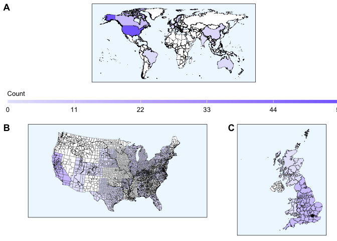<!-- -->

### Primary Performance Indicators

``` r
ppi_frequencies <- extraction_data %>%
  select(study,principal_indicator_var) %>%
  separate_longer_delim(c(principal_indicator_var),delim=";") %>%
  add_column(count=1) %>%
  group_by(principal_indicator_var) %>%
  summarise(frequency=sum(count)) %>%
  mutate(across(principal_indicator_var,str_replace_all,"Observed Food Choice","Food Choice, Observed")) %>%
  mutate(across(principal_indicator_var,str_replace_all,"Observed Food Service","Food Service, Observed")) %>%
  mutate(across(principal_indicator_var,str_replace_all,"Self-Reported Food Choice","Food Choice, Self-Reported")) %>%
  mutate(across(principal_indicator_var,str_replace_all,"Intended Food Choice","Food Choice, Intended")) 
ppi_frequencies 
```

    ## # A tibble: 8 × 2
    ##   principal_indicator_var       frequency
    ##   <chr>                             <dbl>
    ## 1 "  Food Choice, Observed"             1
    ## 2 " Food Choice, Observed"             11
    ## 3 " Food Service, Observed"             1
    ## 4 " Food Choice, Self-Reported"        30
    ## 5 "Food Choice, Intended"              36
    ## 6 "Food Choice, Observed"              42
    ## 7 "Food Service, Observed"              1
    ## 8 "Food Choice, Self-Reported"         37

``` r
extraction_data %>% select(study_id,accessory_indicator_var_count) %>%
  group_by(accessory_indicator_var_count) %>%
  summarise(count=n())
```

    ## # A tibble: 5 × 2
    ##   accessory_indicator_var_count count
    ##                           <int> <int>
    ## 1                             0    18
    ## 2                             1    57
    ## 3                             2    34
    ## 4                             3     6
    ## 5                             4     1

``` r
principal_indicator_var_manual <- c("Food Choice, Intended","Food Choice, Self-Reported","Food Choice, Observed","Food Service, Observed")
frequency_manual <- c(36,67,54,2)
ppi_frequencies_manual <- tibble(principal_indicator_var_manual,frequency_manual) %>%
  arrange(desc(frequency_manual))
ppi_frequencies_manual 
```

    ## # A tibble: 4 × 2
    ##   principal_indicator_var_manual frequency_manual
    ##   <chr>                                     <dbl>
    ## 1 Food Choice, Self-Reported                   67
    ## 2 Food Choice, Observed                        54
    ## 3 Food Choice, Intended                        36
    ## 4 Food Service, Observed                        2

``` r
ppi_contingency_table <- ppi_frequencies_manual %>%
  rename(Reported=frequency_manual) %>%
  mutate(Omitted=116-Reported)
ppi_contingency_table
```

    ## # A tibble: 4 × 3
    ##   principal_indicator_var_manual Reported Omitted
    ##   <chr>                             <dbl>   <dbl>
    ## 1 Food Choice, Self-Reported           67      49
    ## 2 Food Choice, Observed                54      62
    ## 3 Food Choice, Intended                36      80
    ## 4 Food Service, Observed                2     114

``` r
ppi_contigency_table <- as.table(rbind(c(67,54,36,2),c(49,62,80,114)))
dimnames(ppi_contigency_table) <- list(dichotomy=c("Reported","Omitted"),
                                       indicators=c("Food Choice, Self-Reported","Food Choice, Observed","Food Choice, Intended","Food Service, Observed"))
ppi_chisq_test <- chisq.test(ppi_contigency_table)
ppi_chisq_test
```

    ## 
    ##  Pearson's Chi-squared test
    ## 
    ## data:  ppi_contigency_table
    ## X-squared = 91.269, df = 3, p-value < 2.2e-16

Significant associated between the type of principal performance
indicator and its likelihood of appearance

``` r
ppi_observed_counts <- ppi_chisq_test$observed
print(ppi_chisq_test)
```

    ## 
    ##  Pearson's Chi-squared test
    ## 
    ## data:  ppi_contigency_table
    ## X-squared = 91.269, df = 3, p-value < 2.2e-16

``` r
ppi_expected_counts <- ppi_chisq_test$expected
print(round(ppi_expected_counts,2))
```

    ##           indicators
    ## dichotomy  Food Choice, Self-Reported Food Choice, Observed
    ##   Reported                      39.75                 39.75
    ##   Omitted                       76.25                 76.25
    ##           indicators
    ## dichotomy  Food Choice, Intended Food Service, Observed
    ##   Reported                 39.75                  39.75
    ##   Omitted                  76.25                  76.25

``` r
ppi_pearson_residuals <- ppi_chisq_test$residuals
print(round(ppi_pearson_residuals,2))
```

    ##           indicators
    ## dichotomy  Food Choice, Self-Reported Food Choice, Observed
    ##   Reported                       4.32                  2.26
    ##   Omitted                       -3.12                 -1.63
    ##           indicators
    ## dichotomy  Food Choice, Intended Food Service, Observed
    ##   Reported                 -0.59                  -5.99
    ##   Omitted                   0.43                   4.32

``` r
ppi_contributions <- (ppi_observed_counts-ppi_expected_counts)^2/ppi_expected_counts
ppi_total_chi_square <- ppi_chisq_test$statistic
ppi_percentage_contributions <- 100*ppi_contributions/ppi_total_chi_square
print("Percentage Contributions:")
```

    ## [1] "Percentage Contributions:"

``` r
print(round(ppi_percentage_contributions,2))
```

    ##           indicators
    ## dichotomy  Food Choice, Self-Reported Food Choice, Observed
    ##   Reported                      20.47                  5.60
    ##   Omitted                       10.67                  2.92
    ##           indicators
    ## dichotomy  Food Choice, Intended Food Service, Observed
    ##   Reported                  0.39                  39.28
    ##   Omitted                   0.20                  20.48

``` r
pheatmap(ppi_percentage_contributions,display_numbers=TRUE,cluster_rows=FALSE,cluster_cols=FALSE,main="Percentage Contributions to Chi-Square Statistic")
```

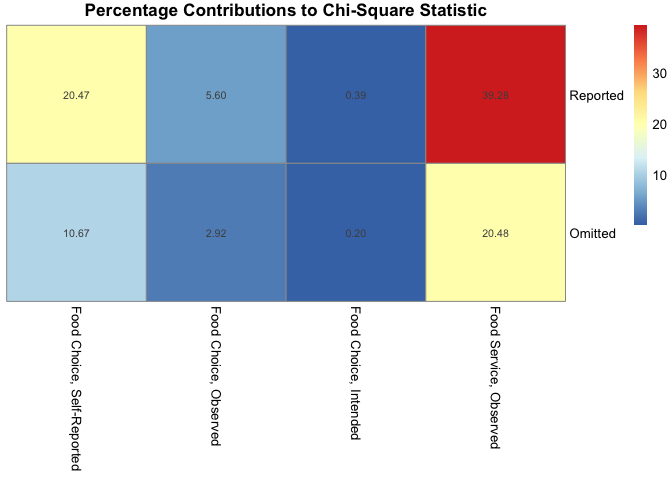<!-- -->

``` r
ppi_contingency_table_alt <- ppi_contingency_table %>%
  pivot_longer(!principal_indicator_var_manual,names_to="appearance",values_to="frequency_manual") %>%
  mutate(contribution=case_when(principal_indicator_var_manual=="Food Choice, Self-Reported"&appearance=="Reported"~20.47,
    principal_indicator_var_manual=="Food Choice, Self-Reported"&appearance=="Omitted"~10.67,
    principal_indicator_var_manual=="Food Choice, Observed"&appearance=="Reported"~5.60,
    principal_indicator_var_manual=="Food Choice, Observed"&appearance=="Omitted"~2.92,
    principal_indicator_var_manual=="Food Choice, Intended"&appearance=="Reported"~0.39,
    principal_indicator_var_manual=="Food Choice, Intended"&appearance=="Omitted"~0.20,
    principal_indicator_var_manual=="Food Service, Observed"&appearance=="Reported"~39.28,
    principal_indicator_var_manual=="Food Service, Observed"&appearance=="Omitted"~20.48)) %>%
  mutate(label_y=case_when(appearance=="Reported"~118,
                           appearance=="Omitted"~-2))
ppi_contingency_table_alt
```

    ## # A tibble: 8 × 5
    ##   principal_indicator_var_man…¹ appearance frequency_manual contribution label_y
    ##   <chr>                         <chr>                 <dbl>        <dbl>   <dbl>
    ## 1 Food Choice, Self-Reported    Reported                 67        20.5      118
    ## 2 Food Choice, Self-Reported    Omitted                  49        10.7       -2
    ## 3 Food Choice, Observed         Reported                 54         5.6      118
    ## 4 Food Choice, Observed         Omitted                  62         2.92      -2
    ## 5 Food Choice, Intended         Reported                 36         0.39     118
    ## 6 Food Choice, Intended         Omitted                  80         0.2       -2
    ## 7 Food Service, Observed        Reported                  2        39.3      118
    ## 8 Food Service, Observed        Omitted                 114        20.5       -2
    ## # ℹ abbreviated name: ¹​principal_indicator_var_manual

``` r
ppi_frequencies_plot <- ppi_contingency_table_alt %>%
  ggplot(aes(x=principal_indicator_var_manual,y=frequency_manual,fill=appearance,color=appearance)) + 
  geom_col(color="black",size=0.2) + 
  geom_text(aes(y=label_y,label=paste(format(contribution,nsmall=2),"%")),color="black",size=3) +
  geom_signif(comparisons=list(c("Food Choice, Self-Reported","Food Service, Observed")),color="black",size=0.25,annotation="***",y_position=116,tip_length=0.02,vjust=0) +
  xlab("Principal Indicator") +
  ylab("Frequency") +
  scale_x_discrete(limits=c("Food Service, Observed","Food Choice, Intended","Food Choice, Observed","Food Choice, Self-Reported")) + 
  scale_y_continuous(breaks=c(0,29,58,87,116)) +
  scale_fill_manual(values=c("lavender","lightslateblue")) +
  scale_color_manual(values=c("lavender","lightslateblue")) +
  guides(fill=guide_legend(title="Mode"),color=guide_legend(title="Mode")) +
  labs(caption="X-squared: 91.3 (3sf); p-value < 0.001") + 
  theme(aspect.ratio=0.8,legend.position="right",panel.grid=element_blank(),panel.background=element_rect(fill="white"),panel.border=element_rect(fill=NA),legend.title=element_text(size=10),legend.text=element_text(size=10),plot.title=element_text(size=10))
```

### Accessory Performance Indicators

``` r
api_frequencies <- extraction_data %>%
  select(study,accessory_indicator_var) %>%
  separate_longer_delim(c(accessory_indicator_var),delim=";") %>%
  add_column(count=1) %>%
  group_by(accessory_indicator_var) %>%
  summarise(frequency=sum(count))
api_frequencies
```

    ## # A tibble: 15 × 2
    ##    accessory_indicator_var                 frequency
    ##    <chr>                                       <dbl>
    ##  1 " Campus Culture"                               2
    ##  2 " Dietary Health"                              18
    ##  3 " Food Pricing"                                 1
    ##  4 " Guest Dining Experience"                      4
    ##  5 " Institutional Sustainability"                 2
    ##  6 " Operating Costs"                             12
    ##  7 " Staff Satisfaction"                           1
    ##  8 " Sustainability of Guest Food Choices"        10
    ##  9 "Campus Culture"                               80
    ## 10 "Dietary Health"                                9
    ## 11 "Food Pricing"                                  3
    ## 12 "Guest Dining Experience"                       1
    ## 13 "Operating Costs"                               2
    ## 14 "Sustainability of Guest Food Choices"          3
    ## 15  <NA>                                          18

``` r
accessory_indicator_var_manual <- c("Campus Culture","Dietary Health","Food Pricing","Guest Dining Experience","Institutional Sustainability","Operating Costs","Staff Satisfaction","Sustainability of Guest Food Choices")
frequency_manual <- c(82,27,4,5,2,14,1,13)
api_frequencies_manual <- tibble(accessory_indicator_var_manual,frequency_manual) %>%
  arrange(desc(frequency_manual))
api_frequencies_manual 
```

    ## # A tibble: 8 × 2
    ##   accessory_indicator_var_manual       frequency_manual
    ##   <chr>                                           <dbl>
    ## 1 Campus Culture                                     82
    ## 2 Dietary Health                                     27
    ## 3 Operating Costs                                    14
    ## 4 Sustainability of Guest Food Choices               13
    ## 5 Guest Dining Experience                             5
    ## 6 Food Pricing                                        4
    ## 7 Institutional Sustainability                        2
    ## 8 Staff Satisfaction                                  1

``` r
api_contigency_table <- api_frequencies_manual %>%
  rename(Reported=frequency_manual) %>%
  mutate(Omitted=116-Reported)
api_contigency_table
```

    ## # A tibble: 8 × 3
    ##   accessory_indicator_var_manual       Reported Omitted
    ##   <chr>                                   <dbl>   <dbl>
    ## 1 Campus Culture                             82      34
    ## 2 Dietary Health                             27      89
    ## 3 Operating Costs                            14     102
    ## 4 Sustainability of Guest Food Choices       13     103
    ## 5 Guest Dining Experience                     5     111
    ## 6 Food Pricing                                4     112
    ## 7 Institutional Sustainability                2     114
    ## 8 Staff Satisfaction                          1     115

``` r
api_contigency_table_alt <- api_contigency_table %>%
  pivot_longer(!accessory_indicator_var_manual,names_to="appearance",values_to="frequency_manual") %>%
  mutate(contribution=case_when(accessory_indicator_var_manual=="Campus Culture"&appearance=="Reported"~62.97,
    accessory_indicator_var_manual=="Campus Culture"&appearance=="Omitted"~13.71,
    accessory_indicator_var_manual=="Dietary Health"&appearance=="Reported"~0.66,
    accessory_indicator_var_manual=="Dietary Health"&appearance=="Omitted"~0.14,
    accessory_indicator_var_manual=="Operating Costs"&appearance=="Reported"~0.76,
    accessory_indicator_var_manual=="Operating Costs"&appearance=="Omitted"~0.17,
    accessory_indicator_var_manual=="Sustainability of Guest Food Choices"&appearance=="Reported"~1.00,
    accessory_indicator_var_manual=="Sustainability of Guest Food Choices"&appearance=="Omitted"~0.22,
    accessory_indicator_var_manual=="Guest Dining Experience"&appearance=="Reported"~4.15,
    accessory_indicator_var_manual=="Guest Dining Experience"&appearance=="Omitted"~0.90,
    accessory_indicator_var_manual=="Food Pricing"&appearance=="Reported"~0.16,
    accessory_indicator_var_manual=="Food Pricing"&appearance=="Omitted"~0.03,
    accessory_indicator_var_manual=="Institutional Sustainability"&appearance=="Reported"~5.89,
    accessory_indicator_var_manual=="Institutional Sustainability"&appearance=="Omitted"~1.28,
    accessory_indicator_var_manual=="Staff Satisfaction"&appearance=="Reported"~6.53,
    accessory_indicator_var_manual=="Staff Satisfaction"&appearance=="Omitted"~1.42)) %>%
  mutate(label_y=case_when(appearance=="Reported"~118,
                           appearance=="Omitted"~-2))
api_contigency_table_alt
```

    ## # A tibble: 16 × 5
    ##    accessory_indicator_var_ma…¹ appearance frequency_manual contribution label_y
    ##    <chr>                        <chr>                 <dbl>        <dbl>   <dbl>
    ##  1 Campus Culture               Reported                 82        63.0      118
    ##  2 Campus Culture               Omitted                  34        13.7       -2
    ##  3 Dietary Health               Reported                 27         0.66     118
    ##  4 Dietary Health               Omitted                  89         0.14      -2
    ##  5 Operating Costs              Reported                 14         0.76     118
    ##  6 Operating Costs              Omitted                 102         0.17      -2
    ##  7 Sustainability of Guest Foo… Reported                 13         1        118
    ##  8 Sustainability of Guest Foo… Omitted                 103         0.22      -2
    ##  9 Guest Dining Experience      Reported                  5         4.15     118
    ## 10 Guest Dining Experience      Omitted                 111         0.9       -2
    ## 11 Food Pricing                 Reported                  4         0.16     118
    ## 12 Food Pricing                 Omitted                 112         0.03      -2
    ## 13 Institutional Sustainability Reported                  2         5.89     118
    ## 14 Institutional Sustainability Omitted                 114         1.28      -2
    ## 15 Staff Satisfaction           Reported                  1         6.53     118
    ## 16 Staff Satisfaction           Omitted                 115         1.42      -2
    ## # ℹ abbreviated name: ¹​accessory_indicator_var_manual

``` r
api_frequencies_plot <- api_contigency_table_alt %>%
  ggplot(aes(x=accessory_indicator_var_manual,y=frequency_manual,fill=appearance,color=appearance)) + 
  geom_col(color="black",size=0.2) + 
  geom_text(aes(y=label_y,label=paste(format(contribution,nsmall=2),"%")),color="black",size=3) +
  geom_signif(comparisons=list(c("Campus Culture","Staff Satisfaction")),color="black",size=0.25,annotation="***",y_position=116,tip_length=0.02,vjust=0) +
  xlab("Accessory Indicator") +
  ylab("Frequency") +
  scale_x_discrete(limits=c("Staff Satisfaction","Institutional Sustainability","Food Pricing","Guest Dining Experience","Sustainability of Guest Food Choices","Operating Costs","Dietary Health","Campus Culture"),labels=c("Staff Satisfaction","Institutional Sustainability","Food Prices","Diner Experience","Dietary Sustainability","Operating Costs","Dietary Health","Organizational Culture")) + 
  scale_y_continuous(breaks=c(0,29,58,87,116)) +
  scale_fill_manual(values=c("aliceblue","lightsteelblue")) +
  scale_color_manual(values=c("aliceblue","lightsteelblue")) +
  guides(fill=guide_legend(title="Mode"),color=guide_legend(title="Mode")) +
  labs(caption="X-squared: 287 (3sf); p-value < 0.001") + 
  theme(aspect.ratio=0.4,legend.position="right",panel.grid=element_blank(),panel.background=element_rect(fill="white"),panel.border=element_rect(fill=NA),legend.title=element_text(size=10),legend.text=element_text(size=10),plot.title=element_text(size=10))
```

``` r
api_contigency_table <- as.table(rbind(c(82,27,14,13,5,4,2,1),c(34,89,102,103,111,12,114,115)))
dimnames(api_contigency_table) <- list(dichotomy=c("Reported","Omitted"),
                                       indicators=c("Campus Culture","Dietary Health","Operating Costs","Sustainability of Guest Food Choices","Guest Dining Experience","Food Pricing","Institutional Sustainability","Staff Satisfaction"))
api_chisq_test <- chisq.test(api_contigency_table)
```

    ## Warning in chisq.test(api_contigency_table): Chi-squared approximation may be
    ## incorrect

``` r
api_chisq_test
```

    ## 
    ##  Pearson's Chi-squared test
    ## 
    ## data:  api_contigency_table
    ## X-squared = 287.48, df = 7, p-value < 2.2e-16

Significant association between the type of accessory performance
indicator and its likelihood of appearance (chi-square test
interpretation (<https://www.datacamp.com/tutorial/chi-square-test-r>))

``` r
api_observed_counts <- api_chisq_test$observed
print(api_chisq_test)
```

    ## 
    ##  Pearson's Chi-squared test
    ## 
    ## data:  api_contigency_table
    ## X-squared = 287.48, df = 7, p-value < 2.2e-16

``` r
api_expected_counts <- api_chisq_test$expected
print(round(api_expected_counts,2))
```

    ##           indicators
    ## dichotomy  Campus Culture Dietary Health Operating Costs
    ##   Reported          20.73          20.73           20.73
    ##   Omitted           95.27          95.27           95.27
    ##           indicators
    ## dichotomy  Sustainability of Guest Food Choices Guest Dining Experience
    ##   Reported                                20.73                   20.73
    ##   Omitted                                 95.27                   95.27
    ##           indicators
    ## dichotomy  Food Pricing Institutional Sustainability Staff Satisfaction
    ##   Reported         2.86                        20.73              20.73
    ##   Omitted         13.14                        95.27              95.27

``` r
api_pearson_residuals <- api_chisq_test$residuals
print(round(api_pearson_residuals,2))
```

    ##           indicators
    ## dichotomy  Campus Culture Dietary Health Operating Costs
    ##   Reported          13.45           1.38           -1.48
    ##   Omitted           -6.28          -0.64            0.69
    ##           indicators
    ## dichotomy  Sustainability of Guest Food Choices Guest Dining Experience
    ##   Reported                                -1.70                   -3.46
    ##   Omitted                                  0.79                    1.61
    ##           indicators
    ## dichotomy  Food Pricing Institutional Sustainability Staff Satisfaction
    ##   Reported         0.67                        -4.11              -4.33
    ##   Omitted         -0.31                         1.92               2.02

``` r
api_contributions <- (api_observed_counts-api_expected_counts)^2/api_expected_counts
api_total_chi_square <- api_chisq_test$statistic
api_percentage_contributions <- 100*api_contributions/api_total_chi_square
print("Percentage Contributions:")
```

    ## [1] "Percentage Contributions:"

``` r
print(round(api_percentage_contributions,2))
```

    ##           indicators
    ## dichotomy  Campus Culture Dietary Health Operating Costs
    ##   Reported          62.97           0.66            0.76
    ##   Omitted           13.71           0.14            0.17
    ##           indicators
    ## dichotomy  Sustainability of Guest Food Choices Guest Dining Experience
    ##   Reported                                 1.00                    4.15
    ##   Omitted                                  0.22                    0.90
    ##           indicators
    ## dichotomy  Food Pricing Institutional Sustainability Staff Satisfaction
    ##   Reported         0.16                         5.89               6.53
    ##   Omitted          0.03                         1.28               1.42

``` r
library(pheatmap)
pheatmap(api_percentage_contributions,display_numbers=TRUE,cluster_rows=FALSE,cluster_cols=FALSE,main="Percentage Contributions to Chi-Square Statistic")
```

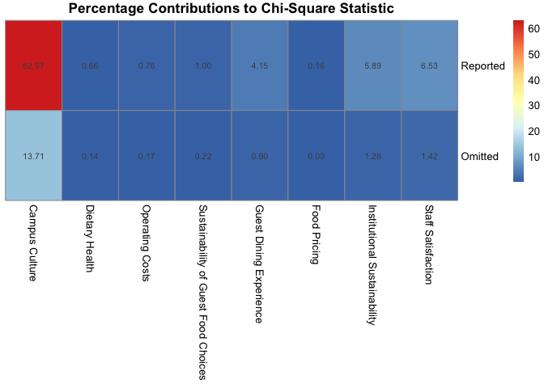<!-- -->

Rerun this using list class instead of variety class

list

``` r
extraction_data %>%
  select(accessory_indicator_list) %>%
  str_count("Campus Culture")
```

    ## Warning in stri_count_regex(string, pattern, opts_regex = opts(pattern)):
    ## argument is not an atomic vector; coercing

    ## [1] 398

``` r
extraction_data %>%
  select(accessory_indicator_list) %>%
  str_count("Dietary Health")
```

    ## Warning in stri_count_regex(string, pattern, opts_regex = opts(pattern)):
    ## argument is not an atomic vector; coercing

    ## [1] 241

``` r
extraction_data %>%
  select(accessory_indicator_list) %>%
  str_count("Operating Costs")
```

    ## Warning in stri_count_regex(string, pattern, opts_regex = opts(pattern)):
    ## argument is not an atomic vector; coercing

    ## [1] 23

``` r
extraction_data %>%
  select(accessory_indicator_list) %>%
  str_count("Sustainability of Guest Food Choices")
```

    ## Warning in stri_count_regex(string, pattern, opts_regex = opts(pattern)):
    ## argument is not an atomic vector; coercing

    ## [1] 41

``` r
extraction_data %>%
  select(accessory_indicator_list) %>%
  str_count("Guest Dining Experience")
```

    ## Warning in stri_count_regex(string, pattern, opts_regex = opts(pattern)):
    ## argument is not an atomic vector; coercing

    ## [1] 7

``` r
extraction_data %>%
  select(accessory_indicator_list) %>%
  str_count("Food Pricing")
```

    ## Warning in stri_count_regex(string, pattern, opts_regex = opts(pattern)):
    ## argument is not an atomic vector; coercing

    ## [1] 4

``` r
extraction_data %>%
  select(accessory_indicator_list) %>%
  str_count("Institutional Sustainability")
```

    ## Warning in stri_count_regex(string, pattern, opts_regex = opts(pattern)):
    ## argument is not an atomic vector; coercing

    ## [1] 8

``` r
extraction_data %>%
  select(accessory_indicator_list) %>%
  str_count("Staff Satisfaction")
```

    ## Warning in stri_count_regex(string, pattern, opts_regex = opts(pattern)):
    ## argument is not an atomic vector; coercing

    ## [1] 1

### Performance Qualifiers

``` r
qpi_frequencies <- extraction_data %>%
  select(study,qualifying_indicator_var) %>%
  separate_longer_delim(c(qualifying_indicator_var),delim=";") %>%
  add_column(count=1) %>%
  group_by(qualifying_indicator_var) %>%
  summarise(frequency=sum(count))
qpi_frequencies
```

    ## # A tibble: 9 × 2
    ##   qualifying_indicator_var frequency
    ##   <chr>                        <dbl>
    ## 1 " Lifestyle"                    37
    ## 2 " Lifestyle "                    6
    ## 3 " Program Reception"            34
    ## 4 " Situational"                  21
    ## 5 "Demographics"                  87
    ## 6 "Lifestyle"                      3
    ## 7 "Program Reception"              5
    ## 8 "Situational"                    8
    ## 9  <NA>                           13

``` r
qualifying_indicator_var_manual <- c("Demographics","Lifestyle","Program Reception","Situational")
frequency_manual <- c(87,46,39,29)
qpi_frequencies_manual <- tibble(qualifying_indicator_var_manual,frequency_manual) %>%
  arrange(desc(frequency_manual))
qpi_frequencies_manual 
```

    ## # A tibble: 4 × 2
    ##   qualifying_indicator_var_manual frequency_manual
    ##   <chr>                                      <dbl>
    ## 1 Demographics                                  87
    ## 2 Lifestyle                                     46
    ## 3 Program Reception                             39
    ## 4 Situational                                   29

``` r
qpi_contingency_table <- qpi_frequencies_manual %>%
  rename(Reported=frequency_manual) %>%
  mutate(Omitted=116-Reported)
qpi_contingency_table
```

    ## # A tibble: 4 × 3
    ##   qualifying_indicator_var_manual Reported Omitted
    ##   <chr>                              <dbl>   <dbl>
    ## 1 Demographics                          87      29
    ## 2 Lifestyle                             46      70
    ## 3 Program Reception                     39      77
    ## 4 Situational                           29      87

``` r
qpi_contingency_table_alt <- qpi_contingency_table %>%
  pivot_longer(!qualifying_indicator_var_manual,names_to="appearance",values_to="frequency_manual") %>%
  mutate(contribution=case_when(qualifying_indicator_var_manual=="Demographics"&appearance=="Reported"~39.32,
    qualifying_indicator_var_manual=="Demographics"&appearance=="Omitted"~30.05,
    qualifying_indicator_var_manual=="Lifestyle"&appearance=="Reported"~0.53,
    qualifying_indicator_var_manual=="Lifestyle"&appearance=="Omitted"~0.40,
    qualifying_indicator_var_manual=="Program Reception"&appearance=="Reported"~3.68,
    qualifying_indicator_var_manual=="Program Reception"&appearance=="Omitted"~2.82,
    qualifying_indicator_var_manual=="Situational"&appearance=="Reported"~13.15,
    qualifying_indicator_var_manual=="Situational"&appearance=="Omitted"~10.05)) %>%
  mutate(label_y=case_when(appearance=="Reported"~118,
                           appearance=="Omitted"~-2))
api_contigency_table_alt
```

    ## # A tibble: 16 × 5
    ##    accessory_indicator_var_ma…¹ appearance frequency_manual contribution label_y
    ##    <chr>                        <chr>                 <dbl>        <dbl>   <dbl>
    ##  1 Campus Culture               Reported                 82        63.0      118
    ##  2 Campus Culture               Omitted                  34        13.7       -2
    ##  3 Dietary Health               Reported                 27         0.66     118
    ##  4 Dietary Health               Omitted                  89         0.14      -2
    ##  5 Operating Costs              Reported                 14         0.76     118
    ##  6 Operating Costs              Omitted                 102         0.17      -2
    ##  7 Sustainability of Guest Foo… Reported                 13         1        118
    ##  8 Sustainability of Guest Foo… Omitted                 103         0.22      -2
    ##  9 Guest Dining Experience      Reported                  5         4.15     118
    ## 10 Guest Dining Experience      Omitted                 111         0.9       -2
    ## 11 Food Pricing                 Reported                  4         0.16     118
    ## 12 Food Pricing                 Omitted                 112         0.03      -2
    ## 13 Institutional Sustainability Reported                  2         5.89     118
    ## 14 Institutional Sustainability Omitted                 114         1.28      -2
    ## 15 Staff Satisfaction           Reported                  1         6.53     118
    ## 16 Staff Satisfaction           Omitted                 115         1.42      -2
    ## # ℹ abbreviated name: ¹​accessory_indicator_var_manual

``` r
qpi_frequencies_plot <- qpi_contingency_table_alt %>%
  ggplot(aes(x=qualifying_indicator_var_manual,y=frequency_manual,fill=appearance,color=appearance)) + 
  geom_col(color="black",size=0.2) + 
  geom_text(aes(y=label_y,label=paste(format(contribution,nsmall=2),"%")),color="black",size=3) +
  geom_signif(comparisons=list(c("Demographics","Situational")),color="black",size=0.25,annotation="***",y_position=116,tip_length=0.02,vjust=0) +
  xlab("Qualifying Indicator") +
  ylab("Frequency") +
  scale_x_discrete(limits=c("Situational","Program Reception","Lifestyle","Demographics")) + 
  scale_y_continuous(breaks=c(0,29,58,87,116)) +
  scale_fill_manual(values=c("mistyrose","lightcoral")) +
  scale_color_manual(values=c("mistyrose","lightcoral")) +
  guides(fill=guide_legend(title="Mode"),color=guide_legend(title="Mode")) +
  labs(caption="X-squared: 68.35 (2dp); p-value < 0.001") + 
  theme(aspect.ratio=0.8,legend.position="right",panel.grid=element_blank(),panel.background=element_rect(fill="white"),panel.border=element_rect(fill=NA),legend.title=element_text(size=10),legend.text=element_text(size=10),plot.title=element_text(size=10))
```

``` r
qpi_contingency_table <- as.table(rbind(c(87,46,39,29),c(29,70,77,87)))
dimnames(qpi_contingency_table) <- list(dichomoty=c("Reported","Omitted"),
                                        indicators=c("Demographics","Lifestyle","Program Reception","Situational"))
qpi_chisq_test <- chisq.test(qpi_contingency_table)
qpi_chisq_test
```

    ## 
    ##  Pearson's Chi-squared test
    ## 
    ## data:  qpi_contingency_table
    ## X-squared = 68.35, df = 3, p-value = 9.629e-15

Significant association between the type of qualifying performance
indicator and its likelihood of appearance

``` r
qpi_observed_counts <- qpi_chisq_test$observed
print(qpi_chisq_test)
```

    ## 
    ##  Pearson's Chi-squared test
    ## 
    ## data:  qpi_contingency_table
    ## X-squared = 68.35, df = 3, p-value = 9.629e-15

``` r
qpi_expected_counts <- qpi_chisq_test$expected
print(round(qpi_expected_counts,2))
```

    ##           indicators
    ## dichomoty  Demographics Lifestyle Program Reception Situational
    ##   Reported        50.25     50.25             50.25       50.25
    ##   Omitted         65.75     65.75             65.75       65.75

``` r
qpi_pearson_residuals <- qpi_chisq_test$residuals
print(round(qpi_pearson_residuals,2))
```

    ##           indicators
    ## dichomoty  Demographics Lifestyle Program Reception Situational
    ##   Reported         5.18     -0.60             -1.59       -3.00
    ##   Omitted         -4.53      0.52              1.39        2.62

``` r
qpi_contributions <- (qpi_observed_counts-qpi_expected_counts)^2/qpi_expected_counts
qpi_total_chi_square <- qpi_chisq_test$statistic
qpi_percentage_contributions <- 100*qpi_contributions/qpi_total_chi_square
print("Percentage Contributions:")
```

    ## [1] "Percentage Contributions:"

``` r
print(round(qpi_percentage_contributions,2))
```

    ##           indicators
    ## dichomoty  Demographics Lifestyle Program Reception Situational
    ##   Reported        39.32      0.53              3.68       13.15
    ##   Omitted         30.05      0.40              2.82       10.05

``` r
pheatmap(qpi_percentage_contributions,display_numbers=TRUE,cluster_rows=FALSE,cluster_cols=FALSE,main="Percentage Contributions to Chi-Square Statistic")
```

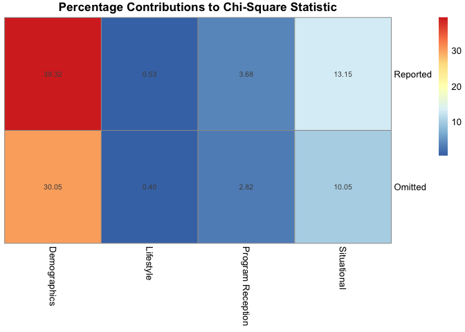<!-- -->

``` r
principal_qualifying_indicator_plots <- ggarrange(ppi_frequencies_plot,qpi_frequencies_plot,
          ncol=2,
          labels=c("A","C"))
accessory_indicator_plots <- ggarrange(api_frequencies_plot,
          labels="B")
```

``` r
combined_indicators <- ggarrange(principal_qualifying_indicator_plots,accessory_indicator_plots,
          nrow=2)
ggsave(filename="combined-performance-indicators.png",plot=combined_indicators,path="/Users/kenjinchang/github/stakeholder-analysis/figures",width=45,height=33,units="cm",dpi=150,limitsize=TRUE)
combined_indicators
```

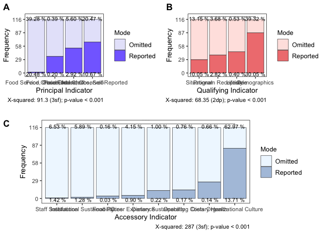<!-- -->

### Gap Monitoring

#### Spillover

#### Intention-Behavior Asymmetries

## Data Cleaning: Stakeholder Analysis

- `date`: the
- `completion`: the
- `channel`: the
- `consent`: the
- `involvement`: the
- `involvement_other`: the
- `stakeholder_type`: the
- `stakeholder_type_other`: the
- `role_title`: the
- \`role_duration\`\`: the
- `dietary_health_ranking`: the
- `dietary_sustainability_ranking`: the
- `institutional_sustainability_ranking`: the
- `food_pricing_ranking`: the
- `operating_costs_ranking`: the
- `guest_experience_ranking`: the
- `staff_satisfaction_ranking`: the
- `campus_culture_ranking`: the
- `other_ranking`: the
- `other_ranking_other`: the

``` r
survey_data <- survey_data %>%
  select(RecordedDate,Progress,DistributionChannel,Q1,Q2,Q2_4_TEXT,Q6,Q6_10_TEXT,Q3,Q5_1,Q2_1,Q2_2,Q2_3,Q2_4,Q2_5,Q2_6,Q2_7,Q2_8,Q2_9,Q2_9_TEXT) %>%
  rename(date=RecordedDate,completion=Progress,mode=DistributionChannel,consent=Q1,role=Q2,role_other=Q2_4_TEXT,stakeholder_type=Q6,stakeholder_type_other=Q6_10_TEXT,position_title=Q3,position_duration=Q5_1,dietary_health_ranking=Q2_1,dietary_sustainability_ranking=Q2_2,institutional_sustainability_ranking=Q2_3,food_pricing_ranking=Q2_4,operating_costs_ranking=Q2_5,guest_experience_ranking=Q2_6,staff_satisfaction_ranking=Q2_7,campus_culture_ranking=Q2_8,other_ranking=Q2_9,other_ranking_other=Q2_9_TEXT) %>%
  slice(3:n()) %>%
  mutate(dietary_health_ranking=as.numeric(dietary_health_ranking)) %>%
  mutate(dietary_sustainability_ranking=as.numeric(dietary_sustainability_ranking)) %>%
  mutate(institutional_sustainability_ranking=as.numeric(institutional_sustainability_ranking)) %>%
  mutate(food_pricing_ranking=as.numeric(food_pricing_ranking)) %>%
  mutate(operating_costs_ranking=as.numeric(operating_costs_ranking)) %>%
  mutate(guest_experience_ranking=as.numeric(guest_experience_ranking)) %>%
  mutate(staff_satisfaction_ranking=as.numeric(staff_satisfaction_ranking)) %>%
  mutate(campus_culture_ranking=as.numeric(campus_culture_ranking)) %>%
  mutate(other_ranking=as.numeric(other_ranking)) %>%
  mutate(id=row_number(),.before=role) %>%
  mutate(campus_culture_ranking=case_when(id==22~8,TRUE~campus_culture_ranking)) %>%
  mutate(staff_satisfaction_ranking=case_when(id==22~7,TRUE~staff_satisfaction_ranking)) %>%
  mutate(operating_costs_ranking=case_when(id==22~2,TRUE~operating_costs_ranking)) %>%
  mutate(food_pricing_ranking=case_when(id==22~3,TRUE~food_pricing_ranking)) %>%
  mutate(institutional_sustainability_ranking=case_when(id==22~4,TRUE~institutional_sustainability_ranking)) %>%
  mutate(dietary_sustainability_ranking=case_when(id==22~5,TRUE~dietary_sustainability_ranking)) %>%
  mutate(dietary_health_ranking=case_when(id==22~6,TRUE~dietary_health_ranking)) %>%
  select(-other_ranking,-other_ranking_other,-completion,-date,-mode,-consent) %>%
  mutate(dietary_health_score=case_when(dietary_health_ranking==1~8,
                                        dietary_health_ranking==2~7,
                                        dietary_health_ranking==3~6,
                                        dietary_health_ranking==4~5,
                                        dietary_health_ranking==5~4,
                                        dietary_health_ranking==6~3,
                                        dietary_health_ranking==7~2,
                                        dietary_health_ranking==8~1)) %>%
  mutate(dietary_sustainability_score=case_when(dietary_sustainability_ranking==1~8,
                                                dietary_sustainability_ranking==2~7,
                                                dietary_sustainability_ranking==3~6,
                                                dietary_sustainability_ranking==4~5,
                                                dietary_sustainability_ranking==5~4,
                                                dietary_sustainability_ranking==6~3,
                                                dietary_sustainability_ranking==7~2,
                                                dietary_sustainability_ranking==8~1)) %>%
  mutate(institutional_sustainability_score=case_when(institutional_sustainability_ranking==1~8,
                                                      institutional_sustainability_ranking==2~7,
                                                      institutional_sustainability_ranking==3~6,
                                                      institutional_sustainability_ranking==4~5,
                                                      institutional_sustainability_ranking==5~4,
                                                      institutional_sustainability_ranking==6~3,
                                                      institutional_sustainability_ranking==7~2,
                                                      institutional_sustainability_ranking==8~1)) %>%
  mutate(food_pricing_score=case_when(food_pricing_ranking==1~8,
                                      food_pricing_ranking==2~7,
                                      food_pricing_ranking==3~6,
                                      food_pricing_ranking==4~5,
                                      food_pricing_ranking==5~4,
                                      food_pricing_ranking==6~3,
                                      food_pricing_ranking==7~2,
                                      food_pricing_ranking==8~1)) %>%
  mutate(operating_costs_score=case_when(operating_costs_ranking==1~8,
                                         operating_costs_ranking==2~7,
                                         operating_costs_ranking==3~6,
                                         operating_costs_ranking==4~5,
                                         operating_costs_ranking==5~4,
                                         operating_costs_ranking==6~3,
                                         operating_costs_ranking==7~2,
                                         operating_costs_ranking==8~1)) %>%
  mutate(guest_experience_score=case_when(guest_experience_ranking==1~8,
                                          guest_experience_ranking==2~7,
                                          guest_experience_ranking==3~6,
                                          guest_experience_ranking==4~5,
                                          guest_experience_ranking==5~4,
                                          guest_experience_ranking==6~3,
                                          guest_experience_ranking==7~2,
                                          guest_experience_ranking==8~1)) %>%
  mutate(staff_satisfaction_score=case_when(staff_satisfaction_ranking==1~8,
                                            staff_satisfaction_ranking==2~7,
                                            staff_satisfaction_ranking==3~6,
                                            staff_satisfaction_ranking==4~5,
                                            staff_satisfaction_ranking==5~4,
                                            staff_satisfaction_ranking==6~3,
                                            staff_satisfaction_ranking==7~2,
                                            staff_satisfaction_ranking==8~1)) %>%
  mutate(campus_culture_score=case_when(campus_culture_ranking==1~8,
                                        campus_culture_ranking==2~7,
                                        campus_culture_ranking==3~6,
                                        campus_culture_ranking==4~5,
                                        campus_culture_ranking==5~4,
                                        campus_culture_ranking==6~3,
                                        campus_culture_ranking==7~2,
                                        campus_culture_ranking==8~1)) 
```

``` r
survey_data <- survey_data %>%
  mutate(across(role,str_replace,"I consult on best practices","Advisor")) %>%
  mutate(across(role,str_replace,"I am a primary decision maker","Decision Maker")) %>%
  mutate(across(role,str_replace,"I offer feedback on existing services","Auditor")) %>%
  mutate(across(role,str_replace,"Other \\(please specify\\):","Advisor")) %>%
  select(-role_other)
```

``` r
survey_data %>%
  filter(role=="Advisor" | role=="Auditor") %>%
  select(role,position_duration,stakeholder_type,stakeholder_type_other)
```

    ##       role position_duration           stakeholder_type
    ## 1  Advisor                 2       Nutrition specialist
    ## 2  Advisor                 1 Sustainability coordinator
    ## 3  Advisor                 2    Other (please specify):
    ## 4  Advisor         5.5 years Sustainability coordinator
    ## 5  Advisor                 3       Nutrition specialist
    ## 6  Advisor                 1    Other (please specify):
    ## 7  Advisor                12       Nutrition specialist
    ## 8  Advisor                 3 Sustainability coordinator
    ## 9  Advisor                 3                       Chef
    ## 10 Advisor          20 years   University administrator
    ## 11 Advisor                 2    Other (please specify):
    ## 12 Auditor                 1                       Chef
    ## 13 Advisor                 3       Nutrition specialist
    ## 14 Advisor                .1 Sustainability coordinator
    ## 15 Auditor                 3       Nutrition specialist
    ## 16 Advisor                10 Sustainability coordinator
    ## 17 Advisor                 5            Dining director
    ## 18 Advisor                 2    Other (please specify):
    ## 19 Advisor                 3    Other (please specify):
    ## 20 Auditor                      Other (please specify):
    ##            stakeholder_type_other
    ## 1                                
    ## 2                                
    ## 3                    NGO employee
    ## 4                                
    ## 5                                
    ## 6                        Advisor 
    ## 7                                
    ## 8                                
    ## 9                                
    ## 10                               
    ## 11             Dining management 
    ## 12                               
    ## 13                               
    ## 14                               
    ## 15                               
    ## 16                               
    ## 17                               
    ## 18 Manager of residential dining 
    ## 19              Dining marketing 
    ## 20                      marketing

``` r
role <- c("Decision Maker","Decision Maker","Decision Maker","Decision Maker","Decision Maker","Decision Maker","Decision Maker","Decision Maker","Decision Maker","Decision Maker","Decision Maker","Decision Maker")
position_duration <- c(1,11,3,1,32,3,2,4,2,16,2,3)
position_type <- c("Dining Director","Dining Director","Chef","Dining Director","Dining Director","Chef","University Administrator","University Administrator","Dining Director","University Administrator","Sustainability Manager","Dining Director")
dm <- tibble(role,position_duration,position_type)
```

``` r
role <- c("Consultant","Consultant","Consultant","Consultant","Consultant","Consultant","Consultant","Consultant","Consultant","Consultant","Consultant","Consultant","Consultant","Consultant","Consultant","Consultant","Consultant","Consultant","Consultant","Consultant")
position_duration <- c(2,1,2,6,3,1,12,3,3,20,2,1,3,1,3,10,5,2,3,1)
position_type <- c("Nutrition Manager","Sustainability Manager","Dining Advisor","Sustainability Manager","Nutrition Manager","Dining Advisor","Nutrition Manager","Sustainability Manager","Chef","University Administrator","Dining Manager","Chef","Nutrition Manager","Sustainability Manager","Nutrition Manager","Sustainability Manager","Dining Director","Dining Manager","Marketing Manager","Marketing Manager")
c <- tibble(role,position_duration,position_type)
```

``` r
duration_data <- bind_rows(dm,c)
duration_data
```

    ## # A tibble: 32 × 3
    ##    role           position_duration position_type           
    ##    <chr>                      <dbl> <chr>                   
    ##  1 Decision Maker                 1 Dining Director         
    ##  2 Decision Maker                11 Dining Director         
    ##  3 Decision Maker                 3 Chef                    
    ##  4 Decision Maker                 1 Dining Director         
    ##  5 Decision Maker                32 Dining Director         
    ##  6 Decision Maker                 3 Chef                    
    ##  7 Decision Maker                 2 University Administrator
    ##  8 Decision Maker                 4 University Administrator
    ##  9 Decision Maker                 2 Dining Director         
    ## 10 Decision Maker                16 University Administrator
    ## # ℹ 22 more rows

``` r
duration_data %>% ggplot(aes(x=role,y=position_duration,fill=position_type)) +
  geom_col() 
```

<!-- -->

``` r
authority <- c("Decision Maker","Decision Maker","Decision Maker","Decision Maker","Consultant","Consultant","Consultant","Consultant","Consultant","Consultant","Consultant","Consultant")
role <- c("Chef","Dining Director","Sustainability Manager","University Administrator","Chef","Dining Advisor","Dining Director","Dining Manager","Marketing Manager","Nutrition Manager","Sustainability Manager","University Administrator")
frequency <- c(2,6,1,3,2,2,1,2,2,5,5,1)
sample_comp <- tibble(authority,role,frequency)
sample_comp
```

    ## # A tibble: 12 × 3
    ##    authority      role                     frequency
    ##    <chr>          <chr>                        <dbl>
    ##  1 Decision Maker Chef                             2
    ##  2 Decision Maker Dining Director                  6
    ##  3 Decision Maker Sustainability Manager           1
    ##  4 Decision Maker University Administrator         3
    ##  5 Consultant     Chef                             2
    ##  6 Consultant     Dining Advisor                   2
    ##  7 Consultant     Dining Director                  1
    ##  8 Consultant     Dining Manager                   2
    ##  9 Consultant     Marketing Manager                2
    ## 10 Consultant     Nutrition Manager                5
    ## 11 Consultant     Sustainability Manager           5
    ## 12 Consultant     University Administrator         1

``` r
sample_composition_plot <- sample_comp %>%
  ggplot(aes(x=authority,y=frequency,fill=role)) +
  geom_col(position="fill",color="black",size=0.2) + 
  geom_signif(comparisons=list(c("Consultant","Decision Maker")),color="black",size=0.25,annotation="**",y_position=0.80,tip_length=0.002,vjust=0) +
  scale_fill_viridis_d(option="mako",name="Role Type",alpha=0.8) +
  scale_y_continuous(labels=scales::percent,breaks=c(0,0.2,0.4,0.6,0.8,1)) +
  scale_x_discrete(label=c("Technical Advisor (n=20)","Primary Decision Maker (n=12)")) +
  xlab("Authority Level") + 
  ylab("Relative Frequency") + 
  labs(caption="Fisher's exact test, p-value:0.01 (2dp)") +
  theme(aspect.ratio=0.8,panel.grid=element_blank(),panel.background=element_rect(fill="white"),panel.border=element_rect(fill=NA),legend.title=element_text(size=10),legend.text=element_text(size=10),plot.title=element_text(size=10))
ggsave(filename="sample_composition.png",plot=sample_composition_plot,path="/Users/kenjinchang/github/stakeholder-analysis/figures",width=22,height=16,units="cm",dpi=150,limitsize=TRUE)
```

``` r
duraation_authority_plot <- duration_data %>%
  ggplot(aes(x=role,y=position_duration,fill=role)) + 
  geom_violin(draw_quantiles=0.5,adjust=1,size=0.2,color="black",alpha=0.8) +
  stat_summary(fun.y=mean,geom="point",shape=20,size=2,color="black",fill="white") +
  geom_signif(comparisons=list(c("Consultant","Decision Maker")),color="black",size=0.25,annotation="n.s.",y_position=32,tip_length=0.01,vjust=0) +
  labs(caption="W-value: 106.00 (2dp); p-value: 0.59 (2dp)") +
  scale_x_discrete(label=c("Technical Advisor (n=20)","Primary Decision Maker (n=12)")) +
  scale_fill_manual(values=c("aquamarine2","darkslateblue"),name="Authority Level") +
  ylab("Role Duration (Years)") + 
  xlab("") +
  theme(aspect.ratio=0.94,legend.position="none",panel.grid=element_blank(),panel.background=element_rect(fill="white"),panel.border=element_rect(fill=NA),legend.title=element_text(size=10),legend.text=element_text(size=10),plot.title=element_text(size=10))
```

    ## Warning: The `fun.y` argument of `stat_summary()` is deprecated as of ggplot2 3.3.0.
    ## ℹ Please use the `fun` argument instead.
    ## This warning is displayed once every 8 hours.
    ## Call `lifecycle::last_lifecycle_warnings()` to see where this warning was
    ## generated.

``` r
duration_roletype_plots <- ggarrange(duraation_authority_plot,sample_composition_plot,
          ncol=2,
          labels=c("A","B"),
          widths=c(1,1.25))
ggsave(filename="predictors-of-authority.png",plot=duration_roletype_plots,path="/Users/kenjinchang/github/stakeholder-analysis/figures",width=40,height=14,units="cm",dpi=150,limitsize=TRUE)
duration_roletype_plots
```

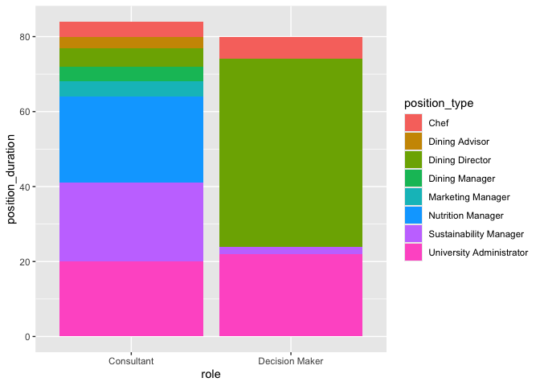<!-- -->

``` r
duration_data %>%
  group_by(role) %>%
  summarise(mean=mean(position_duration),sd=sd(position_duration))
```

    ## # A tibble: 2 × 3
    ##   role            mean    sd
    ##   <chr>          <dbl> <dbl>
    ## 1 Consultant      4.2   4.74
    ## 2 Decision Maker  6.67  9.17

``` r
with(duration_data,shapiro.test(position_duration[role=="Consultant"]))
```

    ## 
    ##  Shapiro-Wilk normality test
    ## 
    ## data:  position_duration[role == "Consultant"]
    ## W = 0.66847, p-value = 1.648e-05

``` r
with(duration_data,shapiro.test(position_duration[role=="Decision Maker"]))
```

    ## 
    ##  Shapiro-Wilk normality test
    ## 
    ## data:  position_duration[role == "Decision Maker"]
    ## W = 0.6481, p-value = 0.0002786

``` r
res <- wilcox.test(position_duration~role,data=duration_data,
                   exact = FALSE)
res
```

    ## 
    ##  Wilcoxon rank sum test with continuity correction
    ## 
    ## data:  position_duration by role
    ## W = 106, p-value = 0.5912
    ## alternative hypothesis: true location shift is not equal to 0

``` r
res <- t.test(position_duration~role,data=duration_data,var.equal=FALSE)
res
```

    ## 
    ##  Welch Two Sample t-test
    ## 
    ## data:  position_duration by role
    ## t = -0.86514, df = 14.596, p-value = 0.401
    ## alternative hypothesis: true difference in means between group Consultant and group Decision Maker is not equal to 0
    ## 95 percent confidence interval:
    ##  -8.558496  3.625162
    ## sample estimates:
    ##     mean in group Consultant mean in group Decision Maker 
    ##                     4.200000                     6.666667

``` r
role <- c("Decision Maker","Decision Maker","Decision Maker","Decision Maker","Decision Maker","Decision Maker","Decision Maker","Decision Maker","Decision Maker","Decision Maker","Decision Maker","Decision Maker","Consultant","Consultant","Consultant","Consultant","Consultant","Consultant","Consultant","Consultant","Consultant","Consultant","Consultant","Consultant","Consultant","Consultant","Consultant","Consultant","Consultant","Consultant","Consultant","Consultant")
stakeholder_type <- c("Chef","Chef","Dining Director","Dining Director","Dining Director","Dining Director","Dining Director","Dining Director","Sustainability Manager","University Administrator","University Administrator","University Administrator","Chef","Chef","Dining Director","Nutrition Manager","Nutrition Manager","Nutrition Manager","Nutrition Manager","Nutrition Manager","Sustainability Manager","Sustainability Manager","Sustainability Manager","Sustainability Manager","Sustainability Manager","University Administrator","Dining Advisor","Dining Advisor","Dining Manager","Dining Manager","Marketing Manager","Marketing Manager")
tibble(stakeholder_type,role)
```

    ## # A tibble: 32 × 2
    ##    stakeholder_type         role          
    ##    <chr>                    <chr>         
    ##  1 Chef                     Decision Maker
    ##  2 Chef                     Decision Maker
    ##  3 Dining Director          Decision Maker
    ##  4 Dining Director          Decision Maker
    ##  5 Dining Director          Decision Maker
    ##  6 Dining Director          Decision Maker
    ##  7 Dining Director          Decision Maker
    ##  8 Dining Director          Decision Maker
    ##  9 Sustainability Manager   Decision Maker
    ## 10 University Administrator Decision Maker
    ## # ℹ 22 more rows

qpi_contingency_table \<- as.table(rbind(c(87,46,39,29),c(29,70,77,87)))
dimnames(qpi_contingency_table) \<-
list(dichomoty=c(“Reported”,“Omitted”),
indicators=c(“Demographics”,“Lifestyle”,“Program
Reception”,“Situational”)) qpi_chisq_test \<-
chisq.test(qpi_contingency_table) qpi_chisq_test

``` r
dm_contingency_table <- as.table(rbind(c(2,6,1,3),c(10,6,11,9)))
dimnames(dm_contingency_table) <- list(dichotomy=c("Present","Absent"),
                                       role=c("Chef","Dining Director","Sustainability Manager","University Administrator"))
dm_chisq_test <- chisq.test(dm_contingency_table)
```

    ## Warning in chisq.test(dm_contingency_table): Chi-squared approximation may be
    ## incorrect

``` r
dm_chisq_test
```

    ## 
    ##  Pearson's Chi-squared test
    ## 
    ## data:  dm_contingency_table
    ## X-squared = 6.2222, df = 3, p-value = 0.1013

``` r
role_contingency_table <- as.table(rbind(c(2,6,0,1,3,0,0,0),c(2,1,5,5,1,2,2,2)))
dimnames(role_contingency_table) <- list(authority=c("Decision Maker","Consultant"),
                                         role=c("Chef","Dining Director","Nutrition Manager","Sustainability Manager","University Administrator","Dining Advisor","Dining Manager","Marketing Manager"))
role_chisq_test <- chisq.test(role_contingency_table)
```

    ## Warning in chisq.test(role_contingency_table): Chi-squared approximation may be
    ## incorrect

``` r
role_chisq_test
```

    ## 
    ##  Pearson's Chi-squared test
    ## 
    ## data:  role_contingency_table
    ## X-squared = 17.321, df = 7, p-value = 0.01544

``` r
fisher.test(role_contingency_table)
```

    ## 
    ##  Fisher's Exact Test for Count Data
    ## 
    ## data:  role_contingency_table
    ## p-value = 0.007346
    ## alternative hypothesis: two.sided

``` r
role_expected_counts <- role_chisq_test$expected
print(round(role_expected_counts,2))
```

    ##                 role
    ## authority        Chef Dining Director Nutrition Manager Sustainability Manager
    ##   Decision Maker  1.5            2.62              1.88                   2.25
    ##   Consultant      2.5            4.38              3.12                   3.75
    ##                 role
    ## authority        University Administrator Dining Advisor Dining Manager
    ##   Decision Maker                      1.5           0.75           0.75
    ##   Consultant                          2.5           1.25           1.25
    ##                 role
    ## authority        Marketing Manager
    ##   Decision Maker              0.75
    ##   Consultant                  1.25

``` r
library(rstatix)
```

    ## 
    ## Attaching package: 'rstatix'

    ## The following object is masked from 'package:stats':
    ## 
    ##     filter

``` r
pairwise_fisher_test(as.matrix(role_contingency_table),p.adjust.method="fdr")
```

    ## # A tibble: 28 × 6
    ##    group1          group2                       n      p p.adj p.adj.signif
    ##  * <chr>           <chr>                    <dbl>  <dbl> <dbl> <chr>       
    ##  1 Chef            Dining Director             11 0.491  0.875 ns          
    ##  2 Chef            Nutrition Manager            9 0.167  0.665 ns          
    ##  3 Chef            Sustainability Manager      10 0.5    0.875 ns          
    ##  4 Chef            University Administrator     8 1      1     ns          
    ##  5 Chef            Dining Advisor               6 0.467  0.875 ns          
    ##  6 Chef            Dining Manager               6 0.467  0.875 ns          
    ##  7 Chef            Marketing Manager            6 0.467  0.875 ns          
    ##  8 Dining Director Nutrition Manager           12 0.0152 0.389 ns          
    ##  9 Dining Director Sustainability Manager      13 0.0291 0.389 ns          
    ## 10 Dining Director University Administrator    11 1      1     ns          
    ## # ℹ 18 more rows

``` r
rank_frequencies <- survey_data %>%
  select(id,dietary_health_ranking,dietary_sustainability_ranking,institutional_sustainability_ranking,food_pricing_ranking,operating_costs_ranking,guest_experience_ranking,staff_satisfaction_ranking,campus_culture_ranking) %>%
  pivot_longer(!id,names_to="indicator",values_to="ranking") %>%
  mutate(across(indicator,str_replace,"guest_experience_ranking","Guest Dining Experience")) %>%
  mutate(across(indicator,str_replace,"dietary_health_ranking","Dietary Health")) %>%
  mutate(across(indicator,str_replace,"operating_costs_ranking","Operating Costs")) %>%
  mutate(across(indicator,str_replace,"dietary_sustainability_ranking","Sustainability of Guest Food Choices")) %>%
  mutate(across(indicator,str_replace,"food_pricing_ranking","Food Pricing")) %>%
  mutate(across(indicator,str_replace,"institutional_sustainability_ranking","Institutional Sustainability")) %>%
  mutate(across(indicator,str_replace,"campus_culture_ranking","Campus Culture")) %>%
  mutate(across(indicator,str_replace,"staff_satisfaction_ranking","Staff Satisfaction")) 
rank_frequencies %>%
  group_by(indicator) %>%
  summarise(mean_ranking=mean(ranking),sd_ranking=sd(ranking)) %>%
  arrange(mean_ranking)
```

    ## # A tibble: 8 × 3
    ##   indicator                            mean_ranking sd_ranking
    ##   <chr>                                       <dbl>      <dbl>
    ## 1 Guest Dining Experience                      2.94       1.74
    ## 2 Dietary Health                               3.84       2.14
    ## 3 Operating Costs                              4          2.11
    ## 4 Sustainability of Guest Food Choices         4.66       1.77
    ## 5 Food Pricing                                 4.75       2.41
    ## 6 Institutional Sustainability                 5.16       2.44
    ## 7 Campus Culture                               5.25       2.41
    ## 8 Staff Satisfaction                           5.41       2.33

``` r
score_frequencies <- survey_data %>%
  select(id,dietary_health_score,dietary_sustainability_score,institutional_sustainability_score,food_pricing_score,operating_costs_score,guest_experience_score,staff_satisfaction_score,campus_culture_score) %>%
  pivot_longer(!id,names_to="indicator",values_to="score") %>%
  mutate(across(indicator,str_replace,"guest_experience_score","Guest Dining Experience")) %>%
  mutate(across(indicator,str_replace,"dietary_health_score","Dietary Health")) %>%
  mutate(across(indicator,str_replace,"operating_costs_score","Operating Costs")) %>%
  mutate(across(indicator,str_replace,"dietary_sustainability_score","Sustainability of Guest Food Choices")) %>%
  mutate(across(indicator,str_replace,"food_pricing_score","Food Pricing")) %>%
  mutate(across(indicator,str_replace,"institutional_sustainability_score","Institutional Sustainability")) %>%
  mutate(across(indicator,str_replace,"campus_culture_score","Campus Culture")) %>%
  mutate(across(indicator,str_replace,"staff_satisfaction_score","Staff Satisfaction"))
score_frequencies %>%
  group_by(indicator) %>%
  summarise(mean_score=mean(score),sd_score=sd(score)) %>%
  arrange(desc(mean_score))
```

    ## # A tibble: 8 × 3
    ##   indicator                            mean_score sd_score
    ##   <chr>                                     <dbl>    <dbl>
    ## 1 Guest Dining Experience                    6.06     1.74
    ## 2 Dietary Health                             5.16     2.14
    ## 3 Operating Costs                            5        2.11
    ## 4 Sustainability of Guest Food Choices       4.34     1.77
    ## 5 Food Pricing                               4.25     2.41
    ## 6 Institutional Sustainability               3.84     2.44
    ## 7 Campus Culture                             3.75     2.41
    ## 8 Staff Satisfaction                         3.59     2.33

``` r
summary_score_aov <- aov(score~indicator,data=score_frequencies)
summary(summary_score_aov)
```

    ##              Df Sum Sq Mean Sq F value   Pr(>F)    
    ## indicator     7  160.8  22.964   4.813 4.23e-05 ***
    ## Residuals   248 1183.3   4.771                     
    ## ---
    ## Signif. codes:  0 '***' 0.001 '**' 0.01 '*' 0.05 '.' 0.1 ' ' 1

``` r
TukeyHSD(summary_score_aov)
```

    ##   Tukey multiple comparisons of means
    ##     95% family-wise confidence level
    ## 
    ## Fit: aov(formula = score ~ indicator, data = score_frequencies)
    ## 
    ## $indicator
    ##                                                                       diff
    ## Dietary Health-Campus Culture                                      1.40625
    ## Food Pricing-Campus Culture                                        0.50000
    ## Guest Dining Experience-Campus Culture                             2.31250
    ## Institutional Sustainability-Campus Culture                        0.09375
    ## Operating Costs-Campus Culture                                     1.25000
    ## Staff Satisfaction-Campus Culture                                 -0.15625
    ## Sustainability of Guest Food Choices-Campus Culture                0.59375
    ## Food Pricing-Dietary Health                                       -0.90625
    ## Guest Dining Experience-Dietary Health                             0.90625
    ## Institutional Sustainability-Dietary Health                       -1.31250
    ## Operating Costs-Dietary Health                                    -0.15625
    ## Staff Satisfaction-Dietary Health                                 -1.56250
    ## Sustainability of Guest Food Choices-Dietary Health               -0.81250
    ## Guest Dining Experience-Food Pricing                               1.81250
    ## Institutional Sustainability-Food Pricing                         -0.40625
    ## Operating Costs-Food Pricing                                       0.75000
    ## Staff Satisfaction-Food Pricing                                   -0.65625
    ## Sustainability of Guest Food Choices-Food Pricing                  0.09375
    ## Institutional Sustainability-Guest Dining Experience              -2.21875
    ## Operating Costs-Guest Dining Experience                           -1.06250
    ## Staff Satisfaction-Guest Dining Experience                        -2.46875
    ## Sustainability of Guest Food Choices-Guest Dining Experience      -1.71875
    ## Operating Costs-Institutional Sustainability                       1.15625
    ## Staff Satisfaction-Institutional Sustainability                   -0.25000
    ## Sustainability of Guest Food Choices-Institutional Sustainability  0.50000
    ## Staff Satisfaction-Operating Costs                                -1.40625
    ## Sustainability of Guest Food Choices-Operating Costs              -0.65625
    ## Sustainability of Guest Food Choices-Staff Satisfaction            0.75000
    ##                                                                          lwr
    ## Dietary Health-Campus Culture                                     -0.2631037
    ## Food Pricing-Campus Culture                                       -1.1693537
    ## Guest Dining Experience-Campus Culture                             0.6431463
    ## Institutional Sustainability-Campus Culture                       -1.5756037
    ## Operating Costs-Campus Culture                                    -0.4193537
    ## Staff Satisfaction-Campus Culture                                 -1.8256037
    ## Sustainability of Guest Food Choices-Campus Culture               -1.0756037
    ## Food Pricing-Dietary Health                                       -2.5756037
    ## Guest Dining Experience-Dietary Health                            -0.7631037
    ## Institutional Sustainability-Dietary Health                       -2.9818537
    ## Operating Costs-Dietary Health                                    -1.8256037
    ## Staff Satisfaction-Dietary Health                                 -3.2318537
    ## Sustainability of Guest Food Choices-Dietary Health               -2.4818537
    ## Guest Dining Experience-Food Pricing                               0.1431463
    ## Institutional Sustainability-Food Pricing                         -2.0756037
    ## Operating Costs-Food Pricing                                      -0.9193537
    ## Staff Satisfaction-Food Pricing                                   -2.3256037
    ## Sustainability of Guest Food Choices-Food Pricing                 -1.5756037
    ## Institutional Sustainability-Guest Dining Experience              -3.8881037
    ## Operating Costs-Guest Dining Experience                           -2.7318537
    ## Staff Satisfaction-Guest Dining Experience                        -4.1381037
    ## Sustainability of Guest Food Choices-Guest Dining Experience      -3.3881037
    ## Operating Costs-Institutional Sustainability                      -0.5131037
    ## Staff Satisfaction-Institutional Sustainability                   -1.9193537
    ## Sustainability of Guest Food Choices-Institutional Sustainability -1.1693537
    ## Staff Satisfaction-Operating Costs                                -3.0756037
    ## Sustainability of Guest Food Choices-Operating Costs              -2.3256037
    ## Sustainability of Guest Food Choices-Staff Satisfaction           -0.9193537
    ##                                                                           upr
    ## Dietary Health-Campus Culture                                      3.07560374
    ## Food Pricing-Campus Culture                                        2.16935374
    ## Guest Dining Experience-Campus Culture                             3.98185374
    ## Institutional Sustainability-Campus Culture                        1.76310374
    ## Operating Costs-Campus Culture                                     2.91935374
    ## Staff Satisfaction-Campus Culture                                  1.51310374
    ## Sustainability of Guest Food Choices-Campus Culture                2.26310374
    ## Food Pricing-Dietary Health                                        0.76310374
    ## Guest Dining Experience-Dietary Health                             2.57560374
    ## Institutional Sustainability-Dietary Health                        0.35685374
    ## Operating Costs-Dietary Health                                     1.51310374
    ## Staff Satisfaction-Dietary Health                                  0.10685374
    ## Sustainability of Guest Food Choices-Dietary Health                0.85685374
    ## Guest Dining Experience-Food Pricing                               3.48185374
    ## Institutional Sustainability-Food Pricing                          1.26310374
    ## Operating Costs-Food Pricing                                       2.41935374
    ## Staff Satisfaction-Food Pricing                                    1.01310374
    ## Sustainability of Guest Food Choices-Food Pricing                  1.76310374
    ## Institutional Sustainability-Guest Dining Experience              -0.54939626
    ## Operating Costs-Guest Dining Experience                            0.60685374
    ## Staff Satisfaction-Guest Dining Experience                        -0.79939626
    ## Sustainability of Guest Food Choices-Guest Dining Experience      -0.04939626
    ## Operating Costs-Institutional Sustainability                       2.82560374
    ## Staff Satisfaction-Institutional Sustainability                    1.41935374
    ## Sustainability of Guest Food Choices-Institutional Sustainability  2.16935374
    ## Staff Satisfaction-Operating Costs                                 0.26310374
    ## Sustainability of Guest Food Choices-Operating Costs               1.01310374
    ## Sustainability of Guest Food Choices-Staff Satisfaction            2.41935374
    ##                                                                       p adj
    ## Dietary Health-Campus Culture                                     0.1700716
    ## Food Pricing-Campus Culture                                       0.9843638
    ## Guest Dining Experience-Campus Culture                            0.0008360
    ## Institutional Sustainability-Campus Culture                       0.9999998
    ## Operating Costs-Campus Culture                                    0.3038151
    ## Staff Satisfaction-Campus Culture                                 0.9999921
    ## Sustainability of Guest Food Choices-Campus Culture               0.9590001
    ## Food Pricing-Dietary Health                                       0.7132295
    ## Guest Dining Experience-Dietary Health                            0.7132295
    ## Institutional Sustainability-Dietary Health                       0.2442536
    ## Operating Costs-Dietary Health                                    0.9999921
    ## Staff Satisfaction-Dietary Health                                 0.0851770
    ## Sustainability of Guest Food Choices-Dietary Health               0.8133712
    ## Guest Dining Experience-Food Pricing                              0.0228131
    ## Institutional Sustainability-Food Pricing                         0.9955233
    ## Operating Costs-Food Pricing                                      0.8685241
    ## Staff Satisfaction-Food Pricing                                   0.9308515
    ## Sustainability of Guest Food Choices-Food Pricing                 0.9999998
    ## Institutional Sustainability-Guest Dining Experience              0.0016525
    ## Operating Costs-Guest Dining Experience                           0.5208908
    ## Staff Satisfaction-Guest Dining Experience                        0.0002535
    ## Sustainability of Guest Food Choices-Guest Dining Experience      0.0384822
    ## Operating Costs-Institutional Sustainability                      0.4066483
    ## Staff Satisfaction-Institutional Sustainability                   0.9998078
    ## Sustainability of Guest Food Choices-Institutional Sustainability 0.9843638
    ## Staff Satisfaction-Operating Costs                                0.1700716
    ## Sustainability of Guest Food Choices-Operating Costs              0.9308515
    ## Sustainability of Guest Food Choices-Staff Satisfaction           0.8685241

guest_experience_score-food_pricing_score 0.0228131
guest_experience_score-dietary_sustainability_score 0.0384822
institutional_sustainability_score-guest_experience_score 0.0016525
guest_experience_score-campus_culture_score 0.0008360
staff_satisfaction_score-guest_experience_score 0.0002535

``` r
score_frequencies %>%
  group_by(indicator) %>%
  summarise(mean_score=mean(score),sd_score=sd(score)) %>%
  arrange(desc(mean_score)) %>%
  ggplot(aes(x=fct_reorder(indicator,mean_score),y=mean_score,fill=fct_reorder(indicator,mean_score))) + 
  geom_col(color="black",size=0.2) + 
  geom_errorbar(aes(ymin=mean_score-sd_score,ymax=mean_score+sd_score),color="black",width=0.2,linewidth=0.3) +
  geom_signif(comparisons=list(c("Guest Dining Experience","Staff Satisfaction")),color="black",size=0.25,annotation="***",y_position=10) +
  geom_signif(comparisons=list(c("Guest Dining Experience","Campus Culture")),color="black",size=0.25,annotation="***",y_position=9.5) +
  geom_signif(comparisons=list(c("Guest Dining Experience","Institutional Sustainability")),color="black",size=0.25,annotation="**",y_position=9) +
  geom_signif(comparisons=list(c("Guest Dining Experience","Food Pricing")),color="black",size=0.25,annotation="*",y_position=8.5) +
  geom_signif(comparisons=list(c("Guest Dining Experience","Sustainability of Guest Food Choices")),color="black",size=0.25,annotation="*",y_position=8) +
  scale_fill_viridis_d(option="mako") +
  xlab("") + 
  ylab("Mean Summary Score") +
  labs(caption="F-value: 4.81 (3sf); p-value < 0.001") + 
  coord_flip() +
  theme(legend.position="none",panel.grid=element_blank(),panel.background=element_rect(fill="white"),panel.border=element_rect(fill=NA),legend.title=element_text(size=10),legend.text=element_text(size=10),plot.title=element_text(size=10))
```

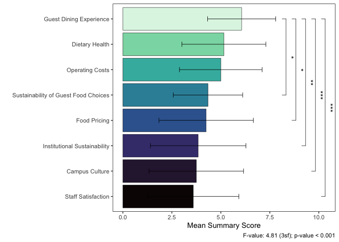<!-- -->
need to put anova value in caption - could also consider boxplot/violin
plot

``` r
summary_score_plot <- score_frequencies %>%
  ggplot(aes(x=fct_reorder(indicator,score,.fun="mean"),y=score,fill=fct_reorder(indicator,score,.fun="mean"),color=fct_reorder(indicator,score,.fun="mean"))) + 
  geom_boxplot(outlier.shape=NA,color="black",size=0.2,alpha=0.8) +
   stat_summary(fun.y=mean,geom="point",shape=20,size=2,color="black",fill="white") +
  geom_signif(comparisons=list(c("Guest Dining Experience","Staff Satisfaction")),color="black",size=0.25,annotation="***",y_position=10) +
  geom_signif(comparisons=list(c("Guest Dining Experience","Campus Culture")),color="black",size=0.25,annotation="***",y_position=9.5) +
  geom_signif(comparisons=list(c("Guest Dining Experience","Institutional Sustainability")),color="black",size=0.25,annotation="**",y_position=9) +
  geom_signif(comparisons=list(c("Guest Dining Experience","Food Pricing")),color="black",size=0.25,annotation="*",y_position=8.5) +
  geom_signif(comparisons=list(c("Guest Dining Experience","Sustainability of Guest Food Choices")),color="black",size=0.25,annotation="*",y_position=8) +
  scale_fill_viridis_d(option="mako") +
  scale_color_viridis_d(option="mako",alpha=1) +
  xlab("") + 
  ylab("Mean Summary Score") + 
  labs(caption="F-value: 4.81 (3sf); p-value < 0.001") + 
  coord_flip() +
  theme(aspect.ratio=0.8,legend.position="none",panel.grid=element_blank(),panel.background=element_rect(fill="white"),panel.border=element_rect(fill=NA),legend.title=element_text(size=10),legend.text=element_text(size=10),plot.title=element_text(size=10))
```

percent time each was ranked first

``` r
score_frequencies %>%
  group_by(indicator) %>%
  summarise(mean_score=mean(score),sd_score=sd(score)) %>%
  arrange(desc(mean_score)) 
```

    ## # A tibble: 8 × 3
    ##   indicator                            mean_score sd_score
    ##   <chr>                                     <dbl>    <dbl>
    ## 1 Guest Dining Experience                    6.06     1.74
    ## 2 Dietary Health                             5.16     2.14
    ## 3 Operating Costs                            5        2.11
    ## 4 Sustainability of Guest Food Choices       4.34     1.77
    ## 5 Food Pricing                               4.25     2.41
    ## 6 Institutional Sustainability               3.84     2.44
    ## 7 Campus Culture                             3.75     2.41
    ## 8 Staff Satisfaction                         3.59     2.33

``` r
first_choice_frequencies <- score_frequencies %>%
  mutate(first_choice=case_when(indicator=="Guest Dining Experience"&score==8~1,
                                indicator=="Dietary Health"&score==8~1,
                                indicator=="Operating Costs"&score==8~1,
                                indicator=="Sustainability of Guest Food Choices"&score==8~1,
                                indicator=="Food Pricing"&score==8~1,
                                indicator=="Institutional Sustainability"&score==8~1,
                                indicator=="Campus Culture"&score==8~1,
                                indicator=="Staff Satisfaction"&score==8~1)) %>%
  mutate(first_choice=ifelse(is.na(first_choice),0,first_choice)) %>%
  group_by(indicator) %>%
  summarise(first_choice_frequency=sum(first_choice)) %>%
  arrange(desc(first_choice_frequency))
first_choice_frequencies
```

    ## # A tibble: 8 × 2
    ##   indicator                            first_choice_frequency
    ##   <chr>                                                 <dbl>
    ## 1 Guest Dining Experience                                   9
    ## 2 Dietary Health                                            5
    ## 3 Institutional Sustainability                              5
    ## 4 Campus Culture                                            4
    ## 5 Operating Costs                                           4
    ## 6 Food Pricing                                              3
    ## 7 Staff Satisfaction                                        2
    ## 8 Sustainability of Guest Food Choices                      0

``` r
first_choice_contingency_table <- first_choice_frequencies %>%
  rename(Initial=first_choice_frequency) %>%
  mutate(Noninitial=32-Initial)
first_choice_contingency_table
```

    ## # A tibble: 8 × 3
    ##   indicator                            Initial Noninitial
    ##   <chr>                                  <dbl>      <dbl>
    ## 1 Guest Dining Experience                    9         23
    ## 2 Dietary Health                             5         27
    ## 3 Institutional Sustainability               5         27
    ## 4 Campus Culture                             4         28
    ## 5 Operating Costs                            4         28
    ## 6 Food Pricing                               3         29
    ## 7 Staff Satisfaction                         2         30
    ## 8 Sustainability of Guest Food Choices       0         32

``` r
first_choice_contingency_table <- as.table(rbind(c(9,5,5,4,4,3,2,0),c(23,27,27,28,28,29,30,32)))
dimnames(first_choice_contingency_table) <- list(dichotomy=c("Initial","Noninitial"),
                                                 indicators=c("Guest Dining Experience","Dietary Health","Institutional Sustainability","Campus Culture","Operating Costs","Food Pricing","Staff Satisfaction","Sustainability of Guest Food Choices"))
first_choice_chisq_test <- chisq.test(first_choice_contingency_table)
```

    ## Warning in chisq.test(first_choice_contingency_table): Chi-squared
    ## approximation may be incorrect

``` r
print(first_choice_chisq_test)
```

    ## 
    ##  Pearson's Chi-squared test
    ## 
    ## data:  first_choice_contingency_table
    ## X-squared = 13.714, df = 7, p-value = 0.0565

No significant association between the type of indicator and its
likelihood of being ranked first

``` r
first_choice_observed_counts <- first_choice_chisq_test$observed
print(first_choice_chisq_test)
```

    ## 
    ##  Pearson's Chi-squared test
    ## 
    ## data:  first_choice_contingency_table
    ## X-squared = 13.714, df = 7, p-value = 0.0565

``` r
first_choice_expected_counts <- first_choice_chisq_test$expected
print(round(first_choice_expected_counts,2))
```

    ##             indicators
    ## dichotomy    Guest Dining Experience Dietary Health
    ##   Initial                          4              4
    ##   Noninitial                      28             28
    ##             indicators
    ## dichotomy    Institutional Sustainability Campus Culture Operating Costs
    ##   Initial                               4              4               4
    ##   Noninitial                           28             28              28
    ##             indicators
    ## dichotomy    Food Pricing Staff Satisfaction
    ##   Initial               4                  4
    ##   Noninitial           28                 28
    ##             indicators
    ## dichotomy    Sustainability of Guest Food Choices
    ##   Initial                                       4
    ##   Noninitial                                   28

``` r
first_choice_pearson_residuals <- first_choice_chisq_test$residuals
print(round(first_choice_pearson_residuals,2))
```

    ##             indicators
    ## dichotomy    Guest Dining Experience Dietary Health
    ##   Initial                       2.50           0.50
    ##   Noninitial                   -0.94          -0.19
    ##             indicators
    ## dichotomy    Institutional Sustainability Campus Culture Operating Costs
    ##   Initial                            0.50           0.00            0.00
    ##   Noninitial                        -0.19           0.00            0.00
    ##             indicators
    ## dichotomy    Food Pricing Staff Satisfaction
    ##   Initial           -0.50              -1.00
    ##   Noninitial         0.19               0.38
    ##             indicators
    ## dichotomy    Sustainability of Guest Food Choices
    ##   Initial                                   -2.00
    ##   Noninitial                                 0.76

``` r
first_choice_contributions <- (first_choice_observed_counts-first_choice_expected_counts)^2/first_choice_expected_counts
first_choice_total_chi_square <- first_choice_chisq_test$statistic
first_choice_percentage_contributions <- 100*first_choice_contributions/first_choice_total_chi_square
print("Percentage Contributions:")
```

    ## [1] "Percentage Contributions:"

``` r
print(round(first_choice_percentage_contributions,2))
```

    ##             indicators
    ## dichotomy    Guest Dining Experience Dietary Health
    ##   Initial                      45.57           1.82
    ##   Noninitial                    6.51           0.26
    ##             indicators
    ## dichotomy    Institutional Sustainability Campus Culture Operating Costs
    ##   Initial                            1.82           0.00            0.00
    ##   Noninitial                         0.26           0.00            0.00
    ##             indicators
    ## dichotomy    Food Pricing Staff Satisfaction
    ##   Initial            1.82               7.29
    ##   Noninitial         0.26               1.04
    ##             indicators
    ## dichotomy    Sustainability of Guest Food Choices
    ##   Initial                                   29.17
    ##   Noninitial                                 4.17

``` r
pheatmap(first_choice_percentage_contributions,display_numbers=TRUE,cluster_rows=FALSE,cluster_cols=FALSE,main="Percentage Contributions to Chi-Square Statistic")
```

<!-- -->

``` r
first_choice_contingency_table <- first_choice_frequencies %>%
  rename(Initial=first_choice_frequency) %>%
  mutate(Noninitial=32-Initial) %>%
  pivot_longer(!indicator,names_to="selection",values_to="frequency") %>%
  mutate(contribution=case_when(indicator=="Guest Dining Experience"&selection=="Initial"~45.57,
    indicator=="Guest Dining Experience"&selection=="Noninitial"~6.51,
    indicator=="Dietary Health"&selection=="Initial"~1.82,
    indicator=="Dietary Health"&selection=="Noninitial"~0.26,
    indicator=="Institutional Sustainability"&selection=="Initial"~1.82,
    indicator=="Institutional Sustainability"&selection=="Noninitial"~0.26,
    indicator=="Campus Culture"&selection=="Initial"~0,
    indicator=="Campus Culture"&selection=="Noninitial"~0,
    indicator=="Operating Costs"&selection=="Initial"~0,
    indicator=="Operating Costs"&selection=="Noninitial"~0,
    indicator=="Food Pricing"&selection=="Initial"~1.82,
    indicator=="Food Pricing"&selection=="Noninitial"~0.26,
    indicator=="Staff Satisfaction"&selection=="Initial"~7.29,
    indicator=="Staff Satisfaction"&selection=="Noninitial"~1.04,
    indicator=="Sustainability of Guest Food Choices"&selection=="Initial"~29.17,
    indicator=="Sustainability of Guest Food Choices"&selection=="Noninitial"~4.17)) %>%
  mutate(label_y=case_when(selection=="Initial"~34,
                           selection=="Noninitial"~-2))
first_choice_contingency_table
```

    ## # A tibble: 16 × 5
    ##    indicator                            selection frequency contribution label_y
    ##    <chr>                                <chr>         <dbl>        <dbl>   <dbl>
    ##  1 Guest Dining Experience              Initial           9        45.6       34
    ##  2 Guest Dining Experience              Noniniti…        23         6.51      -2
    ##  3 Dietary Health                       Initial           5         1.82      34
    ##  4 Dietary Health                       Noniniti…        27         0.26      -2
    ##  5 Institutional Sustainability         Initial           5         1.82      34
    ##  6 Institutional Sustainability         Noniniti…        27         0.26      -2
    ##  7 Campus Culture                       Initial           4         0         34
    ##  8 Campus Culture                       Noniniti…        28         0         -2
    ##  9 Operating Costs                      Initial           4         0         34
    ## 10 Operating Costs                      Noniniti…        28         0         -2
    ## 11 Food Pricing                         Initial           3         1.82      34
    ## 12 Food Pricing                         Noniniti…        29         0.26      -2
    ## 13 Staff Satisfaction                   Initial           2         7.29      34
    ## 14 Staff Satisfaction                   Noniniti…        30         1.04      -2
    ## 15 Sustainability of Guest Food Choices Initial           0        29.2       34
    ## 16 Sustainability of Guest Food Choices Noniniti…        32         4.17      -2

``` r
first_choice_frequency_plot <- ggplot(first_choice_contingency_table[order(first_choice_contingency_table$selection,decreasing=T),],aes(x=indicator,y=frequency,fill=factor(selection,levels=c("Noninitial","Initial")),color=factor(selection,levels=c("Noninitial","Initial")))) + 
  geom_col(color="black",size=0.2,alpha=0.9) + 
  geom_text(aes(y=label_y,label=paste(format(contribution,nsmall=2),"%")),color="black",size=3) +
  geom_signif(comparisons=list(c("Guest Dining Experience","Sustainability of Guest Food Choices")),color="black",size=0.25,annotation="n.s.",y_position=34,tip_length=0.02,vjust=0) +
  xlab("Accessory Indicator") +
  ylab("Frequency") +
  scale_fill_manual(values=c("slateblue4","aquamarine3")) +
  scale_color_manual(values=c("slateblue4","aquamarine3")) +
  scale_x_discrete(limits=c("Sustainability of Guest Food Choices","Staff Satisfaction","Food Pricing","Operating Costs","Campus Culture","Institutional Sustainability","Dietary Health","Guest Dining Experience")) +
  scale_y_continuous(breaks=c(0,8,16,24,32)) +
  guides(fill=guide_legend(title="Mode"),color=guide_legend(title="Mode")) +
  labs(caption="X-squared: 13.7 (3sf); p-value = 0.056") + 
  theme(aspect.ratio=0.4,legend.position="right",panel.grid=element_blank(),panel.background=element_rect(fill="white"),panel.border=element_rect(fill=NA),legend.title=element_text(size=10),legend.text=element_text(size=10),plot.title=element_text(size=10))
```

``` r
score_frequencies %>%
  ggplot(aes(x=fct_reorder(indicator,score,.fun="mean"),y=score,fill=fct_reorder(indicator,score,.fun="mean"),color=fct_reorder(indicator,score,.fun="mean"))) + 
  geom_violin(draw_quantiles=0.5,adjust=1,alpha=0.7,size=0.2,color="black") +
  geom_jitter(width=0.33,size=2,shape=21,alpha=0.5) +
   stat_summary(fun.y=mean,geom="point",shape=20,size=2,color="black",fill="white") +
  geom_signif(comparisons=list(c("Guest Dining Experience","Staff Satisfaction")),color="black",size=0.25,annotation="***",y_position=10) +
  geom_signif(comparisons=list(c("Guest Dining Experience","Campus Culture")),color="black",size=0.25,annotation="***",y_position=9.5) +
  geom_signif(comparisons=list(c("Guest Dining Experience","Institutional Sustainability")),color="black",size=0.25,annotation="**",y_position=9) +
  geom_signif(comparisons=list(c("Guest Dining Experience","Food Pricing")),color="black",size=0.25,annotation="*",y_position=8.5) +
  geom_signif(comparisons=list(c("Guest Dining Experience","Sustainability of Guest Food Choices")),color="black",size=0.25,annotation="*",y_position=8) +
  scale_fill_viridis_d(option="mako") +
  scale_color_viridis_d(option="mako",alpha=1) +
  xlab("") + 
  ylab("Mean Summary Score") + 
  labs(caption="F-value: 4.81 (3sf); p-value < 0.001") + 
  coord_flip() +
  theme(aspect.ratio=0.8,legend.position="none",panel.grid=element_blank(),panel.background=element_rect(fill="white"),panel.border=element_rect(fill=NA),legend.title=element_text(size=10),legend.text=element_text(size=10),plot.title=element_text(size=10))
```

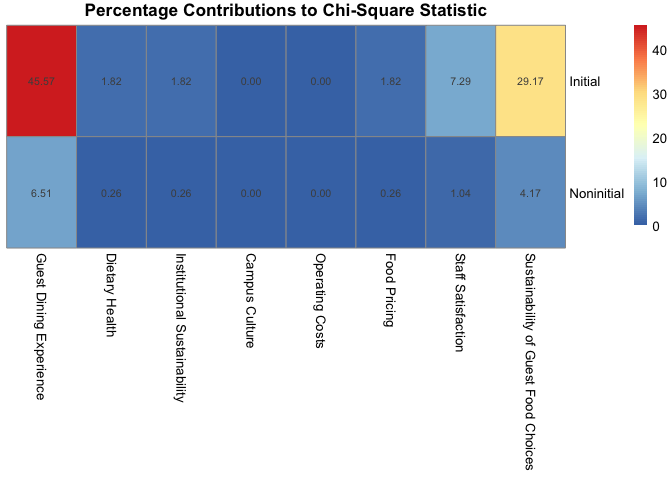<!-- -->

``` r
preliminary_indicator_rankings <- 
ggarrange(first_choice_frequency_plot,summary_score_plot,
          nrow=2,
          labels=c("A","B"))
ggsave(filename="preliminary_indicator_rankings.png",plot=preliminary_indicator_rankings,path="/Users/kenjinchang/github/stakeholder-analysis/figures",width=38,height=30,units="cm",dpi=150,limitsize=TRUE)
preliminary_indicator_rankings
```

<!-- -->

``` r
priority_score_frequencies <- tibble(comparison_indicator=c("Guest Dining Experience","Dietary Health","Operating Costs","Sustainability of Guest Food Choices","Food Pricing","Institutional Sustainability","Campus Culture","Staff Satisfaction"),guest_dining_experience_selection_frequency=as.double(NA),dietary_health_selection_frequency=as.double(NA),operating_costs_selection_frequency=as.double(NA),dietary_sustainability_selection_frequency=as.double(NA),food_pricing_selection_frequency=as.double(NA),institutional_sustainability_selection_frequency=as.double(NA),campus_culture_selection_frequency=as.double(NA),staff_satisfaction_selection_frequency=as.double(NA))
priority_score_frequencies
```

    ## # A tibble: 8 × 9
    ##   comparison_indicator             guest_dining_experie…¹ dietary_health_selec…²
    ##   <chr>                                             <dbl>                  <dbl>
    ## 1 Guest Dining Experience                              NA                     NA
    ## 2 Dietary Health                                       NA                     NA
    ## 3 Operating Costs                                      NA                     NA
    ## 4 Sustainability of Guest Food Ch…                     NA                     NA
    ## 5 Food Pricing                                         NA                     NA
    ## 6 Institutional Sustainability                         NA                     NA
    ## 7 Campus Culture                                       NA                     NA
    ## 8 Staff Satisfaction                                   NA                     NA
    ## # ℹ abbreviated names: ¹​guest_dining_experience_selection_frequency,
    ## #   ²​dietary_health_selection_frequency
    ## # ℹ 6 more variables: operating_costs_selection_frequency <dbl>,
    ## #   dietary_sustainability_selection_frequency <dbl>,
    ## #   food_pricing_selection_frequency <dbl>,
    ## #   institutional_sustainability_selection_frequency <dbl>,
    ## #   campus_culture_selection_frequency <dbl>, …

``` r
priority_score_tabulation <- survey_data %>%
  select(id,dietary_health_ranking,dietary_sustainability_ranking,institutional_sustainability_ranking,food_pricing_ranking,operating_costs_ranking,guest_experience_ranking,staff_satisfaction_ranking,campus_culture_ranking)
```

``` r
guest_experience_priority_score_tabulation <- priority_score_tabulation %>%
  mutate(guest_experience_over_guest_experience=0) %>%
  mutate(guest_experience_over_dietary_health=case_when(guest_experience_ranking<dietary_health_ranking~1,
                                                        guest_experience_ranking>dietary_health_ranking~0)) %>%
  mutate(guest_experience_over_operating_costs=case_when(guest_experience_ranking<operating_costs_ranking~1,
                                                        guest_experience_ranking>operating_costs_ranking~0)) %>%
  mutate(guest_experience_over_dietary_sustainability=case_when(guest_experience_ranking<dietary_sustainability_ranking~1,
                                                        guest_experience_ranking>dietary_sustainability_ranking~0)) %>%
  mutate(guest_experience_over_food_pricing=case_when(guest_experience_ranking<food_pricing_ranking~1,
                                                        guest_experience_ranking>food_pricing_ranking~0)) %>%
   mutate(guest_experience_over_institutional_sustainability=case_when(guest_experience_ranking<institutional_sustainability_ranking~1,
                                                        guest_experience_ranking>institutional_sustainability_ranking~0)) %>%
  mutate(guest_experience_over_campus_culture=case_when(guest_experience_ranking<campus_culture_ranking~1,
                                                        guest_experience_ranking>campus_culture_ranking~0)) %>%
  mutate(guest_experience_over_staff_satisfaction=case_when(guest_experience_ranking<staff_satisfaction_ranking~1,
                                                        guest_experience_ranking>staff_satisfaction_ranking~0)) %>%
  select(id,guest_experience_over_dietary_health,guest_experience_over_operating_costs,guest_experience_over_dietary_sustainability,guest_experience_over_food_pricing,guest_experience_over_institutional_sustainability,guest_experience_over_campus_culture,guest_experience_over_staff_satisfaction,guest_experience_over_guest_experience) %>%
  pivot_longer(!id,names_to="condition",values_to="frequency") %>%
  group_by(condition) %>%
  summarise(instances=sum(frequency))
guest_experience_priority_score_tabulation
```

    ## # A tibble: 8 × 2
    ##   condition                                          instances
    ##   <chr>                                                  <dbl>
    ## 1 guest_experience_over_campus_culture                      25
    ## 2 guest_experience_over_dietary_health                      20
    ## 3 guest_experience_over_dietary_sustainability              24
    ## 4 guest_experience_over_food_pricing                        22
    ## 5 guest_experience_over_guest_experience                     0
    ## 6 guest_experience_over_institutional_sustainability        25
    ## 7 guest_experience_over_operating_costs                     21
    ## 8 guest_experience_over_staff_satisfaction                  25

``` r
priority_score_frequencies <- priority_score_frequencies %>%
  mutate(guest_dining_experience_selection_frequency=c(0,20,21,24,22,25,25,25))
priority_score_frequencies
```

    ## # A tibble: 8 × 9
    ##   comparison_indicator             guest_dining_experie…¹ dietary_health_selec…²
    ##   <chr>                                             <dbl>                  <dbl>
    ## 1 Guest Dining Experience                               0                     NA
    ## 2 Dietary Health                                       20                     NA
    ## 3 Operating Costs                                      21                     NA
    ## 4 Sustainability of Guest Food Ch…                     24                     NA
    ## 5 Food Pricing                                         22                     NA
    ## 6 Institutional Sustainability                         25                     NA
    ## 7 Campus Culture                                       25                     NA
    ## 8 Staff Satisfaction                                   25                     NA
    ## # ℹ abbreviated names: ¹​guest_dining_experience_selection_frequency,
    ## #   ²​dietary_health_selection_frequency
    ## # ℹ 6 more variables: operating_costs_selection_frequency <dbl>,
    ## #   dietary_sustainability_selection_frequency <dbl>,
    ## #   food_pricing_selection_frequency <dbl>,
    ## #   institutional_sustainability_selection_frequency <dbl>,
    ## #   campus_culture_selection_frequency <dbl>, …

``` r
dietary_health_priority_score_tabulation <- priority_score_tabulation %>%
  mutate(dietary_health_over_guest_experience=case_when(dietary_health_ranking<guest_experience_ranking~1,
                                                        dietary_health_ranking>guest_experience_ranking~0)) %>%
  mutate(dietary_health_over_dietary_health=0) %>%
  mutate(dietary_health_over_operating_costs=case_when(dietary_health_ranking<operating_costs_ranking~1,
                                                        dietary_health_ranking>operating_costs_ranking~0)) %>%
  mutate(dietary_health_over_dietary_sustainability=case_when(dietary_health_ranking<dietary_sustainability_ranking~1,
                                                        dietary_health_ranking>dietary_sustainability_ranking~0)) %>%
  mutate(dietary_health_over_food_pricing=case_when(dietary_health_ranking<food_pricing_ranking~1,
                                                        dietary_health_ranking>food_pricing_ranking~0)) %>%
  mutate(dietary_health_over_institutional_sustainability=case_when(dietary_health_ranking<institutional_sustainability_ranking~1,
                                                        dietary_health_ranking>institutional_sustainability_ranking~0)) %>%
  mutate(dietary_health_over_campus_culture=case_when(dietary_health_ranking<campus_culture_ranking~1,
                                                        dietary_health_ranking>campus_culture_ranking~0)) %>%
  mutate(dietary_health_over_staff_satisfaction=case_when(dietary_health_ranking<staff_satisfaction_ranking~1,
                                                        dietary_health_ranking>staff_satisfaction_ranking~0)) %>%
  select(id,dietary_health_over_guest_experience,dietary_health_over_dietary_health,dietary_health_over_operating_costs,dietary_health_over_dietary_sustainability,dietary_health_over_food_pricing,dietary_health_over_institutional_sustainability,dietary_health_over_campus_culture,dietary_health_over_staff_satisfaction) %>%
  pivot_longer(!id,names_to="condition",values_to="instances") %>%
  group_by(condition) %>%
  summarise(instances=sum(instances))
dietary_health_priority_score_tabulation
```

    ## # A tibble: 8 × 2
    ##   condition                                        instances
    ##   <chr>                                                <dbl>
    ## 1 dietary_health_over_campus_culture                      21
    ## 2 dietary_health_over_dietary_health                       0
    ## 3 dietary_health_over_dietary_sustainability              22
    ## 4 dietary_health_over_food_pricing                        19
    ## 5 dietary_health_over_guest_experience                    12
    ## 6 dietary_health_over_institutional_sustainability        19
    ## 7 dietary_health_over_operating_costs                     17
    ## 8 dietary_health_over_staff_satisfaction                  23

``` r
priority_score_frequencies <- priority_score_frequencies %>%
  mutate(dietary_health_selection_frequency=c(12,0,17,22,19,19,21,23))
priority_score_frequencies
```

    ## # A tibble: 8 × 9
    ##   comparison_indicator             guest_dining_experie…¹ dietary_health_selec…²
    ##   <chr>                                             <dbl>                  <dbl>
    ## 1 Guest Dining Experience                               0                     12
    ## 2 Dietary Health                                       20                      0
    ## 3 Operating Costs                                      21                     17
    ## 4 Sustainability of Guest Food Ch…                     24                     22
    ## 5 Food Pricing                                         22                     19
    ## 6 Institutional Sustainability                         25                     19
    ## 7 Campus Culture                                       25                     21
    ## 8 Staff Satisfaction                                   25                     23
    ## # ℹ abbreviated names: ¹​guest_dining_experience_selection_frequency,
    ## #   ²​dietary_health_selection_frequency
    ## # ℹ 6 more variables: operating_costs_selection_frequency <dbl>,
    ## #   dietary_sustainability_selection_frequency <dbl>,
    ## #   food_pricing_selection_frequency <dbl>,
    ## #   institutional_sustainability_selection_frequency <dbl>,
    ## #   campus_culture_selection_frequency <dbl>, …

``` r
operating_costs_priority_score_tabulation <- priority_score_tabulation %>%
  mutate(operating_costs_over_guest_experience=case_when(operating_costs_ranking<guest_experience_ranking~1,
                                                        operating_costs_ranking>guest_experience_ranking~0)) %>%
  mutate(operating_costs_over_dietary_health=case_when(operating_costs_ranking<dietary_health_ranking~1,
                                                        operating_costs_ranking>dietary_health_ranking~0)) %>%
  mutate(operating_costs_over_operating_costs=0) %>%
  mutate(operating_costs_over_dietary_sustainability=case_when(operating_costs_ranking<dietary_sustainability_ranking~1,
                                                        operating_costs_ranking>dietary_sustainability_ranking~0)) %>%
  mutate(operating_costs_over_food_pricing=case_when(operating_costs_ranking<food_pricing_ranking~1,
                                                        operating_costs_ranking>food_pricing_ranking~0)) %>%
  mutate(operating_costs_over_institutional_sustainability=case_when(operating_costs_ranking<institutional_sustainability_ranking~1,
                                                        operating_costs_ranking>institutional_sustainability_ranking~0)) %>%
  mutate(operating_costs_over_campus_culture=case_when(operating_costs_ranking<campus_culture_ranking~1,
                                                        operating_costs_ranking>campus_culture_ranking~0)) %>%
  mutate(operating_costs_over_staff_satisfaction=case_when(operating_costs_ranking<staff_satisfaction_ranking~1,
                                                        operating_costs_ranking>staff_satisfaction_ranking~0)) %>%
  select(id,operating_costs_over_guest_experience,operating_costs_over_dietary_health,operating_costs_over_operating_costs,operating_costs_over_dietary_sustainability,operating_costs_over_food_pricing,operating_costs_over_institutional_sustainability,operating_costs_over_campus_culture,operating_costs_over_staff_satisfaction) %>%
  pivot_longer(!id,names_to="condition",values_to="instances") %>%
  group_by(condition) %>%
  summarise(instances=sum(instances))
operating_costs_priority_score_tabulation
```

    ## # A tibble: 8 × 2
    ##   condition                                         instances
    ##   <chr>                                                 <dbl>
    ## 1 operating_costs_over_campus_culture                      20
    ## 2 operating_costs_over_dietary_health                      15
    ## 3 operating_costs_over_dietary_sustainability              18
    ## 4 operating_costs_over_food_pricing                        21
    ## 5 operating_costs_over_guest_experience                    11
    ## 6 operating_costs_over_institutional_sustainability        22
    ## 7 operating_costs_over_operating_costs                      0
    ## 8 operating_costs_over_staff_satisfaction                  21

``` r
priority_score_frequencies <- priority_score_frequencies %>%
  mutate(operating_costs_selection_frequency=c(11,15,0,18,21,22,20,21))
priority_score_frequencies
```

    ## # A tibble: 8 × 9
    ##   comparison_indicator             guest_dining_experie…¹ dietary_health_selec…²
    ##   <chr>                                             <dbl>                  <dbl>
    ## 1 Guest Dining Experience                               0                     12
    ## 2 Dietary Health                                       20                      0
    ## 3 Operating Costs                                      21                     17
    ## 4 Sustainability of Guest Food Ch…                     24                     22
    ## 5 Food Pricing                                         22                     19
    ## 6 Institutional Sustainability                         25                     19
    ## 7 Campus Culture                                       25                     21
    ## 8 Staff Satisfaction                                   25                     23
    ## # ℹ abbreviated names: ¹​guest_dining_experience_selection_frequency,
    ## #   ²​dietary_health_selection_frequency
    ## # ℹ 6 more variables: operating_costs_selection_frequency <dbl>,
    ## #   dietary_sustainability_selection_frequency <dbl>,
    ## #   food_pricing_selection_frequency <dbl>,
    ## #   institutional_sustainability_selection_frequency <dbl>,
    ## #   campus_culture_selection_frequency <dbl>, …

``` r
dietary_sustainability_priority_score_tabulation <- priority_score_tabulation %>%
  mutate(dietary_sustainability_over_guest_experience=case_when(dietary_sustainability_ranking<guest_experience_ranking~1,
                                                        dietary_sustainability_ranking>guest_experience_ranking~0)) %>%
  mutate(dietary_sustainability_over_dietary_health=case_when(dietary_sustainability_ranking<dietary_health_ranking~1,
                                                        dietary_sustainability_ranking>dietary_health_ranking~0)) %>%
  mutate(dietary_sustainability_over_operating_costs=case_when(dietary_sustainability_ranking<operating_costs_ranking~1,
                                                        dietary_sustainability_ranking>operating_costs_ranking~0)) %>%
  mutate(dietary_sustainability_over_dietary_sustainability=0) %>%
  mutate(dietary_sustainability_over_food_pricing=case_when(dietary_sustainability_ranking<food_pricing_ranking~1,
                                                        dietary_sustainability_ranking>food_pricing_ranking~0)) %>%
  mutate(dietary_sustainability_over_institutional_sustainability=case_when(dietary_sustainability_ranking<institutional_sustainability_ranking~1,
                                                        dietary_sustainability_ranking>institutional_sustainability_ranking~0)) %>%
  mutate(dietary_sustainability_over_campus_culture=case_when(dietary_sustainability_ranking<campus_culture_ranking~1,
                                                        dietary_sustainability_ranking>campus_culture_ranking~0)) %>%
  mutate(dietary_sustainability_over_staff_satisfaction=case_when(dietary_sustainability_ranking<staff_satisfaction_ranking~1,
                                                        dietary_sustainability_ranking>staff_satisfaction_ranking~0)) %>%
  select(id,dietary_sustainability_over_guest_experience,dietary_sustainability_over_dietary_health,dietary_sustainability_over_operating_costs,dietary_sustainability_over_dietary_sustainability,dietary_sustainability_over_food_pricing,dietary_sustainability_over_institutional_sustainability,dietary_sustainability_over_campus_culture,dietary_sustainability_over_staff_satisfaction) %>%
  pivot_longer(!id,names_to="condition",values_to="instances") %>%
  group_by(condition) %>%
  summarise(instances=sum(instances))
dietary_sustainability_priority_score_tabulation
```

    ## # A tibble: 8 × 2
    ##   condition                                                instances
    ##   <chr>                                                        <dbl>
    ## 1 dietary_sustainability_over_campus_culture                      21
    ## 2 dietary_sustainability_over_dietary_health                      10
    ## 3 dietary_sustainability_over_dietary_sustainability               0
    ## 4 dietary_sustainability_over_food_pricing                        17
    ## 5 dietary_sustainability_over_guest_experience                     8
    ## 6 dietary_sustainability_over_institutional_sustainability        17
    ## 7 dietary_sustainability_over_operating_costs                     14
    ## 8 dietary_sustainability_over_staff_satisfaction                  20

``` r
priority_score_frequencies <- priority_score_frequencies %>%
  mutate(dietary_sustainability_selection_frequency=c(8,10,14,0,17,17,21,20)) 
priority_score_frequencies
```

    ## # A tibble: 8 × 9
    ##   comparison_indicator             guest_dining_experie…¹ dietary_health_selec…²
    ##   <chr>                                             <dbl>                  <dbl>
    ## 1 Guest Dining Experience                               0                     12
    ## 2 Dietary Health                                       20                      0
    ## 3 Operating Costs                                      21                     17
    ## 4 Sustainability of Guest Food Ch…                     24                     22
    ## 5 Food Pricing                                         22                     19
    ## 6 Institutional Sustainability                         25                     19
    ## 7 Campus Culture                                       25                     21
    ## 8 Staff Satisfaction                                   25                     23
    ## # ℹ abbreviated names: ¹​guest_dining_experience_selection_frequency,
    ## #   ²​dietary_health_selection_frequency
    ## # ℹ 6 more variables: operating_costs_selection_frequency <dbl>,
    ## #   dietary_sustainability_selection_frequency <dbl>,
    ## #   food_pricing_selection_frequency <dbl>,
    ## #   institutional_sustainability_selection_frequency <dbl>,
    ## #   campus_culture_selection_frequency <dbl>, …

``` r
food_pricing_priority_score_tabulation <- priority_score_tabulation %>%
  mutate(food_pricing_over_guest_experience=case_when(food_pricing_ranking<guest_experience_ranking~1,
                                                        food_pricing_ranking>guest_experience_ranking~0)) %>%
  mutate(food_pricing_over_dietary_health=case_when(food_pricing_ranking<dietary_health_ranking~1,
                                                        food_pricing_ranking>dietary_health_ranking~0)) %>%
  mutate(food_pricing_over_operating_costs=case_when(food_pricing_ranking<operating_costs_ranking~1,
                                                        food_pricing_ranking>operating_costs_ranking~0)) %>%
  mutate(food_pricing_over_dietary_sustainability=case_when(food_pricing_ranking<dietary_sustainability_ranking~1,
                                                        food_pricing_ranking>dietary_sustainability_ranking~0)) %>%
  mutate(food_pricing_over_food_pricing=0) %>%
  mutate(food_pricing_over_institutional_sustainability=case_when(food_pricing_ranking<institutional_sustainability_ranking~1,
                                                        food_pricing_ranking>institutional_sustainability_ranking~0)) %>%
  mutate(food_pricing_over_campus_culture=case_when(food_pricing_ranking<campus_culture_ranking~1,
                                                        food_pricing_ranking>campus_culture_ranking~0)) %>%
  mutate(food_pricing_over_staff_satisfaction=case_when(food_pricing_ranking<staff_satisfaction_ranking~1,
                                                        food_pricing_ranking>staff_satisfaction_ranking~0)) %>%
  select(id,food_pricing_over_guest_experience,food_pricing_over_dietary_health,food_pricing_over_operating_costs,food_pricing_over_dietary_sustainability,food_pricing_over_food_pricing,food_pricing_over_institutional_sustainability,food_pricing_over_campus_culture,food_pricing_over_staff_satisfaction) %>%
  pivot_longer(!id,names_to="condition",values_to="instances") %>%
  group_by(condition) %>%
  summarise(instances=sum(instances))
food_pricing_priority_score_tabulation
```

    ## # A tibble: 8 × 2
    ##   condition                                      instances
    ##   <chr>                                              <dbl>
    ## 1 food_pricing_over_campus_culture                      18
    ## 2 food_pricing_over_dietary_health                      13
    ## 3 food_pricing_over_dietary_sustainability              15
    ## 4 food_pricing_over_food_pricing                         0
    ## 5 food_pricing_over_guest_experience                    10
    ## 6 food_pricing_over_institutional_sustainability        17
    ## 7 food_pricing_over_operating_costs                     11
    ## 8 food_pricing_over_staff_satisfaction                  20

``` r
priority_score_frequencies <- priority_score_frequencies %>%
  mutate(food_pricing_selection_frequency=c(10,13,11,15,0,17,18,20))
priority_score_frequencies
```

    ## # A tibble: 8 × 9
    ##   comparison_indicator             guest_dining_experie…¹ dietary_health_selec…²
    ##   <chr>                                             <dbl>                  <dbl>
    ## 1 Guest Dining Experience                               0                     12
    ## 2 Dietary Health                                       20                      0
    ## 3 Operating Costs                                      21                     17
    ## 4 Sustainability of Guest Food Ch…                     24                     22
    ## 5 Food Pricing                                         22                     19
    ## 6 Institutional Sustainability                         25                     19
    ## 7 Campus Culture                                       25                     21
    ## 8 Staff Satisfaction                                   25                     23
    ## # ℹ abbreviated names: ¹​guest_dining_experience_selection_frequency,
    ## #   ²​dietary_health_selection_frequency
    ## # ℹ 6 more variables: operating_costs_selection_frequency <dbl>,
    ## #   dietary_sustainability_selection_frequency <dbl>,
    ## #   food_pricing_selection_frequency <dbl>,
    ## #   institutional_sustainability_selection_frequency <dbl>,
    ## #   campus_culture_selection_frequency <dbl>, …

``` r
institutional_sustainability_priority_score_tabulation <- priority_score_tabulation %>%
  mutate(institutional_sustainability_over_guest_experience=case_when(institutional_sustainability_ranking<guest_experience_ranking~1,
                                                        institutional_sustainability_ranking>guest_experience_ranking~0)) %>%
  mutate(institutional_sustainability_over_dietary_health=case_when(institutional_sustainability_ranking<dietary_health_ranking~1,
                                                        institutional_sustainability_ranking>dietary_health_ranking~0)) %>%
  mutate(institutional_sustainability_over_operating_costs=case_when(institutional_sustainability_ranking<operating_costs_ranking~1,
                                                        institutional_sustainability_ranking>operating_costs_ranking~0)) %>%
  mutate(institutional_sustainability_over_dietary_sustainability=case_when(institutional_sustainability_ranking<dietary_sustainability_ranking~1,
                                                        institutional_sustainability_ranking>dietary_sustainability_ranking~0)) %>%
  mutate(institutional_sustainability_over_food_pricing=case_when(institutional_sustainability_ranking<food_pricing_ranking~1,
                                                        institutional_sustainability_ranking>food_pricing_ranking~0)) %>%
  mutate(institutional_sustainability_over_institutional_sustainability=0) %>%
  mutate(institutional_sustainability_over_campus_culture=case_when(institutional_sustainability_ranking<campus_culture_ranking~1,
                                                        institutional_sustainability_ranking>campus_culture_ranking~0)) %>%
  mutate(institutional_sustainability_over_staff_satisfaction=case_when(institutional_sustainability_ranking<staff_satisfaction_ranking~1,
                                                        institutional_sustainability_ranking>staff_satisfaction_ranking~0)) %>%
  select(id,institutional_sustainability_over_guest_experience,institutional_sustainability_over_dietary_health,institutional_sustainability_over_operating_costs,institutional_sustainability_over_dietary_sustainability,institutional_sustainability_over_food_pricing,institutional_sustainability_over_institutional_sustainability,institutional_sustainability_over_campus_culture,institutional_sustainability_over_staff_satisfaction) %>%
  pivot_longer(!id,names_to="condition",values_to="instances") %>%
  group_by(condition) %>%
  summarise(instances=sum(instances))
institutional_sustainability_priority_score_tabulation
```

    ## # A tibble: 8 × 2
    ##   condition                                                      instances
    ##   <chr>                                                              <dbl>
    ## 1 institutional_sustainability_over_campus_culture                      15
    ## 2 institutional_sustainability_over_dietary_health                      13
    ## 3 institutional_sustainability_over_dietary_sustainability              15
    ## 4 institutional_sustainability_over_food_pricing                        15
    ## 5 institutional_sustainability_over_guest_experience                     7
    ## 6 institutional_sustainability_over_institutional_sustainability         0
    ## 7 institutional_sustainability_over_operating_costs                     10
    ## 8 institutional_sustainability_over_staff_satisfaction                  16

``` r
priority_score_frequencies <- priority_score_frequencies %>%
  mutate(institutional_sustainability_selection_frequency=c(7,13,10,15,15,0,15,16))
priority_score_frequencies
```

    ## # A tibble: 8 × 9
    ##   comparison_indicator             guest_dining_experie…¹ dietary_health_selec…²
    ##   <chr>                                             <dbl>                  <dbl>
    ## 1 Guest Dining Experience                               0                     12
    ## 2 Dietary Health                                       20                      0
    ## 3 Operating Costs                                      21                     17
    ## 4 Sustainability of Guest Food Ch…                     24                     22
    ## 5 Food Pricing                                         22                     19
    ## 6 Institutional Sustainability                         25                     19
    ## 7 Campus Culture                                       25                     21
    ## 8 Staff Satisfaction                                   25                     23
    ## # ℹ abbreviated names: ¹​guest_dining_experience_selection_frequency,
    ## #   ²​dietary_health_selection_frequency
    ## # ℹ 6 more variables: operating_costs_selection_frequency <dbl>,
    ## #   dietary_sustainability_selection_frequency <dbl>,
    ## #   food_pricing_selection_frequency <dbl>,
    ## #   institutional_sustainability_selection_frequency <dbl>,
    ## #   campus_culture_selection_frequency <dbl>, …

``` r
campus_culture_priority_score_tabulation <- priority_score_tabulation %>%
  mutate(campus_culture_over_guest_experience=case_when(campus_culture_ranking<guest_experience_ranking~1,
                                                        campus_culture_ranking>guest_experience_ranking~0)) %>%
  mutate(campus_culture_over_dietary_health=case_when(campus_culture_ranking<dietary_health_ranking~1,
                                                        campus_culture_ranking>dietary_health_ranking~0)) %>%
  mutate(campus_culture_over_operating_costs=case_when(campus_culture_ranking<operating_costs_ranking~1,
                                                        campus_culture_ranking>operating_costs_ranking~0)) %>%
  mutate(campus_culture_over_dietary_sustainability=case_when(campus_culture_ranking<dietary_sustainability_ranking~1,
                                                        campus_culture_ranking>dietary_sustainability_ranking~0)) %>%
  mutate(campus_culture_over_food_pricing=case_when(campus_culture_ranking<food_pricing_ranking~1,
                                                        campus_culture_ranking>food_pricing_ranking~0)) %>%
  mutate(campus_culture_over_institutional_sustainability=case_when(campus_culture_ranking<institutional_sustainability_ranking~1,
                                                        campus_culture_ranking>institutional_sustainability_ranking~0)) %>%
  mutate(campus_culture_over_campus_culture=0) %>%
  mutate(campus_culture_over_staff_satisfaction=case_when(campus_culture_ranking<staff_satisfaction_ranking~1,
                                                        campus_culture_ranking>staff_satisfaction_ranking~0)) %>%
  select(id,campus_culture_over_guest_experience,campus_culture_over_dietary_health,campus_culture_over_operating_costs,campus_culture_over_dietary_sustainability,campus_culture_over_food_pricing,campus_culture_over_institutional_sustainability,campus_culture_over_campus_culture,campus_culture_over_staff_satisfaction) %>%
  pivot_longer(!id,names_to="condition",values_to="instances") %>%
  group_by(condition) %>%
  summarise(instances=sum(instances))
campus_culture_priority_score_tabulation
```

    ## # A tibble: 8 × 2
    ##   condition                                        instances
    ##   <chr>                                                <dbl>
    ## 1 campus_culture_over_campus_culture                       0
    ## 2 campus_culture_over_dietary_health                      11
    ## 3 campus_culture_over_dietary_sustainability              11
    ## 4 campus_culture_over_food_pricing                        14
    ## 5 campus_culture_over_guest_experience                     7
    ## 6 campus_culture_over_institutional_sustainability        17
    ## 7 campus_culture_over_operating_costs                     12
    ## 8 campus_culture_over_staff_satisfaction                  16

``` r
priority_score_frequencies <- priority_score_frequencies %>%
  mutate(campus_culture_selection_frequency=c(7,11,12,11,14,17,0,16))
priority_score_frequencies
```

    ## # A tibble: 8 × 9
    ##   comparison_indicator             guest_dining_experie…¹ dietary_health_selec…²
    ##   <chr>                                             <dbl>                  <dbl>
    ## 1 Guest Dining Experience                               0                     12
    ## 2 Dietary Health                                       20                      0
    ## 3 Operating Costs                                      21                     17
    ## 4 Sustainability of Guest Food Ch…                     24                     22
    ## 5 Food Pricing                                         22                     19
    ## 6 Institutional Sustainability                         25                     19
    ## 7 Campus Culture                                       25                     21
    ## 8 Staff Satisfaction                                   25                     23
    ## # ℹ abbreviated names: ¹​guest_dining_experience_selection_frequency,
    ## #   ²​dietary_health_selection_frequency
    ## # ℹ 6 more variables: operating_costs_selection_frequency <dbl>,
    ## #   dietary_sustainability_selection_frequency <dbl>,
    ## #   food_pricing_selection_frequency <dbl>,
    ## #   institutional_sustainability_selection_frequency <dbl>,
    ## #   campus_culture_selection_frequency <dbl>, …

``` r
staff_satisfaction_priority_score_tabulation <- priority_score_tabulation %>%
  mutate(staff_satisfaction_over_guest_experience=case_when(staff_satisfaction_ranking<guest_experience_ranking~1,
                                                        staff_satisfaction_ranking>guest_experience_ranking~0)) %>%
  mutate(staff_satisfaction_over_dietary_health=case_when(staff_satisfaction_ranking<dietary_health_ranking~1,
                                                        staff_satisfaction_ranking>dietary_health_ranking~0)) %>%
  mutate(staff_satisfaction_over_operating_costs=case_when(staff_satisfaction_ranking<operating_costs_ranking~1,
                                                        staff_satisfaction_ranking>operating_costs_ranking~0)) %>%
  mutate(staff_satisfaction_over_dietary_sustainability=case_when(staff_satisfaction_ranking<dietary_sustainability_ranking~1,
                                                        staff_satisfaction_ranking>dietary_sustainability_ranking~0)) %>%
  mutate(staff_satisfaction_over_food_pricing=case_when(staff_satisfaction_ranking<food_pricing_ranking~1,
                                                        staff_satisfaction_ranking>food_pricing_ranking~0)) %>%
  mutate(staff_satisfaction_over_institutional_sustainability=case_when(staff_satisfaction_ranking<institutional_sustainability_ranking~1,
                                                        staff_satisfaction_ranking>institutional_sustainability_ranking~0)) %>%
  mutate(staff_satisfaction_over_campus_culture=case_when(staff_satisfaction_ranking<campus_culture_ranking~1,
                                                        staff_satisfaction_ranking>campus_culture_ranking~0)) %>%
  mutate(staff_satisfaction_over_staff_satisfaction=0) %>%
  select(id,staff_satisfaction_over_guest_experience,staff_satisfaction_over_dietary_health,staff_satisfaction_over_operating_costs,staff_satisfaction_over_dietary_sustainability,staff_satisfaction_over_food_pricing,staff_satisfaction_over_institutional_sustainability,staff_satisfaction_over_campus_culture,staff_satisfaction_over_staff_satisfaction) %>%
  pivot_longer(!id,names_to="condition",values_to="instances") %>%
  group_by(condition) %>%
  summarise(instances=sum(instances))
staff_satisfaction_priority_score_tabulation
```

    ## # A tibble: 8 × 2
    ##   condition                                            instances
    ##   <chr>                                                    <dbl>
    ## 1 staff_satisfaction_over_campus_culture                      16
    ## 2 staff_satisfaction_over_dietary_health                       9
    ## 3 staff_satisfaction_over_dietary_sustainability              12
    ## 4 staff_satisfaction_over_food_pricing                        12
    ## 5 staff_satisfaction_over_guest_experience                     7
    ## 6 staff_satisfaction_over_institutional_sustainability        16
    ## 7 staff_satisfaction_over_operating_costs                     11
    ## 8 staff_satisfaction_over_staff_satisfaction                   0

``` r
priority_score_frequencies <- priority_score_frequencies %>%
  mutate(staff_satisfaction_selection_frequency=c(7,9,11,12,12,16,16,0)) 
priority_score_frequencies
```

    ## # A tibble: 8 × 9
    ##   comparison_indicator             guest_dining_experie…¹ dietary_health_selec…²
    ##   <chr>                                             <dbl>                  <dbl>
    ## 1 Guest Dining Experience                               0                     12
    ## 2 Dietary Health                                       20                      0
    ## 3 Operating Costs                                      21                     17
    ## 4 Sustainability of Guest Food Ch…                     24                     22
    ## 5 Food Pricing                                         22                     19
    ## 6 Institutional Sustainability                         25                     19
    ## 7 Campus Culture                                       25                     21
    ## 8 Staff Satisfaction                                   25                     23
    ## # ℹ abbreviated names: ¹​guest_dining_experience_selection_frequency,
    ## #   ²​dietary_health_selection_frequency
    ## # ℹ 6 more variables: operating_costs_selection_frequency <dbl>,
    ## #   dietary_sustainability_selection_frequency <dbl>,
    ## #   food_pricing_selection_frequency <dbl>,
    ## #   institutional_sustainability_selection_frequency <dbl>,
    ## #   campus_culture_selection_frequency <dbl>, …

``` r
priority_score_probabilities <- priority_score_frequencies %>%
  mutate(guest_dining_experience_selection_probability=guest_dining_experience_selection_frequency/32,.after=guest_dining_experience_selection_frequency) %>%
  mutate(dietary_health_selection_probability=dietary_health_selection_frequency/32,.after=dietary_health_selection_frequency) %>%
  mutate(operating_costs_selection_probability=operating_costs_selection_frequency/32,.after=operating_costs_selection_frequency) %>%
   mutate(dietary_sustainability_selection_probability=dietary_sustainability_selection_frequency/32,.after=dietary_sustainability_selection_frequency) %>%
  mutate(food_pricing_selection_probability=food_pricing_selection_frequency/32,.after=food_pricing_selection_frequency) %>%
  mutate(institutional_sustainability_selection_probability=institutional_sustainability_selection_frequency/32,.after=institutional_sustainability_selection_frequency) %>%
  mutate(campus_culture_selection_probability=campus_culture_selection_frequency/32,.after=campus_culture_selection_frequency) %>%
   mutate(staff_satisfaction_selection_probability=staff_satisfaction_selection_frequency/32,.after=staff_satisfaction_selection_frequency)
priority_score_probabilities
```

    ## # A tibble: 8 × 17
    ##   comparison_indicator             guest_dining_experie…¹ guest_dining_experie…²
    ##   <chr>                                             <dbl>                  <dbl>
    ## 1 Guest Dining Experience                               0                  0    
    ## 2 Dietary Health                                       20                  0.625
    ## 3 Operating Costs                                      21                  0.656
    ## 4 Sustainability of Guest Food Ch…                     24                  0.75 
    ## 5 Food Pricing                                         22                  0.688
    ## 6 Institutional Sustainability                         25                  0.781
    ## 7 Campus Culture                                       25                  0.781
    ## 8 Staff Satisfaction                                   25                  0.781
    ## # ℹ abbreviated names: ¹​guest_dining_experience_selection_frequency,
    ## #   ²​guest_dining_experience_selection_probability
    ## # ℹ 14 more variables: dietary_health_selection_frequency <dbl>,
    ## #   dietary_health_selection_probability <dbl>,
    ## #   operating_costs_selection_frequency <dbl>,
    ## #   operating_costs_selection_probability <dbl>,
    ## #   dietary_sustainability_selection_frequency <dbl>, …

``` r
priority_score_zscores <- priority_score_probabilities %>%
  mutate(guest_dining_experience_selection_zscore=scale(guest_dining_experience_selection_probability),.after=guest_dining_experience_selection_probability) %>%
  mutate(dietary_health_selection_zscore=scale(dietary_health_selection_probability),.after=dietary_health_selection_probability) %>%
  mutate(operating_costs_selection_zscore=scale(operating_costs_selection_probability),.after=operating_costs_selection_probability) %>%
  mutate(dietary_sustainability_selection_zscore=scale(dietary_sustainability_selection_probability),.after=dietary_sustainability_selection_probability) %>%
  mutate(food_pricing_selection_zscore=scale(food_pricing_selection_probability),.after=food_pricing_selection_probability) %>%
  mutate(institutional_sustainability_selection_zscore=scale(institutional_sustainability_selection_probability),.after=institutional_sustainability_selection_probability) %>%
  mutate(campus_culture_selection_zscore=scale(campus_culture_selection_probability),.after=campus_culture_selection_probability) %>%
  mutate(staff_satisfaction_selection_zscore=scale(staff_satisfaction_selection_probability),.after=staff_satisfaction_selection_probability) 
priority_score_zscores
```

    ## # A tibble: 8 × 25
    ##   comparison_indicator             guest_dining_experie…¹ guest_dining_experie…²
    ##   <chr>                                             <dbl>                  <dbl>
    ## 1 Guest Dining Experience                               0                  0    
    ## 2 Dietary Health                                       20                  0.625
    ## 3 Operating Costs                                      21                  0.656
    ## 4 Sustainability of Guest Food Ch…                     24                  0.75 
    ## 5 Food Pricing                                         22                  0.688
    ## 6 Institutional Sustainability                         25                  0.781
    ## 7 Campus Culture                                       25                  0.781
    ## 8 Staff Satisfaction                                   25                  0.781
    ## # ℹ abbreviated names: ¹​guest_dining_experience_selection_frequency,
    ## #   ²​guest_dining_experience_selection_probability
    ## # ℹ 22 more variables: guest_dining_experience_selection_zscore <dbl[,1]>,
    ## #   dietary_health_selection_frequency <dbl>,
    ## #   dietary_health_selection_probability <dbl>,
    ## #   dietary_health_selection_zscore <dbl[,1]>,
    ## #   operating_costs_selection_frequency <dbl>, …

``` r
priority_frequency_table <- priority_score_zscores %>%
  select(comparison_indicator,guest_dining_experience_selection_frequency,dietary_health_selection_frequency,operating_costs_selection_frequency,dietary_sustainability_selection_frequency,food_pricing_selection_frequency,institutional_sustainability_selection_frequency,campus_culture_selection_frequency,staff_satisfaction_selection_frequency) %>%
  pivot_longer(!comparison_indicator,names_to="indicator",values_to="frequency") %>%
  select(-comparison_indicator) %>%
  mutate(across(indicator,str_replace,"guest_dining_experience_selection_frequency","Guest Dining Experience")) %>%
  mutate(across(indicator,str_replace,"dietary_health_selection_frequency","Dietary Health")) %>%
  mutate(across(indicator,str_replace,"operating_costs_selection_frequency","Operating Costs")) %>%
  mutate(across(indicator,str_replace,"dietary_sustainability_selection_frequency","Sustainability of Guest Food Choices")) %>%
  mutate(across(indicator,str_replace,"food_pricing_selection_frequency","Food Pricing")) %>%
  mutate(across(indicator,str_replace,"institutional_sustainability_selection_frequency","Institutional Sustainability")) %>%
  mutate(across(indicator,str_replace,"campus_culture_selection_frequency","Campus Culture")) %>%
  mutate(across(indicator,str_replace,"staff_satisfaction_selection_frequency","Staff Satisfaction")) %>%
  filter(frequency>0)
priority_frequency_table
```

    ## # A tibble: 56 × 2
    ##    indicator                            frequency
    ##    <chr>                                    <dbl>
    ##  1 Dietary Health                              12
    ##  2 Operating Costs                             11
    ##  3 Sustainability of Guest Food Choices         8
    ##  4 Food Pricing                                10
    ##  5 Institutional Sustainability                 7
    ##  6 Campus Culture                               7
    ##  7 Staff Satisfaction                           7
    ##  8 Guest Dining Experience                     20
    ##  9 Operating Costs                             15
    ## 10 Sustainability of Guest Food Choices        10
    ## # ℹ 46 more rows

``` r
priority_frequency_table %>%
  group_by(indicator) %>%
  summarise(total_selection_frequency=sum(frequency),mean_selection_frequency=mean(frequency)) %>%
  arrange(desc(mean_selection_frequency))
```

    ## # A tibble: 8 × 3
    ##   indicator                        total_selection_freq…¹ mean_selection_frequ…²
    ##   <chr>                                             <dbl>                  <dbl>
    ## 1 Guest Dining Experience                             162                   23.1
    ## 2 Dietary Health                                      133                   19  
    ## 3 Operating Costs                                     128                   18.3
    ## 4 Sustainability of Guest Food Ch…                    107                   15.3
    ## 5 Food Pricing                                        104                   14.9
    ## 6 Institutional Sustainability                         91                   13  
    ## 7 Campus Culture                                       88                   12.6
    ## 8 Staff Satisfaction                                   83                   11.9
    ## # ℹ abbreviated names: ¹​total_selection_frequency, ²​mean_selection_frequency

``` r
priority_frequency_table %>%
  group_by(indicator) %>%
  summarise(total_selection_frequency=sum(frequency),mean_selection_frequency=mean(frequency)) %>%
  arrange(desc(mean_selection_frequency)) %>%
  summarise(mean=mean(mean_selection_frequency))
```

    ## # A tibble: 1 × 1
    ##    mean
    ##   <dbl>
    ## 1    16

``` r
selection_frequency_aov <- aov(frequency~indicator,data=priority_frequency_table)
summary(selection_frequency_aov)
```

    ##             Df Sum Sq Mean Sq F value   Pr(>F)    
    ## indicator    7  734.9  104.98   7.959 2.18e-06 ***
    ## Residuals   48  633.1   13.19                     
    ## ---
    ## Signif. codes:  0 '***' 0.001 '**' 0.01 '*' 0.05 '.' 0.1 ' ' 1

There is a significant association between the type of accessory
indicator and its selection frequency (i.e., the chance that the
indicator will be selected over others)

``` r
TukeyHSD(selection_frequency_aov)
```

    ##   Tukey multiple comparisons of means
    ##     95% family-wise confidence level
    ## 
    ## Fit: aov(formula = frequency ~ indicator, data = priority_frequency_table)
    ## 
    ## $indicator
    ##                                                                          diff
    ## Dietary Health-Campus Culture                                       6.4285714
    ## Food Pricing-Campus Culture                                         2.2857143
    ## Guest Dining Experience-Campus Culture                             10.5714286
    ## Institutional Sustainability-Campus Culture                         0.4285714
    ## Operating Costs-Campus Culture                                      5.7142857
    ## Staff Satisfaction-Campus Culture                                  -0.7142857
    ## Sustainability of Guest Food Choices-Campus Culture                 2.7142857
    ## Food Pricing-Dietary Health                                        -4.1428571
    ## Guest Dining Experience-Dietary Health                              4.1428571
    ## Institutional Sustainability-Dietary Health                        -6.0000000
    ## Operating Costs-Dietary Health                                     -0.7142857
    ## Staff Satisfaction-Dietary Health                                  -7.1428571
    ## Sustainability of Guest Food Choices-Dietary Health                -3.7142857
    ## Guest Dining Experience-Food Pricing                                8.2857143
    ## Institutional Sustainability-Food Pricing                          -1.8571429
    ## Operating Costs-Food Pricing                                        3.4285714
    ## Staff Satisfaction-Food Pricing                                    -3.0000000
    ## Sustainability of Guest Food Choices-Food Pricing                   0.4285714
    ## Institutional Sustainability-Guest Dining Experience              -10.1428571
    ## Operating Costs-Guest Dining Experience                            -4.8571429
    ## Staff Satisfaction-Guest Dining Experience                        -11.2857143
    ## Sustainability of Guest Food Choices-Guest Dining Experience       -7.8571429
    ## Operating Costs-Institutional Sustainability                        5.2857143
    ## Staff Satisfaction-Institutional Sustainability                    -1.1428571
    ## Sustainability of Guest Food Choices-Institutional Sustainability   2.2857143
    ## Staff Satisfaction-Operating Costs                                 -6.4285714
    ## Sustainability of Guest Food Choices-Operating Costs               -3.0000000
    ## Sustainability of Guest Food Choices-Staff Satisfaction             3.4285714
    ##                                                                           lwr
    ## Dietary Health-Campus Culture                                       0.2779295
    ## Food Pricing-Campus Culture                                        -3.8649276
    ## Guest Dining Experience-Campus Culture                              4.4207867
    ## Institutional Sustainability-Campus Culture                        -5.7220705
    ## Operating Costs-Campus Culture                                     -0.4363562
    ## Staff Satisfaction-Campus Culture                                  -6.8649276
    ## Sustainability of Guest Food Choices-Campus Culture                -3.4363562
    ## Food Pricing-Dietary Health                                       -10.2934991
    ## Guest Dining Experience-Dietary Health                             -2.0077848
    ## Institutional Sustainability-Dietary Health                       -12.1506419
    ## Operating Costs-Dietary Health                                     -6.8649276
    ## Staff Satisfaction-Dietary Health                                 -13.2934991
    ## Sustainability of Guest Food Choices-Dietary Health                -9.8649276
    ## Guest Dining Experience-Food Pricing                                2.1350724
    ## Institutional Sustainability-Food Pricing                          -8.0077848
    ## Operating Costs-Food Pricing                                       -2.7220705
    ## Staff Satisfaction-Food Pricing                                    -9.1506419
    ## Sustainability of Guest Food Choices-Food Pricing                  -5.7220705
    ## Institutional Sustainability-Guest Dining Experience              -16.2934991
    ## Operating Costs-Guest Dining Experience                           -11.0077848
    ## Staff Satisfaction-Guest Dining Experience                        -17.4363562
    ## Sustainability of Guest Food Choices-Guest Dining Experience      -14.0077848
    ## Operating Costs-Institutional Sustainability                       -0.8649276
    ## Staff Satisfaction-Institutional Sustainability                    -7.2934991
    ## Sustainability of Guest Food Choices-Institutional Sustainability  -3.8649276
    ## Staff Satisfaction-Operating Costs                                -12.5792133
    ## Sustainability of Guest Food Choices-Operating Costs               -9.1506419
    ## Sustainability of Guest Food Choices-Staff Satisfaction            -2.7220705
    ##                                                                          upr
    ## Dietary Health-Campus Culture                                     12.5792133
    ## Food Pricing-Campus Culture                                        8.4363562
    ## Guest Dining Experience-Campus Culture                            16.7220705
    ## Institutional Sustainability-Campus Culture                        6.5792133
    ## Operating Costs-Campus Culture                                    11.8649276
    ## Staff Satisfaction-Campus Culture                                  5.4363562
    ## Sustainability of Guest Food Choices-Campus Culture                8.8649276
    ## Food Pricing-Dietary Health                                        2.0077848
    ## Guest Dining Experience-Dietary Health                            10.2934991
    ## Institutional Sustainability-Dietary Health                        0.1506419
    ## Operating Costs-Dietary Health                                     5.4363562
    ## Staff Satisfaction-Dietary Health                                 -0.9922152
    ## Sustainability of Guest Food Choices-Dietary Health                2.4363562
    ## Guest Dining Experience-Food Pricing                              14.4363562
    ## Institutional Sustainability-Food Pricing                          4.2934991
    ## Operating Costs-Food Pricing                                       9.5792133
    ## Staff Satisfaction-Food Pricing                                    3.1506419
    ## Sustainability of Guest Food Choices-Food Pricing                  6.5792133
    ## Institutional Sustainability-Guest Dining Experience              -3.9922152
    ## Operating Costs-Guest Dining Experience                            1.2934991
    ## Staff Satisfaction-Guest Dining Experience                        -5.1350724
    ## Sustainability of Guest Food Choices-Guest Dining Experience      -1.7065009
    ## Operating Costs-Institutional Sustainability                      11.4363562
    ## Staff Satisfaction-Institutional Sustainability                    5.0077848
    ## Sustainability of Guest Food Choices-Institutional Sustainability  8.4363562
    ## Staff Satisfaction-Operating Costs                                -0.2779295
    ## Sustainability of Guest Food Choices-Operating Costs               3.1506419
    ## Sustainability of Guest Food Choices-Staff Satisfaction            9.5792133
    ##                                                                       p adj
    ## Dietary Health-Campus Culture                                     0.0346700
    ## Food Pricing-Campus Culture                                       0.9344877
    ## Guest Dining Experience-Campus Culture                            0.0000454
    ## Institutional Sustainability-Campus Culture                       0.9999985
    ## Operating Costs-Campus Culture                                    0.0860644
    ## Staff Satisfaction-Campus Culture                                 0.9999500
    ## Sustainability of Guest Food Choices-Campus Culture               0.8536210
    ## Food Pricing-Dietary Health                                       0.4088328
    ## Guest Dining Experience-Dietary Health                            0.4088328
    ## Institutional Sustainability-Dietary Health                       0.0605868
    ## Operating Costs-Dietary Health                                    0.9999500
    ## Staff Satisfaction-Dietary Health                                 0.0127043
    ## Sustainability of Guest Food Choices-Dietary Health               0.5489342
    ## Guest Dining Experience-Food Pricing                              0.0021892
    ## Institutional Sustainability-Food Pricing                         0.9782988
    ## Operating Costs-Food Pricing                                      0.6450738
    ## Staff Satisfaction-Food Pricing                                   0.7790943
    ## Sustainability of Guest Food Choices-Food Pricing                 0.9999985
    ## Institutional Sustainability-Guest Dining Experience              0.0000962
    ## Operating Costs-Guest Dining Experience                           0.2193838
    ## Staff Satisfaction-Guest Dining Experience                        0.0000128
    ## Sustainability of Guest Food Choices-Guest Dining Experience      0.0043134
    ## Operating Costs-Institutional Sustainability                      0.1406645
    ## Staff Satisfaction-Institutional Sustainability                   0.9988691
    ## Sustainability of Guest Food Choices-Institutional Sustainability 0.9344877
    ## Staff Satisfaction-Operating Costs                                0.0346700
    ## Sustainability of Guest Food Choices-Operating Costs              0.7790943
    ## Sustainability of Guest Food Choices-Staff Satisfaction           0.6450738

Dietary Health-Campus Culture 12.5792133 0.0346700 Guest Dining
Experience-Campus Culture 16.7220705 0.0000454 Staff
Satisfaction-Dietary Health -0.9922152 0.0127043 Guest Dining
Experience-Food Pricing 14.4363562 0.0021892 Institutional
Sustainability-Guest Dining Experience -3.9922152 0.0000962 Staff
Satisfaction-Guest Dining Experience -5.1350724 0.0000128 Sustainability
of Guest Food Choices-Guest Dining Experience -1.7065009 0.0043134 Staff
Satisfaction-Operating Costs -0.2779295 0.0346700

``` r
selection_frequency_plot <- priority_frequency_table %>%
  ggplot(aes(x=fct_reorder(indicator,frequency,.fun="mean"),y=frequency,fill=fct_reorder(indicator,frequency,.fun="mean"),color=fct_reorder(indicator,frequency,.fun="mean"))) +
  geom_boxplot(outlier.shape=NA,color="black",size=0.2,alpha=0.8) +
  geom_hline(yintercept=16,linetype="dashed",size=0.3) +
  geom_signif(comparisons=list(c("Staff Satisfaction","Guest Dining Experience")),color="black",size=0.25,annotation="***",y_position=2,tip_length=-0.02,vjust=3) +
  geom_signif(comparisons=list(c("Guest Dining Experience","Campus Culture")),color="black",size=0.25,annotation="***",y_position=3,tip_length=-0.02,vjust=3) +
  geom_signif(comparisons=list(c("Institutional Sustainability","Guest Dining Experience")),color="black",size=0.25,annotation="***",y_position=4,tip_length=-.02,vjust=3) +
  geom_signif(comparisons=list(c("Guest Dining Experience","Food Pricing")),color="black",size=0.25,annotation="**",y_position=5,tip_length=-0.02,vjust=3) +
  geom_signif(comparisons=list(c("Sustainability of Guest Food Choices","Guest Dining Experience")),color="black",size=0.25,annotation="**",y_position=6,tip_length=-0.02,vjust=3) +
  geom_signif(comparisons=list(c("Staff Satisfaction","Operating Costs")),color="black",size=0.25,annotation="*",y_position=22,tip_length=0.02,vjust=0.5) +
  geom_signif(comparisons=list(c("Staff Satisfaction","Dietary Health")),color="black",size=0.25,annotation="**",y_position=23,tip_length=0.02,vjust=0.5) +
  geom_signif(comparisons=list(c("Dietary Health","Campus Culture")),color="black",size=0.25,annotation="*",y_position=24,tip_length=0.02,vjust=0.5) +
  stat_summary(fun.y=mean,geom="point",shape=20,size=2,color="black",fill="white") +
  scale_fill_viridis_d(option="mako") +
  scale_color_viridis_d(option="mako",alpha=1) +
  scale_y_continuous(breaks=c(1,4,7,10,13,16,19,22,25,28)) +
  xlab("") + 
  ylab("Selection Frequency") + 
  labs(caption="F-value: 7.96 (3sf); p-value < 0.001") + 
  coord_flip() +
  theme(aspect.ratio=0.8,legend.position="none",panel.grid=element_blank(),panel.background=element_rect(fill="white"),panel.border=element_rect(fill=NA),legend.title=element_text(size=10),legend.text=element_text(size=10),plot.title=element_text(size=10))
```

theme(aspect.ratio=0.94,legend.position=“none”,panel.grid=element_blank(),panel.background=element_rect(fill=“white”),panel.border=element_rect(fill=NA),legend.title=element_text(size=10),legend.text=element_text(size=10),plot.title=element_text(size=10))

``` r
priority_probability_table <- priority_score_zscores %>%
  select(comparison_indicator,guest_dining_experience_selection_probability,dietary_health_selection_probability,operating_costs_selection_probability,dietary_sustainability_selection_probability,food_pricing_selection_probability,institutional_sustainability_selection_probability,campus_culture_selection_probability,staff_satisfaction_selection_probability) %>%
  pivot_longer(!comparison_indicator,names_to="indicator",values_to="probability") %>%
  select(-comparison_indicator) %>%
  mutate(across(indicator,str_replace,"guest_dining_experience_selection_probability","Guest Dining Experience")) %>%
  mutate(across(indicator,str_replace,"dietary_health_selection_probability","Dietary Health")) %>%
  mutate(across(indicator,str_replace,"operating_costs_selection_probability","Operating Costs")) %>%
  mutate(across(indicator,str_replace,"dietary_sustainability_selection_probability","Sustainability of Guest Food Choices")) %>%
  mutate(across(indicator,str_replace,"food_pricing_selection_probability","Food Pricing")) %>%
  mutate(across(indicator,str_replace,"institutional_sustainability_selection_probability","Institutional Sustainability")) %>%
  mutate(across(indicator,str_replace,"campus_culture_selection_probability","Campus Culture")) %>%
  mutate(across(indicator,str_replace,"staff_satisfaction_selection_probability","Staff Satisfaction")) %>%
  filter(probability>0)
priority_probability_table
```

    ## # A tibble: 56 × 2
    ##    indicator                            probability
    ##    <chr>                                      <dbl>
    ##  1 Dietary Health                             0.375
    ##  2 Operating Costs                            0.344
    ##  3 Sustainability of Guest Food Choices       0.25 
    ##  4 Food Pricing                               0.312
    ##  5 Institutional Sustainability               0.219
    ##  6 Campus Culture                             0.219
    ##  7 Staff Satisfaction                         0.219
    ##  8 Guest Dining Experience                    0.625
    ##  9 Operating Costs                            0.469
    ## 10 Sustainability of Guest Food Choices       0.312
    ## # ℹ 46 more rows

``` r
priority_probability_table %>%
  group_by(indicator) %>%
  summarise(total_selection_probability=sum(probability),mean_selection_probability=mean(probability)) %>%
  arrange(desc(mean_selection_probability))
```

    ## # A tibble: 8 × 3
    ##   indicator                        total_selection_prob…¹ mean_selection_proba…²
    ##   <chr>                                             <dbl>                  <dbl>
    ## 1 Guest Dining Experience                            5.06                  0.723
    ## 2 Dietary Health                                     4.16                  0.594
    ## 3 Operating Costs                                    4                     0.571
    ## 4 Sustainability of Guest Food Ch…                   3.34                  0.478
    ## 5 Food Pricing                                       3.25                  0.464
    ## 6 Institutional Sustainability                       2.84                  0.406
    ## 7 Campus Culture                                     2.75                  0.393
    ## 8 Staff Satisfaction                                 2.59                  0.371
    ## # ℹ abbreviated names: ¹​total_selection_probability,
    ## #   ²​mean_selection_probability

``` r
priority_probability_table %>%
  group_by(indicator) %>%
  summarise(total_selection_probability=sum(probability),mean_selection_probability=mean(probability)) %>%
  arrange(desc(mean_selection_probability)) %>%
  summarise(mean=mean(mean_selection_probability))
```

    ## # A tibble: 1 × 1
    ##    mean
    ##   <dbl>
    ## 1   0.5

``` r
selection_probability_aov <- aov(probability~indicator,data=priority_probability_table)
summary(selection_probability_aov)
```

    ##             Df Sum Sq Mean Sq F value   Pr(>F)    
    ## indicator    7 0.7176 0.10252   7.959 2.18e-06 ***
    ## Residuals   48 0.6183 0.01288                     
    ## ---
    ## Signif. codes:  0 '***' 0.001 '**' 0.01 '*' 0.05 '.' 0.1 ' ' 1

``` r
TukeyHSD(selection_probability_aov)
```

    ##   Tukey multiple comparisons of means
    ##     95% family-wise confidence level
    ## 
    ## Fit: aov(formula = probability ~ indicator, data = priority_probability_table)
    ## 
    ## $indicator
    ##                                                                          diff
    ## Dietary Health-Campus Culture                                      0.20089286
    ## Food Pricing-Campus Culture                                        0.07142857
    ## Guest Dining Experience-Campus Culture                             0.33035714
    ## Institutional Sustainability-Campus Culture                        0.01339286
    ## Operating Costs-Campus Culture                                     0.17857143
    ## Staff Satisfaction-Campus Culture                                 -0.02232143
    ## Sustainability of Guest Food Choices-Campus Culture                0.08482143
    ## Food Pricing-Dietary Health                                       -0.12946429
    ## Guest Dining Experience-Dietary Health                             0.12946429
    ## Institutional Sustainability-Dietary Health                       -0.18750000
    ## Operating Costs-Dietary Health                                    -0.02232143
    ## Staff Satisfaction-Dietary Health                                 -0.22321429
    ## Sustainability of Guest Food Choices-Dietary Health               -0.11607143
    ## Guest Dining Experience-Food Pricing                               0.25892857
    ## Institutional Sustainability-Food Pricing                         -0.05803571
    ## Operating Costs-Food Pricing                                       0.10714286
    ## Staff Satisfaction-Food Pricing                                   -0.09375000
    ## Sustainability of Guest Food Choices-Food Pricing                  0.01339286
    ## Institutional Sustainability-Guest Dining Experience              -0.31696429
    ## Operating Costs-Guest Dining Experience                           -0.15178571
    ## Staff Satisfaction-Guest Dining Experience                        -0.35267857
    ## Sustainability of Guest Food Choices-Guest Dining Experience      -0.24553571
    ## Operating Costs-Institutional Sustainability                       0.16517857
    ## Staff Satisfaction-Institutional Sustainability                   -0.03571429
    ## Sustainability of Guest Food Choices-Institutional Sustainability  0.07142857
    ## Staff Satisfaction-Operating Costs                                -0.20089286
    ## Sustainability of Guest Food Choices-Operating Costs              -0.09375000
    ## Sustainability of Guest Food Choices-Staff Satisfaction            0.10714286
    ##                                                                            lwr
    ## Dietary Health-Campus Culture                                      0.008685297
    ## Food Pricing-Campus Culture                                       -0.120778988
    ## Guest Dining Experience-Campus Culture                             0.138149583
    ## Institutional Sustainability-Campus Culture                       -0.178814703
    ## Operating Costs-Campus Culture                                    -0.013636131
    ## Staff Satisfaction-Campus Culture                                 -0.214528988
    ## Sustainability of Guest Food Choices-Campus Culture               -0.107386131
    ## Food Pricing-Dietary Health                                       -0.321671845
    ## Guest Dining Experience-Dietary Health                            -0.062743274
    ## Institutional Sustainability-Dietary Health                       -0.379707560
    ## Operating Costs-Dietary Health                                    -0.214528988
    ## Staff Satisfaction-Dietary Health                                 -0.415421845
    ## Sustainability of Guest Food Choices-Dietary Health               -0.308278988
    ## Guest Dining Experience-Food Pricing                               0.066721012
    ## Institutional Sustainability-Food Pricing                         -0.250243274
    ## Operating Costs-Food Pricing                                      -0.085064703
    ## Staff Satisfaction-Food Pricing                                   -0.285957560
    ## Sustainability of Guest Food Choices-Food Pricing                 -0.178814703
    ## Institutional Sustainability-Guest Dining Experience              -0.509171845
    ## Operating Costs-Guest Dining Experience                           -0.343993274
    ## Staff Satisfaction-Guest Dining Experience                        -0.544886131
    ## Sustainability of Guest Food Choices-Guest Dining Experience      -0.437743274
    ## Operating Costs-Institutional Sustainability                      -0.027028988
    ## Staff Satisfaction-Institutional Sustainability                   -0.227921845
    ## Sustainability of Guest Food Choices-Institutional Sustainability -0.120778988
    ## Staff Satisfaction-Operating Costs                                -0.393100417
    ## Sustainability of Guest Food Choices-Operating Costs              -0.285957560
    ## Sustainability of Guest Food Choices-Staff Satisfaction           -0.085064703
    ##                                                                            upr
    ## Dietary Health-Campus Culture                                      0.393100417
    ## Food Pricing-Campus Culture                                        0.263636131
    ## Guest Dining Experience-Campus Culture                             0.522564703
    ## Institutional Sustainability-Campus Culture                        0.205600417
    ## Operating Costs-Campus Culture                                     0.370778988
    ## Staff Satisfaction-Campus Culture                                  0.169886131
    ## Sustainability of Guest Food Choices-Campus Culture                0.277028988
    ## Food Pricing-Dietary Health                                        0.062743274
    ## Guest Dining Experience-Dietary Health                             0.321671845
    ## Institutional Sustainability-Dietary Health                        0.004707560
    ## Operating Costs-Dietary Health                                     0.169886131
    ## Staff Satisfaction-Dietary Health                                 -0.031006726
    ## Sustainability of Guest Food Choices-Dietary Health                0.076136131
    ## Guest Dining Experience-Food Pricing                               0.451136131
    ## Institutional Sustainability-Food Pricing                          0.134171845
    ## Operating Costs-Food Pricing                                       0.299350417
    ## Staff Satisfaction-Food Pricing                                    0.098457560
    ## Sustainability of Guest Food Choices-Food Pricing                  0.205600417
    ## Institutional Sustainability-Guest Dining Experience              -0.124756726
    ## Operating Costs-Guest Dining Experience                            0.040421845
    ## Staff Satisfaction-Guest Dining Experience                        -0.160471012
    ## Sustainability of Guest Food Choices-Guest Dining Experience      -0.053328155
    ## Operating Costs-Institutional Sustainability                       0.357386131
    ## Staff Satisfaction-Institutional Sustainability                    0.156493274
    ## Sustainability of Guest Food Choices-Institutional Sustainability  0.263636131
    ## Staff Satisfaction-Operating Costs                                -0.008685297
    ## Sustainability of Guest Food Choices-Operating Costs               0.098457560
    ## Sustainability of Guest Food Choices-Staff Satisfaction            0.299350417
    ##                                                                       p adj
    ## Dietary Health-Campus Culture                                     0.0346700
    ## Food Pricing-Campus Culture                                       0.9344877
    ## Guest Dining Experience-Campus Culture                            0.0000454
    ## Institutional Sustainability-Campus Culture                       0.9999985
    ## Operating Costs-Campus Culture                                    0.0860644
    ## Staff Satisfaction-Campus Culture                                 0.9999500
    ## Sustainability of Guest Food Choices-Campus Culture               0.8536210
    ## Food Pricing-Dietary Health                                       0.4088328
    ## Guest Dining Experience-Dietary Health                            0.4088328
    ## Institutional Sustainability-Dietary Health                       0.0605868
    ## Operating Costs-Dietary Health                                    0.9999500
    ## Staff Satisfaction-Dietary Health                                 0.0127043
    ## Sustainability of Guest Food Choices-Dietary Health               0.5489342
    ## Guest Dining Experience-Food Pricing                              0.0021892
    ## Institutional Sustainability-Food Pricing                         0.9782988
    ## Operating Costs-Food Pricing                                      0.6450738
    ## Staff Satisfaction-Food Pricing                                   0.7790943
    ## Sustainability of Guest Food Choices-Food Pricing                 0.9999985
    ## Institutional Sustainability-Guest Dining Experience              0.0000962
    ## Operating Costs-Guest Dining Experience                           0.2193838
    ## Staff Satisfaction-Guest Dining Experience                        0.0000128
    ## Sustainability of Guest Food Choices-Guest Dining Experience      0.0043134
    ## Operating Costs-Institutional Sustainability                      0.1406645
    ## Staff Satisfaction-Institutional Sustainability                   0.9988691
    ## Sustainability of Guest Food Choices-Institutional Sustainability 0.9344877
    ## Staff Satisfaction-Operating Costs                                0.0346700
    ## Sustainability of Guest Food Choices-Operating Costs              0.7790943
    ## Sustainability of Guest Food Choices-Staff Satisfaction           0.6450738

Dietary Health-Campus Culture 0.20089286 0.008685297 0.393100417
0.0346700 Guest Dining Experience-Campus Culture 0.33035714 0.138149583
0.522564703 0.0000454 Staff Satisfaction-Dietary Health -0.22321429
-0.415421845 -0.031006726 0.0127043 Guest Dining Experience-Food Pricing
0.25892857 0.066721012 0.451136131 0.0021892 Institutional
Sustainability-Guest Dining Experience -0.31696429 -0.509171845
-0.124756726 0.0000962 Staff Satisfaction-Guest Dining Experience
-0.35267857 -0.544886131 -0.160471012 0.0000128 Sustainability of Guest
Food Choices-Guest Dining Experience -0.24553571 -0.437743274
-0.053328155 0.0043134 Staff Satisfaction-Operating Costs -0.20089286
-0.393100417 -0.008685297 0.0346700

``` r
selection_probability_plot <- priority_probability_table %>%
  ggplot(aes(x=fct_reorder(indicator,probability,.fun="mean"),y=probability,fill=fct_reorder(indicator,probability,.fun="mean"),color=fct_reorder(indicator,probability,.fun="mean"))) +
  geom_violin(color="black",draw_quantiles=0.5,alpha=0.7,size=0.2,adjust=1) +
  geom_hline(yintercept=0.5,linetype="dashed",size=0.3) +
  geom_signif(comparisons=list(c("Staff Satisfaction","Guest Dining Experience")),color="black",size=0.25,annotation="***",y_position=0.13,tip_length=-0.02,vjust=2.6) +
  geom_signif(comparisons=list(c("Guest Dining Experience","Campus Culture")),color="black",size=0.25,annotation="***",y_position=0.15,tip_length=-0.02,vjust=2.6) +
  geom_signif(comparisons=list(c("Institutional Sustainability","Guest Dining Experience")),color="black",size=0.25,annotation="***",y_position=0.17,tip_length=-.02,vjust=2.6) +

  geom_signif(comparisons=list(c("Guest Dining Experience","Food Pricing")),color="black",size=0.25,annotation="**",y_position=0.19,tip_length=-0.02,vjust=2.6) +
  geom_signif(comparisons=list(c("Sustainability of Guest Food Choices","Guest Dining Experience")),color="black",size=0.25,annotation="**",y_position=0.21,tip_length=-0.02,vjust=2.6) +
  geom_signif(comparisons=list(c("Staff Satisfaction","Operating Costs")),color="black",size=0.25,annotation="*",y_position=0.77,tip_length=0.02,vjust=0.6) +
  geom_signif(comparisons=list(c("Staff Satisfaction","Dietary Health")),color="black",size=0.25,annotation="**",y_position=0.79,tip_length=0.02,vjust=0.6) +
  geom_signif(comparisons=list(c("Dietary Health","Campus Culture")),color="black",size=0.25,annotation="*",y_position=0.81,tip_length=0.02,vjust=0.6) +
  stat_summary(fun.y=mean,geom="point",shape=16,size=1.75,color="black") +
  scale_fill_viridis_d(option="mako",limits=c("Staff Satisfaction","Campus Culture","Institutional Sustainability","Food Pricing","Sustainability of Guest Food Choices","Operating Costs","Dietary Health","Guest Dining Experience")) +
  scale_color_viridis_d(option="mako") +
  scale_y_continuous(breaks=c(0.1,0.2,0.3,0.4,0.5,0.6,0.7,0.8,0.9),limits=c(0.08,0.92)) +
  scale_x_discrete(label=c("Staff Satisfaction (8th)","Organizational Culture (7th)","Institutional Sustainability (6th)","Food Prices (5th)","Dietary Sustainability (4th)","Operating Costs (3rd)","Dietary Health (2nd)","Diner Experience (1st)")) +
  xlab("") + 
  ylab("Selection Probability") + 
  labs(caption="F-value: 7.96 (3sf); p-value < 0.001",subtitle="Aggregate Sample (n=32)") + 
  coord_flip() +
  theme(legend.position="none",panel.grid=element_blank(),panel.background=element_rect(fill="white"),panel.border=element_rect(fill=NA),legend.title=element_text(size=10),legend.text=element_text(size=10),plot.title=element_text(size=10),plot.subtitle=element_text(size=10,hjust=1),plot.caption=element_text(size=10),axis.title=element_text(size=10),axis.text=element_text(size=10))
selection_probability_plot
```

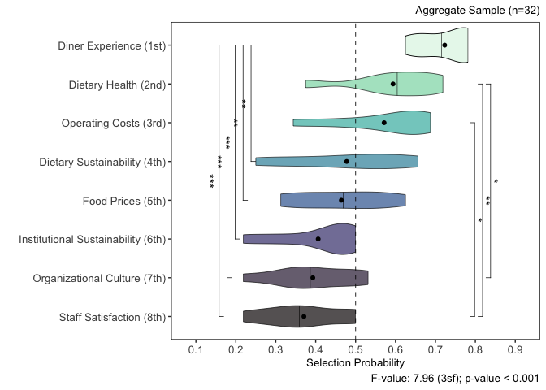<!-- -->

selection_frequency_plot
geom_violin(color=“black”,draw_quantiles=0.5,alpha=0.6,size=0.2,adjust=1)
+

geom_jitter(width=0.33,size=2,shape=21,alpha=0.5) +

stat_summary(data=technical_advisor_priority_probability_table,fun.y=mean,geom=“point”,shape=1,size=1.75,color=“black”) +
stat_summary(data=decision_maker_priority_probability_table,fun.y=mean,geom=“point”,shape=19,size=1.75,color=“black”,fill=“black”)
+

decomp next for advisors, decision makers

repeated the above processes by group (technical advisors) vs (strategic
decision makers)

``` r
survey_data %>%
  group_by(role) %>%
  summarise(count=n())
```

    ## # A tibble: 3 × 2
    ##   role           count
    ##   <chr>          <int>
    ## 1 Advisor           17
    ## 2 Auditor            3
    ## 3 Decision Maker    12

``` r
survey_data %>%
  select(role,stakeholder_type,stakeholder_type_other)
```

    ##              role           stakeholder_type         stakeholder_type_other
    ## 1         Advisor       Nutrition specialist                               
    ## 2         Advisor Sustainability coordinator                               
    ## 3         Advisor    Other (please specify):                   NGO employee
    ## 4  Decision Maker            Dining director                               
    ## 5  Decision Maker            Dining director                               
    ## 6  Decision Maker                       Chef                               
    ## 7  Decision Maker            Dining director                               
    ## 8         Advisor Sustainability coordinator                               
    ## 9         Advisor       Nutrition specialist                               
    ## 10 Decision Maker            Dining director                               
    ## 11        Advisor    Other (please specify):                       Advisor 
    ## 12 Decision Maker                       Chef                               
    ## 13        Advisor       Nutrition specialist                               
    ## 14 Decision Maker   University administrator                               
    ## 15        Advisor Sustainability coordinator                               
    ## 16        Advisor                       Chef                               
    ## 17        Advisor   University administrator                               
    ## 18 Decision Maker   University administrator                               
    ## 19        Advisor    Other (please specify):             Dining management 
    ## 20        Auditor                       Chef                               
    ## 21 Decision Maker            Dining director                               
    ## 22 Decision Maker   University administrator                               
    ## 23        Advisor       Nutrition specialist                               
    ## 24        Advisor Sustainability coordinator                               
    ## 25        Auditor       Nutrition specialist                               
    ## 26        Advisor Sustainability coordinator                               
    ## 27 Decision Maker Sustainability coordinator                               
    ## 28        Advisor            Dining director                               
    ## 29        Advisor    Other (please specify): Manager of residential dining 
    ## 30        Advisor    Other (please specify):              Dining marketing 
    ## 31 Decision Maker            Dining director                               
    ## 32        Auditor    Other (please specify):                      marketing

``` r
survey_data %>%
  filter(role=="Advisor")
```

    ##    id    role           stakeholder_type         stakeholder_type_other
    ## 1   1 Advisor       Nutrition specialist                               
    ## 2   2 Advisor Sustainability coordinator                               
    ## 3   3 Advisor    Other (please specify):                   NGO employee
    ## 4   8 Advisor Sustainability coordinator                               
    ## 5   9 Advisor       Nutrition specialist                               
    ## 6  11 Advisor    Other (please specify):                       Advisor 
    ## 7  13 Advisor       Nutrition specialist                               
    ## 8  15 Advisor Sustainability coordinator                               
    ## 9  16 Advisor                       Chef                               
    ## 10 17 Advisor   University administrator                               
    ## 11 19 Advisor    Other (please specify):             Dining management 
    ## 12 23 Advisor       Nutrition specialist                               
    ## 13 24 Advisor Sustainability coordinator                               
    ## 14 26 Advisor Sustainability coordinator                               
    ## 15 28 Advisor            Dining director                               
    ## 16 29 Advisor    Other (please specify): Manager of residential dining 
    ## 17 30 Advisor    Other (please specify):              Dining marketing 
    ##                                    position_title position_duration
    ## 1                                                                 2
    ## 2                         Sustainability Manager                  1
    ## 3                    Associate Program Specialist                 2
    ## 4                        Sustainability Director          5.5 years
    ## 5                                       Dietitian                 3
    ## 6                                                                 1
    ## 7                       Nutrition Systems Manager                12
    ## 8                          Sustainability Manager                 3
    ## 9                                  Executive chef                 3
    ## 10                                            AVP          20 years
    ## 11 Director of Culinary development and nutrition                 2
    ## 12                                      Dietitian                 3
    ## 13                                                               .1
    ## 14                     Director of sustainability                10
    ## 15          Associate Director, Food and beverage                 5
    ## 16                          Halls cluster manger                  2
    ## 17                             Marketing manager                  3
    ##    dietary_health_ranking dietary_sustainability_ranking
    ## 1                       2                              3
    ## 2                       2                              3
    ## 3                       3                              4
    ## 4                       6                              5
    ## 5                       2                              5
    ## 6                       7                              3
    ## 7                       6                              7
    ## 8                       4                              5
    ## 9                       6                              4
    ## 10                      3                              6
    ## 11                      1                              4
    ## 12                      1                              2
    ## 13                      6                              2
    ## 14                      3                              5
    ## 15                      5                              8
    ## 16                      3                              5
    ## 17                      2                              4
    ##    institutional_sustainability_ranking food_pricing_ranking
    ## 1                                     7                    5
    ## 2                                     1                    8
    ## 3                                     8                    2
    ## 4                                     4                    8
    ## 5                                     7                    8
    ## 6                                     8                    5
    ## 7                                     5                    3
    ## 8                                     1                    6
    ## 9                                     8                    2
    ## 10                                    8                    1
    ## 11                                    8                    6
    ## 12                                    6                    8
    ## 13                                    1                    5
    ## 14                                    1                    6
    ## 15                                    6                    1
    ## 16                                    4                    7
    ## 17                                    3                    6
    ##    operating_costs_ranking guest_experience_ranking staff_satisfaction_ranking
    ## 1                        4                        1                          6
    ## 2                        7                        4                          5
    ## 3                        5                        6                          7
    ## 4                        3                        2                          1
    ## 5                        4                        1                          6
    ## 6                        2                        1                          6
    ## 7                        2                        4                          8
    ## 8                        2                        3                          8
    ## 9                        3                        1                          7
    ## 10                       7                        4                          2
    ## 11                       5                        2                          3
    ## 12                       4                        3                          7
    ## 13                       3                        8                          4
    ## 14                       7                        4                          8
    ## 15                       3                        2                          7
    ## 16                       1                        2                          8
    ## 17                       5                        1                          7
    ##    campus_culture_ranking dietary_health_score dietary_sustainability_score
    ## 1                       8                    7                            6
    ## 2                       6                    7                            6
    ## 3                       1                    6                            5
    ## 4                       7                    3                            4
    ## 5                       3                    7                            4
    ## 6                       4                    2                            6
    ## 7                       1                    3                            2
    ## 8                       7                    5                            4
    ## 9                       5                    3                            5
    ## 10                      5                    6                            3
    ## 11                      7                    8                            5
    ## 12                      5                    8                            7
    ## 13                      7                    3                            7
    ## 14                      2                    6                            4
    ## 15                      4                    4                            1
    ## 16                      6                    6                            4
    ## 17                      8                    7                            5
    ##    institutional_sustainability_score food_pricing_score operating_costs_score
    ## 1                                   2                  4                     5
    ## 2                                   8                  1                     2
    ## 3                                   1                  7                     4
    ## 4                                   5                  1                     6
    ## 5                                   2                  1                     5
    ## 6                                   1                  4                     7
    ## 7                                   4                  6                     7
    ## 8                                   8                  3                     7
    ## 9                                   1                  7                     6
    ## 10                                  1                  8                     2
    ## 11                                  1                  3                     4
    ## 12                                  3                  1                     5
    ## 13                                  8                  4                     6
    ## 14                                  8                  3                     2
    ## 15                                  3                  8                     6
    ## 16                                  5                  2                     8
    ## 17                                  6                  3                     4
    ##    guest_experience_score staff_satisfaction_score campus_culture_score
    ## 1                       8                        3                    1
    ## 2                       5                        4                    3
    ## 3                       3                        2                    8
    ## 4                       7                        8                    2
    ## 5                       8                        3                    6
    ## 6                       8                        3                    5
    ## 7                       5                        1                    8
    ## 8                       6                        1                    2
    ## 9                       8                        2                    4
    ## 10                      5                        7                    4
    ## 11                      7                        6                    2
    ## 12                      6                        2                    4
    ## 13                      1                        5                    2
    ## 14                      5                        1                    7
    ## 15                      7                        2                    5
    ## 16                      7                        1                    3
    ## 17                      8                        2                    1

``` r
survey_data %>%
  filter(role=="Decision Maker") 
```

    ##    id           role           stakeholder_type stakeholder_type_other
    ## 1   4 Decision Maker            Dining director                       
    ## 2   5 Decision Maker            Dining director                       
    ## 3   6 Decision Maker                       Chef                       
    ## 4   7 Decision Maker            Dining director                       
    ## 5  10 Decision Maker            Dining director                       
    ## 6  12 Decision Maker                       Chef                       
    ## 7  14 Decision Maker   University administrator                       
    ## 8  18 Decision Maker   University administrator                       
    ## 9  21 Decision Maker            Dining director                       
    ## 10 22 Decision Maker   University administrator                       
    ## 11 27 Decision Maker Sustainability coordinator                       
    ## 12 31 Decision Maker            Dining director                       
    ##                                                                 position_title
    ## 1                                                                     Director
    ## 2                                                           Director of Dining
    ## 3                                                        Campus Executive Chef
    ## 4                                                           Director of Dining
    ## 5                                           Senior Director of Dining Services
    ## 6  Senior associate Director culinary strategies and plant forward experience 
    ## 7                                                    Assistant Vice President 
    ## 8                                                   Associate Vice Chancellor 
    ## 9                                                   Executive Director dining 
    ## 10                                                          Asst. Vice Provost
    ## 11                                             Regional Sustainability Manager
    ## 12                                                            Dining Director 
    ##    position_duration dietary_health_ranking dietary_sustainability_ranking
    ## 1                  1                      2                              5
    ## 2                 11                      8                              5
    ## 3                  3                      8                              3
    ## 4                  1                      1                              2
    ## 5                 32                      4                              2
    ## 6                  3                      1                              6
    ## 7                  2                      1                              8
    ## 8                  4                      4                              8
    ## 9                  2                      5                              2
    ## 10                16                      6                              5
    ## 11                 2                      6                              5
    ## 12                 3                      5                              6
    ##    institutional_sustainability_ranking food_pricing_ranking
    ## 1                                     6                    4
    ## 2                                     7                    1
    ## 3                                     6                    2
    ## 4                                     3                    5
    ## 5                                     1                    7
    ## 6                                     8                    4
    ## 7                                     5                    6
    ## 8                                     7                    3
    ## 9                                     3                    7
    ## 10                                    4                    3
    ## 11                                    4                    2
    ## 12                                    7                    8
    ##    operating_costs_ranking guest_experience_ranking staff_satisfaction_ranking
    ## 1                        3                        1                          7
    ## 2                        3                        4                          2
    ## 3                        1                        4                          7
    ## 4                        8                        4                          6
    ## 5                        3                        5                          6
    ## 6                        7                        5                          2
    ## 7                        7                        2                          3
    ## 8                        5                        2                          6
    ## 9                        6                        4                          1
    ## 10                       2                        1                          7
    ## 11                       1                        3                          8
    ## 12                       3                        4                          2
    ##    campus_culture_ranking dietary_health_score dietary_sustainability_score
    ## 1                       8                    7                            4
    ## 2                       6                    1                            4
    ## 3                       5                    1                            6
    ## 4                       7                    8                            7
    ## 5                       8                    5                            7
    ## 6                       3                    8                            3
    ## 7                       4                    8                            1
    ## 8                       1                    5                            1
    ## 9                       8                    4                            7
    ## 10                      8                    3                            4
    ## 11                      7                    3                            4
    ## 12                      1                    4                            3
    ##    institutional_sustainability_score food_pricing_score operating_costs_score
    ## 1                                   3                  5                     6
    ## 2                                   2                  8                     6
    ## 3                                   3                  7                     8
    ## 4                                   6                  4                     1
    ## 5                                   8                  2                     6
    ## 6                                   1                  5                     2
    ## 7                                   4                  3                     2
    ## 8                                   2                  6                     4
    ## 9                                   6                  2                     3
    ## 10                                  5                  6                     7
    ## 11                                  5                  7                     8
    ## 12                                  2                  1                     6
    ##    guest_experience_score staff_satisfaction_score campus_culture_score
    ## 1                       8                        2                    1
    ## 2                       5                        7                    3
    ## 3                       5                        2                    4
    ## 4                       5                        3                    2
    ## 5                       4                        3                    1
    ## 6                       4                        7                    6
    ## 7                       7                        6                    5
    ## 8                       7                        3                    8
    ## 9                       5                        8                    1
    ## 10                      8                        2                    1
    ## 11                      6                        1                    2
    ## 12                      5                        7                    8

``` r
decision_maker_priority_score_frequencies <- tibble(comparison_indicator=c("Guest Dining Experience","Dietary Health","Operating Costs","Sustainability of Guest Food Choices","Food Pricing","Institutional Sustainability","Campus Culture","Staff Satisfaction"),guest_dining_experience_selection_frequency=as.double(NA),dietary_health_selection_frequency=as.double(NA),operating_costs_selection_frequency=as.double(NA),dietary_sustainability_selection_frequency=as.double(NA),food_pricing_selection_frequency=as.double(NA),institutional_sustainability_selection_frequency=as.double(NA),campus_culture_selection_frequency=as.double(NA),staff_satisfaction_selection_frequency=as.double(NA))
decision_maker_priority_score_frequencies
```

    ## # A tibble: 8 × 9
    ##   comparison_indicator             guest_dining_experie…¹ dietary_health_selec…²
    ##   <chr>                                             <dbl>                  <dbl>
    ## 1 Guest Dining Experience                              NA                     NA
    ## 2 Dietary Health                                       NA                     NA
    ## 3 Operating Costs                                      NA                     NA
    ## 4 Sustainability of Guest Food Ch…                     NA                     NA
    ## 5 Food Pricing                                         NA                     NA
    ## 6 Institutional Sustainability                         NA                     NA
    ## 7 Campus Culture                                       NA                     NA
    ## 8 Staff Satisfaction                                   NA                     NA
    ## # ℹ abbreviated names: ¹​guest_dining_experience_selection_frequency,
    ## #   ²​dietary_health_selection_frequency
    ## # ℹ 6 more variables: operating_costs_selection_frequency <dbl>,
    ## #   dietary_sustainability_selection_frequency <dbl>,
    ## #   food_pricing_selection_frequency <dbl>,
    ## #   institutional_sustainability_selection_frequency <dbl>,
    ## #   campus_culture_selection_frequency <dbl>, …

``` r
decision_maker_priority_score_tabulation <- survey_data %>%
  filter(role=="Decision Maker") %>%
  select(id,dietary_health_ranking,dietary_sustainability_ranking,institutional_sustainability_ranking,food_pricing_ranking,operating_costs_ranking,guest_experience_ranking,staff_satisfaction_ranking,campus_culture_ranking)
decision_maker_priority_score_tabulation
```

    ##    id dietary_health_ranking dietary_sustainability_ranking
    ## 1   4                      2                              5
    ## 2   5                      8                              5
    ## 3   6                      8                              3
    ## 4   7                      1                              2
    ## 5  10                      4                              2
    ## 6  12                      1                              6
    ## 7  14                      1                              8
    ## 8  18                      4                              8
    ## 9  21                      5                              2
    ## 10 22                      6                              5
    ## 11 27                      6                              5
    ## 12 31                      5                              6
    ##    institutional_sustainability_ranking food_pricing_ranking
    ## 1                                     6                    4
    ## 2                                     7                    1
    ## 3                                     6                    2
    ## 4                                     3                    5
    ## 5                                     1                    7
    ## 6                                     8                    4
    ## 7                                     5                    6
    ## 8                                     7                    3
    ## 9                                     3                    7
    ## 10                                    4                    3
    ## 11                                    4                    2
    ## 12                                    7                    8
    ##    operating_costs_ranking guest_experience_ranking staff_satisfaction_ranking
    ## 1                        3                        1                          7
    ## 2                        3                        4                          2
    ## 3                        1                        4                          7
    ## 4                        8                        4                          6
    ## 5                        3                        5                          6
    ## 6                        7                        5                          2
    ## 7                        7                        2                          3
    ## 8                        5                        2                          6
    ## 9                        6                        4                          1
    ## 10                       2                        1                          7
    ## 11                       1                        3                          8
    ## 12                       3                        4                          2
    ##    campus_culture_ranking
    ## 1                       8
    ## 2                       6
    ## 3                       5
    ## 4                       7
    ## 5                       8
    ## 6                       3
    ## 7                       4
    ## 8                       1
    ## 9                       8
    ## 10                      8
    ## 11                      7
    ## 12                      1

``` r
decision_maker_guest_experience_priority_score_tabulation <- decision_maker_priority_score_tabulation %>%
  mutate(guest_experience_over_guest_experience=0) %>%
  mutate(guest_experience_over_dietary_health=case_when(guest_experience_ranking<dietary_health_ranking~1,
                                                        guest_experience_ranking>dietary_health_ranking~0)) %>%
  mutate(guest_experience_over_operating_costs=case_when(guest_experience_ranking<operating_costs_ranking~1,
                                                        guest_experience_ranking>operating_costs_ranking~0)) %>%
  mutate(guest_experience_over_dietary_sustainability=case_when(guest_experience_ranking<dietary_sustainability_ranking~1,
                                                        guest_experience_ranking>dietary_sustainability_ranking~0)) %>%
  mutate(guest_experience_over_food_pricing=case_when(guest_experience_ranking<food_pricing_ranking~1,
                                                        guest_experience_ranking>food_pricing_ranking~0)) %>%
   mutate(guest_experience_over_institutional_sustainability=case_when(guest_experience_ranking<institutional_sustainability_ranking~1,
                                                        guest_experience_ranking>institutional_sustainability_ranking~0)) %>%
  mutate(guest_experience_over_campus_culture=case_when(guest_experience_ranking<campus_culture_ranking~1,
                                                        guest_experience_ranking>campus_culture_ranking~0)) %>%
  mutate(guest_experience_over_staff_satisfaction=case_when(guest_experience_ranking<staff_satisfaction_ranking~1,
                                                        guest_experience_ranking>staff_satisfaction_ranking~0)) %>%
  select(id,guest_experience_over_dietary_health,guest_experience_over_operating_costs,guest_experience_over_dietary_sustainability,guest_experience_over_food_pricing,guest_experience_over_institutional_sustainability,guest_experience_over_campus_culture,guest_experience_over_staff_satisfaction,guest_experience_over_guest_experience) %>%
  pivot_longer(!id,names_to="condition",values_to="frequency") %>%
  group_by(condition) %>%
  summarise(instances=sum(frequency))
decision_maker_guest_experience_priority_score_tabulation
```

    ## # A tibble: 8 × 2
    ##   condition                                          instances
    ##   <chr>                                                  <dbl>
    ## 1 guest_experience_over_campus_culture                       9
    ## 2 guest_experience_over_dietary_health                       8
    ## 3 guest_experience_over_dietary_sustainability               8
    ## 4 guest_experience_over_food_pricing                         8
    ## 5 guest_experience_over_guest_experience                     0
    ## 6 guest_experience_over_institutional_sustainability         9
    ## 7 guest_experience_over_operating_costs                      7
    ## 8 guest_experience_over_staff_satisfaction                   8

``` r
decision_maker_priority_score_frequencies <- decision_maker_priority_score_frequencies %>%
  mutate(guest_dining_experience_selection_frequency=c(0,8,7,8,8,9,9,8))
decision_maker_priority_score_frequencies
```

    ## # A tibble: 8 × 9
    ##   comparison_indicator             guest_dining_experie…¹ dietary_health_selec…²
    ##   <chr>                                             <dbl>                  <dbl>
    ## 1 Guest Dining Experience                               0                     NA
    ## 2 Dietary Health                                        8                     NA
    ## 3 Operating Costs                                       7                     NA
    ## 4 Sustainability of Guest Food Ch…                      8                     NA
    ## 5 Food Pricing                                          8                     NA
    ## 6 Institutional Sustainability                          9                     NA
    ## 7 Campus Culture                                        9                     NA
    ## 8 Staff Satisfaction                                    8                     NA
    ## # ℹ abbreviated names: ¹​guest_dining_experience_selection_frequency,
    ## #   ²​dietary_health_selection_frequency
    ## # ℹ 6 more variables: operating_costs_selection_frequency <dbl>,
    ## #   dietary_sustainability_selection_frequency <dbl>,
    ## #   food_pricing_selection_frequency <dbl>,
    ## #   institutional_sustainability_selection_frequency <dbl>,
    ## #   campus_culture_selection_frequency <dbl>, …

``` r
decision_maker_dietary_health_priority_score_tabulation <- decision_maker_priority_score_tabulation %>%
  mutate(dietary_health_over_guest_experience=case_when(dietary_health_ranking<guest_experience_ranking~1,
                                                        dietary_health_ranking>guest_experience_ranking~0)) %>%
  mutate(dietary_health_over_dietary_health=0) %>%
  mutate(dietary_health_over_operating_costs=case_when(dietary_health_ranking<operating_costs_ranking~1,
                                                        dietary_health_ranking>operating_costs_ranking~0)) %>%
  mutate(dietary_health_over_dietary_sustainability=case_when(dietary_health_ranking<dietary_sustainability_ranking~1,
                                                        dietary_health_ranking>dietary_sustainability_ranking~0)) %>%
  mutate(dietary_health_over_food_pricing=case_when(dietary_health_ranking<food_pricing_ranking~1,
                                                        dietary_health_ranking>food_pricing_ranking~0)) %>%
  mutate(dietary_health_over_institutional_sustainability=case_when(dietary_health_ranking<institutional_sustainability_ranking~1,
                                                        dietary_health_ranking>institutional_sustainability_ranking~0)) %>%
  mutate(dietary_health_over_campus_culture=case_when(dietary_health_ranking<campus_culture_ranking~1,
                                                        dietary_health_ranking>campus_culture_ranking~0)) %>%
  mutate(dietary_health_over_staff_satisfaction=case_when(dietary_health_ranking<staff_satisfaction_ranking~1,
                                                        dietary_health_ranking>staff_satisfaction_ranking~0)) %>%
  select(id,dietary_health_over_guest_experience,dietary_health_over_dietary_health,dietary_health_over_operating_costs,dietary_health_over_dietary_sustainability,dietary_health_over_food_pricing,dietary_health_over_institutional_sustainability,dietary_health_over_campus_culture,dietary_health_over_staff_satisfaction) %>%
  pivot_longer(!id,names_to="condition",values_to="instances") %>%
  group_by(condition) %>%
  summarise(instances=sum(instances))
decision_maker_dietary_health_priority_score_tabulation
```

    ## # A tibble: 8 × 2
    ##   condition                                        instances
    ##   <chr>                                                <dbl>
    ## 1 dietary_health_over_campus_culture                       8
    ## 2 dietary_health_over_dietary_health                       0
    ## 3 dietary_health_over_dietary_sustainability               6
    ## 4 dietary_health_over_food_pricing                         7
    ## 5 dietary_health_over_guest_experience                     4
    ## 6 dietary_health_over_institutional_sustainability         6
    ## 7 dietary_health_over_operating_costs                      6
    ## 8 dietary_health_over_staff_satisfaction                   8

``` r
decision_maker_priority_score_frequencies <- decision_maker_priority_score_frequencies %>%
  mutate(dietary_health_selection_frequency=c(4,0,6,6,7,6,8,8))
decision_maker_priority_score_frequencies
```

    ## # A tibble: 8 × 9
    ##   comparison_indicator             guest_dining_experie…¹ dietary_health_selec…²
    ##   <chr>                                             <dbl>                  <dbl>
    ## 1 Guest Dining Experience                               0                      4
    ## 2 Dietary Health                                        8                      0
    ## 3 Operating Costs                                       7                      6
    ## 4 Sustainability of Guest Food Ch…                      8                      6
    ## 5 Food Pricing                                          8                      7
    ## 6 Institutional Sustainability                          9                      6
    ## 7 Campus Culture                                        9                      8
    ## 8 Staff Satisfaction                                    8                      8
    ## # ℹ abbreviated names: ¹​guest_dining_experience_selection_frequency,
    ## #   ²​dietary_health_selection_frequency
    ## # ℹ 6 more variables: operating_costs_selection_frequency <dbl>,
    ## #   dietary_sustainability_selection_frequency <dbl>,
    ## #   food_pricing_selection_frequency <dbl>,
    ## #   institutional_sustainability_selection_frequency <dbl>,
    ## #   campus_culture_selection_frequency <dbl>, …

``` r
decision_maker_operating_costs_priority_score_tabulation <- decision_maker_priority_score_tabulation %>%
  mutate(operating_costs_over_guest_experience=case_when(operating_costs_ranking<guest_experience_ranking~1,
                                                        operating_costs_ranking>guest_experience_ranking~0)) %>%
  mutate(operating_costs_over_dietary_health=case_when(operating_costs_ranking<dietary_health_ranking~1,
                                                        operating_costs_ranking>dietary_health_ranking~0)) %>%
  mutate(operating_costs_over_operating_costs=0) %>%
  mutate(operating_costs_over_dietary_sustainability=case_when(operating_costs_ranking<dietary_sustainability_ranking~1,
                                                        operating_costs_ranking>dietary_sustainability_ranking~0)) %>%
  mutate(operating_costs_over_food_pricing=case_when(operating_costs_ranking<food_pricing_ranking~1,
                                                        operating_costs_ranking>food_pricing_ranking~0)) %>%
  mutate(operating_costs_over_institutional_sustainability=case_when(operating_costs_ranking<institutional_sustainability_ranking~1,
                                                        operating_costs_ranking>institutional_sustainability_ranking~0)) %>%
  mutate(operating_costs_over_campus_culture=case_when(operating_costs_ranking<campus_culture_ranking~1,
                                                        operating_costs_ranking>campus_culture_ranking~0)) %>%
  mutate(operating_costs_over_staff_satisfaction=case_when(operating_costs_ranking<staff_satisfaction_ranking~1,
                                                        operating_costs_ranking>staff_satisfaction_ranking~0)) %>%
  select(id,operating_costs_over_guest_experience,operating_costs_over_dietary_health,operating_costs_over_operating_costs,operating_costs_over_dietary_sustainability,operating_costs_over_food_pricing,operating_costs_over_institutional_sustainability,operating_costs_over_campus_culture,operating_costs_over_staff_satisfaction) %>%
  pivot_longer(!id,names_to="condition",values_to="instances") %>%
  group_by(condition) %>%
  summarise(instances=sum(instances))
decision_maker_operating_costs_priority_score_tabulation
```

    ## # A tibble: 8 × 2
    ##   condition                                         instances
    ##   <chr>                                                 <dbl>
    ## 1 operating_costs_over_campus_culture                       7
    ## 2 operating_costs_over_dietary_health                       6
    ## 3 operating_costs_over_dietary_sustainability               8
    ## 4 operating_costs_over_food_pricing                         7
    ## 5 operating_costs_over_guest_experience                     5
    ## 6 operating_costs_over_institutional_sustainability         8
    ## 7 operating_costs_over_operating_costs                      0
    ## 8 operating_costs_over_staff_satisfaction                   6

``` r
decision_maker_priority_score_frequencies <- decision_maker_priority_score_frequencies %>% 
  mutate(operating_costs_selection_frequency=c(5,6,0,8,7,8,7,6))
decision_maker_priority_score_frequencies
```

    ## # A tibble: 8 × 9
    ##   comparison_indicator             guest_dining_experie…¹ dietary_health_selec…²
    ##   <chr>                                             <dbl>                  <dbl>
    ## 1 Guest Dining Experience                               0                      4
    ## 2 Dietary Health                                        8                      0
    ## 3 Operating Costs                                       7                      6
    ## 4 Sustainability of Guest Food Ch…                      8                      6
    ## 5 Food Pricing                                          8                      7
    ## 6 Institutional Sustainability                          9                      6
    ## 7 Campus Culture                                        9                      8
    ## 8 Staff Satisfaction                                    8                      8
    ## # ℹ abbreviated names: ¹​guest_dining_experience_selection_frequency,
    ## #   ²​dietary_health_selection_frequency
    ## # ℹ 6 more variables: operating_costs_selection_frequency <dbl>,
    ## #   dietary_sustainability_selection_frequency <dbl>,
    ## #   food_pricing_selection_frequency <dbl>,
    ## #   institutional_sustainability_selection_frequency <dbl>,
    ## #   campus_culture_selection_frequency <dbl>, …

``` r
decision_maker_dietary_sustainability_priority_score_tabulation <- decision_maker_priority_score_tabulation %>%
  mutate(dietary_sustainability_over_guest_experience=case_when(dietary_sustainability_ranking<guest_experience_ranking~1,
                                                        dietary_sustainability_ranking>guest_experience_ranking~0)) %>%
  mutate(dietary_sustainability_over_dietary_health=case_when(dietary_sustainability_ranking<dietary_health_ranking~1,
                                                        dietary_sustainability_ranking>dietary_health_ranking~0)) %>%
  mutate(dietary_sustainability_over_operating_costs=case_when(dietary_sustainability_ranking<operating_costs_ranking~1,
                                                        dietary_sustainability_ranking>operating_costs_ranking~0)) %>%
  mutate(dietary_sustainability_over_dietary_sustainability=0) %>%
  mutate(dietary_sustainability_over_food_pricing=case_when(dietary_sustainability_ranking<food_pricing_ranking~1,
                                                        dietary_sustainability_ranking>food_pricing_ranking~0)) %>%
  mutate(dietary_sustainability_over_institutional_sustainability=case_when(dietary_sustainability_ranking<institutional_sustainability_ranking~1,
                                                        dietary_sustainability_ranking>institutional_sustainability_ranking~0)) %>%
  mutate(dietary_sustainability_over_campus_culture=case_when(dietary_sustainability_ranking<campus_culture_ranking~1,
                                                        dietary_sustainability_ranking>campus_culture_ranking~0)) %>%
  mutate(dietary_sustainability_over_staff_satisfaction=case_when(dietary_sustainability_ranking<staff_satisfaction_ranking~1,
                                                        dietary_sustainability_ranking>staff_satisfaction_ranking~0)) %>%
  select(id,dietary_sustainability_over_guest_experience,dietary_sustainability_over_dietary_health,dietary_sustainability_over_operating_costs,dietary_sustainability_over_dietary_sustainability,dietary_sustainability_over_food_pricing,dietary_sustainability_over_institutional_sustainability,dietary_sustainability_over_campus_culture,dietary_sustainability_over_staff_satisfaction) %>%
  pivot_longer(!id,names_to="condition",values_to="instances") %>%
  group_by(condition) %>%
  summarise(instances=sum(instances))
decision_maker_dietary_sustainability_priority_score_tabulation
```

    ## # A tibble: 8 × 2
    ##   condition                                                instances
    ##   <chr>                                                        <dbl>
    ## 1 dietary_sustainability_over_campus_culture                       8
    ## 2 dietary_sustainability_over_dietary_health                       6
    ## 3 dietary_sustainability_over_dietary_sustainability               0
    ## 4 dietary_sustainability_over_food_pricing                         4
    ## 5 dietary_sustainability_over_guest_experience                     4
    ## 6 dietary_sustainability_over_institutional_sustainability         7
    ## 7 dietary_sustainability_over_operating_costs                      4
    ## 8 dietary_sustainability_over_staff_satisfaction                   6

``` r
decision_maker_priority_score_frequencies <- decision_maker_priority_score_frequencies %>%
  mutate(dietary_sustainability_selection_frequency=c(4,6,4,0,4,7,8,6))
decision_maker_priority_score_frequencies
```

    ## # A tibble: 8 × 9
    ##   comparison_indicator             guest_dining_experie…¹ dietary_health_selec…²
    ##   <chr>                                             <dbl>                  <dbl>
    ## 1 Guest Dining Experience                               0                      4
    ## 2 Dietary Health                                        8                      0
    ## 3 Operating Costs                                       7                      6
    ## 4 Sustainability of Guest Food Ch…                      8                      6
    ## 5 Food Pricing                                          8                      7
    ## 6 Institutional Sustainability                          9                      6
    ## 7 Campus Culture                                        9                      8
    ## 8 Staff Satisfaction                                    8                      8
    ## # ℹ abbreviated names: ¹​guest_dining_experience_selection_frequency,
    ## #   ²​dietary_health_selection_frequency
    ## # ℹ 6 more variables: operating_costs_selection_frequency <dbl>,
    ## #   dietary_sustainability_selection_frequency <dbl>,
    ## #   food_pricing_selection_frequency <dbl>,
    ## #   institutional_sustainability_selection_frequency <dbl>,
    ## #   campus_culture_selection_frequency <dbl>, …

``` r
decision_maker_food_pricing_priority_score_tabulation <- decision_maker_priority_score_tabulation %>%
  mutate(food_pricing_over_guest_experience=case_when(food_pricing_ranking<guest_experience_ranking~1,
                                                        food_pricing_ranking>guest_experience_ranking~0)) %>%
  mutate(food_pricing_over_dietary_health=case_when(food_pricing_ranking<dietary_health_ranking~1,
                                                        food_pricing_ranking>dietary_health_ranking~0)) %>%
  mutate(food_pricing_over_operating_costs=case_when(food_pricing_ranking<operating_costs_ranking~1,
                                                        food_pricing_ranking>operating_costs_ranking~0)) %>%
  mutate(food_pricing_over_dietary_sustainability=case_when(food_pricing_ranking<dietary_sustainability_ranking~1,
                                                        food_pricing_ranking>dietary_sustainability_ranking~0)) %>%
  mutate(food_pricing_over_food_pricing=0) %>%
  mutate(food_pricing_over_institutional_sustainability=case_when(food_pricing_ranking<institutional_sustainability_ranking~1,
                                                        food_pricing_ranking>institutional_sustainability_ranking~0)) %>%
  mutate(food_pricing_over_campus_culture=case_when(food_pricing_ranking<campus_culture_ranking~1,
                                                        food_pricing_ranking>campus_culture_ranking~0)) %>%
  mutate(food_pricing_over_staff_satisfaction=case_when(food_pricing_ranking<staff_satisfaction_ranking~1,
                                                        food_pricing_ranking>staff_satisfaction_ranking~0)) %>%
  select(id,food_pricing_over_guest_experience,food_pricing_over_dietary_health,food_pricing_over_operating_costs,food_pricing_over_dietary_sustainability,food_pricing_over_food_pricing,food_pricing_over_institutional_sustainability,food_pricing_over_campus_culture,food_pricing_over_staff_satisfaction) %>%
  pivot_longer(!id,names_to="condition",values_to="instances") %>%
  group_by(condition) %>%
  summarise(instances=sum(instances))
decision_maker_food_pricing_priority_score_tabulation
```

    ## # A tibble: 8 × 2
    ##   condition                                      instances
    ##   <chr>                                              <dbl>
    ## 1 food_pricing_over_campus_culture                       8
    ## 2 food_pricing_over_dietary_health                       5
    ## 3 food_pricing_over_dietary_sustainability               8
    ## 4 food_pricing_over_food_pricing                         0
    ## 5 food_pricing_over_guest_experience                     4
    ## 6 food_pricing_over_institutional_sustainability         7
    ## 7 food_pricing_over_operating_costs                      5
    ## 8 food_pricing_over_staff_satisfaction                   7

``` r
decision_maker_priority_score_frequencies <- decision_maker_priority_score_frequencies %>%
  mutate(food_pricing_selection_frequency=c(4,5,5,8,0,7,8,7))
decision_maker_priority_score_frequencies
```

    ## # A tibble: 8 × 9
    ##   comparison_indicator             guest_dining_experie…¹ dietary_health_selec…²
    ##   <chr>                                             <dbl>                  <dbl>
    ## 1 Guest Dining Experience                               0                      4
    ## 2 Dietary Health                                        8                      0
    ## 3 Operating Costs                                       7                      6
    ## 4 Sustainability of Guest Food Ch…                      8                      6
    ## 5 Food Pricing                                          8                      7
    ## 6 Institutional Sustainability                          9                      6
    ## 7 Campus Culture                                        9                      8
    ## 8 Staff Satisfaction                                    8                      8
    ## # ℹ abbreviated names: ¹​guest_dining_experience_selection_frequency,
    ## #   ²​dietary_health_selection_frequency
    ## # ℹ 6 more variables: operating_costs_selection_frequency <dbl>,
    ## #   dietary_sustainability_selection_frequency <dbl>,
    ## #   food_pricing_selection_frequency <dbl>,
    ## #   institutional_sustainability_selection_frequency <dbl>,
    ## #   campus_culture_selection_frequency <dbl>, …

``` r
decision_maker_institutional_sustainability_priority_score_tabulation <- decision_maker_priority_score_tabulation %>%
  mutate(institutional_sustainability_over_guest_experience=case_when(institutional_sustainability_ranking<guest_experience_ranking~1,
                                                        institutional_sustainability_ranking>guest_experience_ranking~0)) %>%
  mutate(institutional_sustainability_over_dietary_health=case_when(institutional_sustainability_ranking<dietary_health_ranking~1,
                                                        institutional_sustainability_ranking>dietary_health_ranking~0)) %>%
  mutate(institutional_sustainability_over_operating_costs=case_when(institutional_sustainability_ranking<operating_costs_ranking~1,
                                                        institutional_sustainability_ranking>operating_costs_ranking~0)) %>%
  mutate(institutional_sustainability_over_dietary_sustainability=case_when(institutional_sustainability_ranking<dietary_sustainability_ranking~1,
                                                        institutional_sustainability_ranking>dietary_sustainability_ranking~0)) %>%
  mutate(institutional_sustainability_over_food_pricing=case_when(institutional_sustainability_ranking<food_pricing_ranking~1,
                                                        institutional_sustainability_ranking>food_pricing_ranking~0)) %>%
  mutate(institutional_sustainability_over_institutional_sustainability=0) %>%
  mutate(institutional_sustainability_over_campus_culture=case_when(institutional_sustainability_ranking<campus_culture_ranking~1,
                                                        institutional_sustainability_ranking>campus_culture_ranking~0)) %>%
  mutate(institutional_sustainability_over_staff_satisfaction=case_when(institutional_sustainability_ranking<staff_satisfaction_ranking~1,
                                                        institutional_sustainability_ranking>staff_satisfaction_ranking~0)) %>%
  select(id,institutional_sustainability_over_guest_experience,institutional_sustainability_over_dietary_health,institutional_sustainability_over_operating_costs,institutional_sustainability_over_dietary_sustainability,institutional_sustainability_over_food_pricing,institutional_sustainability_over_institutional_sustainability,institutional_sustainability_over_campus_culture,institutional_sustainability_over_staff_satisfaction) %>%
  pivot_longer(!id,names_to="condition",values_to="instances") %>%
  group_by(condition) %>%
  summarise(instances=sum(instances))
decision_maker_institutional_sustainability_priority_score_tabulation
```

    ## # A tibble: 8 × 2
    ##   condition                                                      instances
    ##   <chr>                                                              <dbl>
    ## 1 institutional_sustainability_over_campus_culture                       6
    ## 2 institutional_sustainability_over_dietary_health                       6
    ## 3 institutional_sustainability_over_dietary_sustainability               5
    ## 4 institutional_sustainability_over_food_pricing                         5
    ## 5 institutional_sustainability_over_guest_experience                     3
    ## 6 institutional_sustainability_over_institutional_sustainability         0
    ## 7 institutional_sustainability_over_operating_costs                      4
    ## 8 institutional_sustainability_over_staff_satisfaction                   6

``` r
decision_maker_priority_score_frequencies <- decision_maker_priority_score_frequencies %>% 
  mutate(institutional_sustainability_selection_frequency=c(3,6,4,5,5,0,6,6))
decision_maker_priority_score_frequencies
```

    ## # A tibble: 8 × 9
    ##   comparison_indicator             guest_dining_experie…¹ dietary_health_selec…²
    ##   <chr>                                             <dbl>                  <dbl>
    ## 1 Guest Dining Experience                               0                      4
    ## 2 Dietary Health                                        8                      0
    ## 3 Operating Costs                                       7                      6
    ## 4 Sustainability of Guest Food Ch…                      8                      6
    ## 5 Food Pricing                                          8                      7
    ## 6 Institutional Sustainability                          9                      6
    ## 7 Campus Culture                                        9                      8
    ## 8 Staff Satisfaction                                    8                      8
    ## # ℹ abbreviated names: ¹​guest_dining_experience_selection_frequency,
    ## #   ²​dietary_health_selection_frequency
    ## # ℹ 6 more variables: operating_costs_selection_frequency <dbl>,
    ## #   dietary_sustainability_selection_frequency <dbl>,
    ## #   food_pricing_selection_frequency <dbl>,
    ## #   institutional_sustainability_selection_frequency <dbl>,
    ## #   campus_culture_selection_frequency <dbl>, …

``` r
decision_maker_campus_culture_priority_score_tabulation <- decision_maker_priority_score_tabulation %>%
  mutate(campus_culture_over_guest_experience=case_when(campus_culture_ranking<guest_experience_ranking~1,
                                                        campus_culture_ranking>guest_experience_ranking~0)) %>%
  mutate(campus_culture_over_dietary_health=case_when(campus_culture_ranking<dietary_health_ranking~1,
                                                        campus_culture_ranking>dietary_health_ranking~0)) %>%
  mutate(campus_culture_over_operating_costs=case_when(campus_culture_ranking<operating_costs_ranking~1,
                                                        campus_culture_ranking>operating_costs_ranking~0)) %>%
  mutate(campus_culture_over_dietary_sustainability=case_when(campus_culture_ranking<dietary_sustainability_ranking~1,
                                                        campus_culture_ranking>dietary_sustainability_ranking~0)) %>%
  mutate(campus_culture_over_food_pricing=case_when(campus_culture_ranking<food_pricing_ranking~1,
                                                        campus_culture_ranking>food_pricing_ranking~0)) %>%
  mutate(campus_culture_over_institutional_sustainability=case_when(campus_culture_ranking<institutional_sustainability_ranking~1,
                                                        campus_culture_ranking>institutional_sustainability_ranking~0)) %>%
  mutate(campus_culture_over_campus_culture=0) %>%
  mutate(campus_culture_over_staff_satisfaction=case_when(campus_culture_ranking<staff_satisfaction_ranking~1,
                                                        campus_culture_ranking>staff_satisfaction_ranking~0)) %>%
  select(id,campus_culture_over_guest_experience,campus_culture_over_dietary_health,campus_culture_over_operating_costs,campus_culture_over_dietary_sustainability,campus_culture_over_food_pricing,campus_culture_over_institutional_sustainability,campus_culture_over_campus_culture,campus_culture_over_staff_satisfaction) %>%
  pivot_longer(!id,names_to="condition",values_to="instances") %>%
  group_by(condition) %>%
  summarise(instances=sum(instances))
decision_maker_campus_culture_priority_score_tabulation
```

    ## # A tibble: 8 × 2
    ##   condition                                        instances
    ##   <chr>                                                <dbl>
    ## 1 campus_culture_over_campus_culture                       0
    ## 2 campus_culture_over_dietary_health                       4
    ## 3 campus_culture_over_dietary_sustainability               4
    ## 4 campus_culture_over_food_pricing                         4
    ## 5 campus_culture_over_guest_experience                     3
    ## 6 campus_culture_over_institutional_sustainability         6
    ## 7 campus_culture_over_operating_costs                      5
    ## 8 campus_culture_over_staff_satisfaction                   4

``` r
decision_maker_priority_score_frequencies <- decision_maker_priority_score_frequencies %>%
  mutate(campus_culture_selection_frequency=c(3,4,5,4,4,6,0,4))
decision_maker_priority_score_frequencies
```

    ## # A tibble: 8 × 9
    ##   comparison_indicator             guest_dining_experie…¹ dietary_health_selec…²
    ##   <chr>                                             <dbl>                  <dbl>
    ## 1 Guest Dining Experience                               0                      4
    ## 2 Dietary Health                                        8                      0
    ## 3 Operating Costs                                       7                      6
    ## 4 Sustainability of Guest Food Ch…                      8                      6
    ## 5 Food Pricing                                          8                      7
    ## 6 Institutional Sustainability                          9                      6
    ## 7 Campus Culture                                        9                      8
    ## 8 Staff Satisfaction                                    8                      8
    ## # ℹ abbreviated names: ¹​guest_dining_experience_selection_frequency,
    ## #   ²​dietary_health_selection_frequency
    ## # ℹ 6 more variables: operating_costs_selection_frequency <dbl>,
    ## #   dietary_sustainability_selection_frequency <dbl>,
    ## #   food_pricing_selection_frequency <dbl>,
    ## #   institutional_sustainability_selection_frequency <dbl>,
    ## #   campus_culture_selection_frequency <dbl>, …

``` r
decision_maker_staff_satisfaction_priority_score_tabulation <- decision_maker_priority_score_tabulation %>%
  mutate(staff_satisfaction_over_guest_experience=case_when(staff_satisfaction_ranking<guest_experience_ranking~1,
                                                        staff_satisfaction_ranking>guest_experience_ranking~0)) %>%
  mutate(staff_satisfaction_over_dietary_health=case_when(staff_satisfaction_ranking<dietary_health_ranking~1,
                                                        staff_satisfaction_ranking>dietary_health_ranking~0)) %>%
  mutate(staff_satisfaction_over_operating_costs=case_when(staff_satisfaction_ranking<operating_costs_ranking~1,
                                                        staff_satisfaction_ranking>operating_costs_ranking~0)) %>%
  mutate(staff_satisfaction_over_dietary_sustainability=case_when(staff_satisfaction_ranking<dietary_sustainability_ranking~1,
                                                        staff_satisfaction_ranking>dietary_sustainability_ranking~0)) %>%
  mutate(staff_satisfaction_over_food_pricing=case_when(staff_satisfaction_ranking<food_pricing_ranking~1,
                                                        staff_satisfaction_ranking>food_pricing_ranking~0)) %>%
  mutate(staff_satisfaction_over_institutional_sustainability=case_when(staff_satisfaction_ranking<institutional_sustainability_ranking~1,
                                                        staff_satisfaction_ranking>institutional_sustainability_ranking~0)) %>%
  mutate(staff_satisfaction_over_campus_culture=case_when(staff_satisfaction_ranking<campus_culture_ranking~1,
                                                        staff_satisfaction_ranking>campus_culture_ranking~0)) %>%
  mutate(staff_satisfaction_over_staff_satisfaction=0) %>%
  select(id,staff_satisfaction_over_guest_experience,staff_satisfaction_over_dietary_health,staff_satisfaction_over_operating_costs,staff_satisfaction_over_dietary_sustainability,staff_satisfaction_over_food_pricing,staff_satisfaction_over_institutional_sustainability,staff_satisfaction_over_campus_culture,staff_satisfaction_over_staff_satisfaction) %>%
  pivot_longer(!id,names_to="condition",values_to="instances") %>%
  group_by(condition) %>%
  summarise(instances=sum(instances))
decision_maker_staff_satisfaction_priority_score_tabulation
```

    ## # A tibble: 8 × 2
    ##   condition                                            instances
    ##   <chr>                                                    <dbl>
    ## 1 staff_satisfaction_over_campus_culture                       8
    ## 2 staff_satisfaction_over_dietary_health                       4
    ## 3 staff_satisfaction_over_dietary_sustainability               6
    ## 4 staff_satisfaction_over_food_pricing                         5
    ## 5 staff_satisfaction_over_guest_experience                     4
    ## 6 staff_satisfaction_over_institutional_sustainability         6
    ## 7 staff_satisfaction_over_operating_costs                      6
    ## 8 staff_satisfaction_over_staff_satisfaction                   0

``` r
decision_maker_priority_score_frequencies <- decision_maker_priority_score_frequencies %>%
  mutate(staff_satisfaction_selection_frequency=c(4,4,6,6,5,6,8,0))
decision_maker_priority_score_frequencies
```

    ## # A tibble: 8 × 9
    ##   comparison_indicator             guest_dining_experie…¹ dietary_health_selec…²
    ##   <chr>                                             <dbl>                  <dbl>
    ## 1 Guest Dining Experience                               0                      4
    ## 2 Dietary Health                                        8                      0
    ## 3 Operating Costs                                       7                      6
    ## 4 Sustainability of Guest Food Ch…                      8                      6
    ## 5 Food Pricing                                          8                      7
    ## 6 Institutional Sustainability                          9                      6
    ## 7 Campus Culture                                        9                      8
    ## 8 Staff Satisfaction                                    8                      8
    ## # ℹ abbreviated names: ¹​guest_dining_experience_selection_frequency,
    ## #   ²​dietary_health_selection_frequency
    ## # ℹ 6 more variables: operating_costs_selection_frequency <dbl>,
    ## #   dietary_sustainability_selection_frequency <dbl>,
    ## #   food_pricing_selection_frequency <dbl>,
    ## #   institutional_sustainability_selection_frequency <dbl>,
    ## #   campus_culture_selection_frequency <dbl>, …

``` r
decision_maker_priority_score_probabilities <- decision_maker_priority_score_frequencies %>%
  mutate(guest_dining_experience_selection_probability=guest_dining_experience_selection_frequency/12,.after=guest_dining_experience_selection_frequency) %>%
  mutate(dietary_health_selection_probability=dietary_health_selection_frequency/12,.after=dietary_health_selection_frequency) %>%
  mutate(operating_costs_selection_probability=operating_costs_selection_frequency/12,.after=operating_costs_selection_frequency) %>%
   mutate(dietary_sustainability_selection_probability=dietary_sustainability_selection_frequency/12,.after=dietary_sustainability_selection_frequency) %>%
  mutate(food_pricing_selection_probability=food_pricing_selection_frequency/12,.after=food_pricing_selection_frequency) %>%
  mutate(institutional_sustainability_selection_probability=institutional_sustainability_selection_frequency/12,.after=institutional_sustainability_selection_frequency) %>%
  mutate(campus_culture_selection_probability=campus_culture_selection_frequency/12,.after=campus_culture_selection_frequency) %>%
   mutate(staff_satisfaction_selection_probability=staff_satisfaction_selection_frequency/12,.after=staff_satisfaction_selection_frequency)
decision_maker_priority_score_probabilities
```

    ## # A tibble: 8 × 17
    ##   comparison_indicator             guest_dining_experie…¹ guest_dining_experie…²
    ##   <chr>                                             <dbl>                  <dbl>
    ## 1 Guest Dining Experience                               0                  0    
    ## 2 Dietary Health                                        8                  0.667
    ## 3 Operating Costs                                       7                  0.583
    ## 4 Sustainability of Guest Food Ch…                      8                  0.667
    ## 5 Food Pricing                                          8                  0.667
    ## 6 Institutional Sustainability                          9                  0.75 
    ## 7 Campus Culture                                        9                  0.75 
    ## 8 Staff Satisfaction                                    8                  0.667
    ## # ℹ abbreviated names: ¹​guest_dining_experience_selection_frequency,
    ## #   ²​guest_dining_experience_selection_probability
    ## # ℹ 14 more variables: dietary_health_selection_frequency <dbl>,
    ## #   dietary_health_selection_probability <dbl>,
    ## #   operating_costs_selection_frequency <dbl>,
    ## #   operating_costs_selection_probability <dbl>,
    ## #   dietary_sustainability_selection_frequency <dbl>, …

``` r
decision_maker_priority_frequency_table <- decision_maker_priority_score_probabilities %>%
  select(comparison_indicator,guest_dining_experience_selection_frequency,dietary_health_selection_frequency,operating_costs_selection_frequency,dietary_sustainability_selection_frequency,food_pricing_selection_frequency,institutional_sustainability_selection_frequency,campus_culture_selection_frequency,staff_satisfaction_selection_frequency) %>%
  pivot_longer(!comparison_indicator,names_to="indicator",values_to="frequency") %>%
  select(-comparison_indicator) %>%
  mutate(across(indicator,str_replace,"guest_dining_experience_selection_frequency","Guest Dining Experience")) %>%
  mutate(across(indicator,str_replace,"dietary_health_selection_frequency","Dietary Health")) %>%
  mutate(across(indicator,str_replace,"operating_costs_selection_frequency","Operating Costs")) %>%
  mutate(across(indicator,str_replace,"dietary_sustainability_selection_frequency","Sustainability of Guest Food Choices")) %>%
  mutate(across(indicator,str_replace,"food_pricing_selection_frequency","Food Pricing")) %>%
  mutate(across(indicator,str_replace,"institutional_sustainability_selection_frequency","Institutional Sustainability")) %>%
  mutate(across(indicator,str_replace,"campus_culture_selection_frequency","Campus Culture")) %>%
  mutate(across(indicator,str_replace,"staff_satisfaction_selection_frequency","Staff Satisfaction")) %>%
  filter(frequency>0)
decision_maker_priority_frequency_table
```

    ## # A tibble: 56 × 2
    ##    indicator                            frequency
    ##    <chr>                                    <dbl>
    ##  1 Dietary Health                               4
    ##  2 Operating Costs                              5
    ##  3 Sustainability of Guest Food Choices         4
    ##  4 Food Pricing                                 4
    ##  5 Institutional Sustainability                 3
    ##  6 Campus Culture                               3
    ##  7 Staff Satisfaction                           4
    ##  8 Guest Dining Experience                      8
    ##  9 Operating Costs                              6
    ## 10 Sustainability of Guest Food Choices         6
    ## # ℹ 46 more rows

``` r
decision_maker_priority_frequency_table %>%
  group_by(indicator) %>%
  summarise(total_selection_frequency=sum(frequency),mean_selection_frequency=mean(frequency)) %>%
  arrange(desc(mean_selection_frequency)) %>%
  summarise(mean=mean(mean_selection_frequency))
```

    ## # A tibble: 1 × 1
    ##    mean
    ##   <dbl>
    ## 1     6

``` r
decision_maker_priority_probability_table <- decision_maker_priority_score_probabilities %>%
  select(comparison_indicator,guest_dining_experience_selection_probability,dietary_health_selection_probability,operating_costs_selection_probability,dietary_sustainability_selection_probability,food_pricing_selection_probability,institutional_sustainability_selection_probability,campus_culture_selection_probability,staff_satisfaction_selection_probability) %>%
  pivot_longer(!comparison_indicator,names_to="indicator",values_to="probability") %>%
  select(-comparison_indicator) %>%
  mutate(across(indicator,str_replace,"guest_dining_experience_selection_probability","Guest Dining Experience")) %>%
  mutate(across(indicator,str_replace,"dietary_health_selection_probability","Dietary Health")) %>%
  mutate(across(indicator,str_replace,"operating_costs_selection_probability","Operating Costs")) %>%
  mutate(across(indicator,str_replace,"dietary_sustainability_selection_probability","Sustainability of Guest Food Choices")) %>%
  mutate(across(indicator,str_replace,"food_pricing_selection_probability","Food Pricing")) %>%
  mutate(across(indicator,str_replace,"institutional_sustainability_selection_probability","Institutional Sustainability")) %>%
  mutate(across(indicator,str_replace,"campus_culture_selection_probability","Campus Culture")) %>%
  mutate(across(indicator,str_replace,"staff_satisfaction_selection_probability","Staff Satisfaction")) %>%
  filter(probability>0)
decision_maker_priority_probability_table
```

    ## # A tibble: 56 × 2
    ##    indicator                            probability
    ##    <chr>                                      <dbl>
    ##  1 Dietary Health                             0.333
    ##  2 Operating Costs                            0.417
    ##  3 Sustainability of Guest Food Choices       0.333
    ##  4 Food Pricing                               0.333
    ##  5 Institutional Sustainability               0.25 
    ##  6 Campus Culture                             0.25 
    ##  7 Staff Satisfaction                         0.333
    ##  8 Guest Dining Experience                    0.667
    ##  9 Operating Costs                            0.5  
    ## 10 Sustainability of Guest Food Choices       0.5  
    ## # ℹ 46 more rows

``` r
decision_maker_priority_probability_table %>%
  group_by(indicator) %>%
  summarise(total_selection_probability=sum(probability),mean_selection_probability=mean(probability)) %>%
  arrange(desc(mean_selection_probability))
```

    ## # A tibble: 8 × 3
    ##   indicator                        total_selection_prob…¹ mean_selection_proba…²
    ##   <chr>                                             <dbl>                  <dbl>
    ## 1 Guest Dining Experience                            4.75                  0.679
    ## 2 Operating Costs                                    3.92                  0.560
    ## 3 Dietary Health                                     3.75                  0.536
    ## 4 Food Pricing                                       3.67                  0.524
    ## 5 Staff Satisfaction                                 3.25                  0.464
    ## 6 Sustainability of Guest Food Ch…                   3.25                  0.464
    ## 7 Institutional Sustainability                       2.92                  0.417
    ## 8 Campus Culture                                     2.5                   0.357
    ## # ℹ abbreviated names: ¹​total_selection_probability,
    ## #   ²​mean_selection_probability

``` r
decision_maker_priority_probability_table %>%
  group_by(indicator) %>%
  summarise(mean_selection_probability=mean(probability),sd_selection_probability=sd(probability)) %>%
  arrange(desc(mean_selection_probability))
```

    ## # A tibble: 8 × 3
    ##   indicator                        mean_selection_proba…¹ sd_selection_probabi…²
    ##   <chr>                                             <dbl>                  <dbl>
    ## 1 Guest Dining Experience                           0.679                 0.0575
    ## 2 Operating Costs                                   0.560                 0.0927
    ## 3 Dietary Health                                    0.536                 0.116 
    ## 4 Food Pricing                                      0.524                 0.134 
    ## 5 Staff Satisfaction                                0.464                 0.116 
    ## 6 Sustainability of Guest Food Ch…                  0.464                 0.135 
    ## 7 Institutional Sustainability                      0.417                 0.0962
    ## 8 Campus Culture                                    0.357                 0.0793
    ## # ℹ abbreviated names: ¹​mean_selection_probability, ²​sd_selection_probability

``` r
decision_maker_priority_probability_table %>%
  group_by(indicator) %>%
  summarise(total_selection_probability=sum(probability),mean_selection_probability=mean(probability)) %>%
  arrange(desc(mean_selection_probability)) %>%
  summarise(mean=mean(mean_selection_probability))
```

    ## # A tibble: 1 × 1
    ##    mean
    ##   <dbl>
    ## 1   0.5

``` r
decision_maker_selection_probability_aov <- aov(probability~indicator,data=decision_maker_priority_probability_table)
summary(decision_maker_selection_probability_aov)
```

    ##             Df Sum Sq Mean Sq F value   Pr(>F)    
    ## indicator    7 0.4702 0.06718   5.931 5.31e-05 ***
    ## Residuals   48 0.5437 0.01133                     
    ## ---
    ## Signif. codes:  0 '***' 0.001 '**' 0.01 '*' 0.05 '.' 0.1 ' ' 1

``` r
TukeyHSD(decision_maker_selection_probability_aov)
```

    ##   Tukey multiple comparisons of means
    ##     95% family-wise confidence level
    ## 
    ## Fit: aov(formula = probability ~ indicator, data = decision_maker_priority_probability_table)
    ## 
    ## $indicator
    ##                                                                          diff
    ## Dietary Health-Campus Culture                                      0.17857143
    ## Food Pricing-Campus Culture                                        0.16666667
    ## Guest Dining Experience-Campus Culture                             0.32142857
    ## Institutional Sustainability-Campus Culture                        0.05952381
    ## Operating Costs-Campus Culture                                     0.20238095
    ## Staff Satisfaction-Campus Culture                                  0.10714286
    ## Sustainability of Guest Food Choices-Campus Culture                0.10714286
    ## Food Pricing-Dietary Health                                       -0.01190476
    ## Guest Dining Experience-Dietary Health                             0.14285714
    ## Institutional Sustainability-Dietary Health                       -0.11904762
    ## Operating Costs-Dietary Health                                     0.02380952
    ## Staff Satisfaction-Dietary Health                                 -0.07142857
    ## Sustainability of Guest Food Choices-Dietary Health               -0.07142857
    ## Guest Dining Experience-Food Pricing                               0.15476190
    ## Institutional Sustainability-Food Pricing                         -0.10714286
    ## Operating Costs-Food Pricing                                       0.03571429
    ## Staff Satisfaction-Food Pricing                                   -0.05952381
    ## Sustainability of Guest Food Choices-Food Pricing                 -0.05952381
    ## Institutional Sustainability-Guest Dining Experience              -0.26190476
    ## Operating Costs-Guest Dining Experience                           -0.11904762
    ## Staff Satisfaction-Guest Dining Experience                        -0.21428571
    ## Sustainability of Guest Food Choices-Guest Dining Experience      -0.21428571
    ## Operating Costs-Institutional Sustainability                       0.14285714
    ## Staff Satisfaction-Institutional Sustainability                    0.04761905
    ## Sustainability of Guest Food Choices-Institutional Sustainability  0.04761905
    ## Staff Satisfaction-Operating Costs                                -0.09523810
    ## Sustainability of Guest Food Choices-Operating Costs              -0.09523810
    ## Sustainability of Guest Food Choices-Staff Satisfaction            0.00000000
    ##                                                                            lwr
    ## Dietary Health-Campus Culture                                     -0.001659616
    ## Food Pricing-Campus Culture                                       -0.013564378
    ## Guest Dining Experience-Campus Culture                             0.141197527
    ## Institutional Sustainability-Campus Culture                       -0.120707235
    ## Operating Costs-Campus Culture                                     0.022149908
    ## Staff Satisfaction-Campus Culture                                 -0.073088188
    ## Sustainability of Guest Food Choices-Campus Culture               -0.073088188
    ## Food Pricing-Dietary Health                                       -0.192135807
    ## Guest Dining Experience-Dietary Health                            -0.037373902
    ## Institutional Sustainability-Dietary Health                       -0.299278664
    ## Operating Costs-Dietary Health                                    -0.156421521
    ## Staff Satisfaction-Dietary Health                                 -0.251659616
    ## Sustainability of Guest Food Choices-Dietary Health               -0.251659616
    ## Guest Dining Experience-Food Pricing                              -0.025469140
    ## Institutional Sustainability-Food Pricing                         -0.287373902
    ## Operating Costs-Food Pricing                                      -0.144516759
    ## Staff Satisfaction-Food Pricing                                   -0.239754854
    ## Sustainability of Guest Food Choices-Food Pricing                 -0.239754854
    ## Institutional Sustainability-Guest Dining Experience              -0.442135807
    ## Operating Costs-Guest Dining Experience                           -0.299278664
    ## Staff Satisfaction-Guest Dining Experience                        -0.394516759
    ## Sustainability of Guest Food Choices-Guest Dining Experience      -0.394516759
    ## Operating Costs-Institutional Sustainability                      -0.037373902
    ## Staff Satisfaction-Institutional Sustainability                   -0.132611997
    ## Sustainability of Guest Food Choices-Institutional Sustainability -0.132611997
    ## Staff Satisfaction-Operating Costs                                -0.275469140
    ## Sustainability of Guest Food Choices-Operating Costs              -0.275469140
    ## Sustainability of Guest Food Choices-Staff Satisfaction           -0.180231045
    ##                                                                           upr
    ## Dietary Health-Campus Culture                                      0.35880247
    ## Food Pricing-Campus Culture                                        0.34689771
    ## Guest Dining Experience-Campus Culture                             0.50165962
    ## Institutional Sustainability-Campus Culture                        0.23975485
    ## Operating Costs-Campus Culture                                     0.38261200
    ## Staff Satisfaction-Campus Culture                                  0.28737390
    ## Sustainability of Guest Food Choices-Campus Culture                0.28737390
    ## Food Pricing-Dietary Health                                        0.16832628
    ## Guest Dining Experience-Dietary Health                             0.32308819
    ## Institutional Sustainability-Dietary Health                        0.06118343
    ## Operating Costs-Dietary Health                                     0.20404057
    ## Staff Satisfaction-Dietary Health                                  0.10880247
    ## Sustainability of Guest Food Choices-Dietary Health                0.10880247
    ## Guest Dining Experience-Food Pricing                               0.33499295
    ## Institutional Sustainability-Food Pricing                          0.07308819
    ## Operating Costs-Food Pricing                                       0.21594533
    ## Staff Satisfaction-Food Pricing                                    0.12070724
    ## Sustainability of Guest Food Choices-Food Pricing                  0.12070724
    ## Institutional Sustainability-Guest Dining Experience              -0.08167372
    ## Operating Costs-Guest Dining Experience                            0.06118343
    ## Staff Satisfaction-Guest Dining Experience                        -0.03405467
    ## Sustainability of Guest Food Choices-Guest Dining Experience      -0.03405467
    ## Operating Costs-Institutional Sustainability                       0.32308819
    ## Staff Satisfaction-Institutional Sustainability                    0.22785009
    ## Sustainability of Guest Food Choices-Institutional Sustainability  0.22785009
    ## Staff Satisfaction-Operating Costs                                 0.08499295
    ## Sustainability of Guest Food Choices-Operating Costs               0.08499295
    ## Sustainability of Guest Food Choices-Staff Satisfaction            0.18023104
    ##                                                                       p adj
    ## Dietary Health-Campus Culture                                     0.0537732
    ## Food Pricing-Campus Culture                                       0.0888360
    ## Guest Dining Experience-Campus Culture                            0.0000224
    ## Institutional Sustainability-Campus Culture                       0.9644851
    ## Operating Costs-Campus Culture                                    0.0178745
    ## Staff Satisfaction-Campus Culture                                 0.5684820
    ## Sustainability of Guest Food Choices-Campus Culture               0.5684820
    ## Food Pricing-Dietary Health                                       0.9999990
    ## Guest Dining Experience-Dietary Health                            0.2155315
    ## Institutional Sustainability-Dietary Health                       0.4340391
    ## Operating Costs-Dietary Health                                    0.9998806
    ## Staff Satisfaction-Dietary Health                                 0.9103025
    ## Sustainability of Guest Food Choices-Dietary Health               0.9103025
    ## Guest Dining Experience-Food Pricing                              0.1413185
    ## Institutional Sustainability-Food Pricing                         0.5684820
    ## Operating Costs-Food Pricing                                      0.9982923
    ## Staff Satisfaction-Food Pricing                                   0.9644851
    ## Sustainability of Guest Food Choices-Food Pricing                 0.9644851
    ## Institutional Sustainability-Guest Dining Experience              0.0007530
    ## Operating Costs-Guest Dining Experience                           0.4340391
    ## Staff Satisfaction-Guest Dining Experience                        0.0098869
    ## Sustainability of Guest Food Choices-Guest Dining Experience      0.0098869
    ## Operating Costs-Institutional Sustainability                      0.2155315
    ## Staff Satisfaction-Institutional Sustainability                   0.9899523
    ## Sustainability of Guest Food Choices-Institutional Sustainability 0.9899523
    ## Staff Satisfaction-Operating Costs                                0.7032346
    ## Sustainability of Guest Food Choices-Operating Costs              0.7032346
    ## Sustainability of Guest Food Choices-Staff Satisfaction           1.0000000

Dietary Health-Campus Culture 0.0357605 * Guest Dining Experience-Campus
Culture 0.0000082 *** Operating Costs-Campus Culture 0.0106998 * Guest
Dining Experience-Food Pricing 0.0003491 *** Institutional
Sustainability-Guest Dining Experience 0.0003491 \*** Staff
Satisfaction-Guest Dining Experience 0.0056165 ** Sustainability of
Guest Food Choices-Guest Dining Experience 0.0056165 \*\*

NEW - LOST 2

Guest Dining Experience-Campus Culture 0.0000224 *** Operating
Costs-Campus Culture 0.0178745 * Institutional Sustainability-Guest
Dining Experience 0.0007530 **\* Staff Satisfaction-Guest Dining
Experience 0.0098869 ** Sustainability of Guest Food Choices-Guest
Dining Experience 0.0098869 **

``` r
decision_maker_selection_probability_plot <- decision_maker_priority_probability_table %>%
  ggplot(aes(x=fct_reorder(indicator,probability,.fun="mean"),y=probability,fill=fct_reorder(indicator,probability,.fun="mean"),color=fct_reorder(indicator,probability,.fun="mean"))) +
  geom_violin(color="black",draw_quantiles=0.5,alpha=0.7,size=0.2,adjust=1) +
  geom_hline(yintercept=0.5,linetype="dashed",size=0.3) +
  geom_signif(comparisons=list(c("Staff Satisfaction","Guest Dining Experience")),color="black",size=0.25,annotation="**",y_position=0.16,tip_length=-0.02,vjust=2.8) +
  geom_signif(comparisons=list(c("Guest Dining Experience","Campus Culture")),color="black",size=0.25,annotation="***",y_position=0.18,tip_length=-0.02,vjust=2.8) +
  geom_signif(comparisons=list(c("Institutional Sustainability","Guest Dining Experience")),color="black",size=0.25,annotation="***",y_position=0.20,tip_length=-0.02,vjust=2.8) +
  geom_signif(comparisons=list(c("Sustainability of Guest Food Choices","Guest Dining Experience")),color="black",size=0.25,annotation="**",y_position=0.22,tip_length=-0.02,vjust=2.8) +
  geom_signif(comparisons=list(c("Operating Costs","Campus Culture")),color="black",size=0.25,annotation="*",y_position=0.66,tip_length=0.02,vjust=0.6) +
  stat_summary(fun.y=mean,geom="point",shape=21,size=1.75,color="black",fill="white") +
  stat_summary(data=priority_probability_table,fun.y=mean,geom="point",shape=16,size=1.75,color="black") +
  scale_fill_viridis_d(option="mako",limits=c("Staff Satisfaction","Campus Culture","Institutional Sustainability","Food Pricing","Sustainability of Guest Food Choices","Operating Costs","Dietary Health","Guest Dining Experience")) +
  scale_color_viridis_d(option="mako") +
  scale_y_continuous(breaks=c(0.1,0.2,0.3,0.4,0.5,0.6,0.7,0.8,0.9),limits=c(0.08,0.92)) +
  scale_x_discrete(label=c("Staff Satisfaction (6th)","Organizational Culture (8th)","Institutional Sustainability (7th)","Food Prices (4th)","Dietary Sustainability (6th)","Operating Costs (2nd)","Dietary Health (3rd)","Diner Experience (1st)"),limits=c("Staff Satisfaction","Campus Culture","Institutional Sustainability","Food Pricing","Sustainability of Guest Food Choices","Operating Costs","Dietary Health","Guest Dining Experience")) +
  xlab("") + 
  ylab("Selection Probability") + 
  labs(caption="F-value: 5.93 (2dp); p-value < 0.001",subtitle="Primary Decision Makers (n=12)") + 
  coord_flip() +
  theme(legend.position="none",panel.grid=element_blank(),panel.background=element_rect(fill="white"),panel.border=element_rect(fill=NA),legend.title=element_text(size=10),legend.text=element_text(size=10),plot.title=element_text(size=10),plot.subtitle=element_text(size=10,hjust=1),plot.caption=element_text(size=10),axis.title=element_text(size=10),axis.text=element_text(size=10))
decision_maker_selection_probability_plot
```

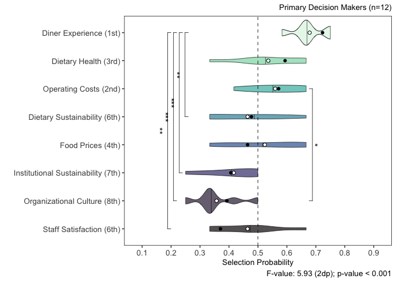<!-- -->

scale_y_continuous(breaks=c(0.1,0.2,0.3,0.4,0.5,0.6,0.7,0.8,0.9),limits=c(0.15,0.85)) +
scale_x_discrete(label=c(“Staff Satisfaction (8th)”,“Organizational
Culture (7th)”,“Institutional Sustainability (6th)”,“Food Prices
(5th)”,“Dietary Sustainability (4th)”,“Operating Costs (3rd)”,“Dietary
Health (2nd)”,“Diner Experience (1st)”)) +

scale_x_discrete(label=c(“Staff Satisfaction (8th)”,“Organizational
Culture (7th)”,“Institutional Sustainability (6th)”,“Food Prices
(5th)”,“Dietary Sustainability (4th)”,“Operating Costs (3rd)”,“Dietary
Health (2nd)”,“Diner Experience (1st)”)) +

geom_jitter(width=0.33,size=2,shape=21,alpha=0.5) +

stat_summary(data=technical_advisor_priority_probability_table,fun.y=mean,geom=“point”,shape=1,size=1.75,color=“black”)
+

``` r
technical_advisor_priority_score_frequencies <- tibble(comparison_indicator=c("Guest Dining Experience","Dietary Health","Operating Costs","Sustainability of Guest Food Choices","Food Pricing","Institutional Sustainability","Campus Culture","Staff Satisfaction"),guest_dining_experience_selection_frequency=as.double(NA),dietary_health_selection_frequency=as.double(NA),operating_costs_selection_frequency=as.double(NA),dietary_sustainability_selection_frequency=as.double(NA),food_pricing_selection_frequency=as.double(NA),institutional_sustainability_selection_frequency=as.double(NA),campus_culture_selection_frequency=as.double(NA),staff_satisfaction_selection_frequency=as.double(NA))
technical_advisor_priority_score_frequencies
```

    ## # A tibble: 8 × 9
    ##   comparison_indicator             guest_dining_experie…¹ dietary_health_selec…²
    ##   <chr>                                             <dbl>                  <dbl>
    ## 1 Guest Dining Experience                              NA                     NA
    ## 2 Dietary Health                                       NA                     NA
    ## 3 Operating Costs                                      NA                     NA
    ## 4 Sustainability of Guest Food Ch…                     NA                     NA
    ## 5 Food Pricing                                         NA                     NA
    ## 6 Institutional Sustainability                         NA                     NA
    ## 7 Campus Culture                                       NA                     NA
    ## 8 Staff Satisfaction                                   NA                     NA
    ## # ℹ abbreviated names: ¹​guest_dining_experience_selection_frequency,
    ## #   ²​dietary_health_selection_frequency
    ## # ℹ 6 more variables: operating_costs_selection_frequency <dbl>,
    ## #   dietary_sustainability_selection_frequency <dbl>,
    ## #   food_pricing_selection_frequency <dbl>,
    ## #   institutional_sustainability_selection_frequency <dbl>,
    ## #   campus_culture_selection_frequency <dbl>, …

``` r
technical_advisor_priority_score_tabulation <- survey_data %>%
  filter(role=="Advisor") %>%
  select(id,dietary_health_ranking,dietary_sustainability_ranking,institutional_sustainability_ranking,food_pricing_ranking,operating_costs_ranking,guest_experience_ranking,staff_satisfaction_ranking,campus_culture_ranking)
technical_advisor_priority_score_tabulation
```

    ##    id dietary_health_ranking dietary_sustainability_ranking
    ## 1   1                      2                              3
    ## 2   2                      2                              3
    ## 3   3                      3                              4
    ## 4   8                      6                              5
    ## 5   9                      2                              5
    ## 6  11                      7                              3
    ## 7  13                      6                              7
    ## 8  15                      4                              5
    ## 9  16                      6                              4
    ## 10 17                      3                              6
    ## 11 19                      1                              4
    ## 12 23                      1                              2
    ## 13 24                      6                              2
    ## 14 26                      3                              5
    ## 15 28                      5                              8
    ## 16 29                      3                              5
    ## 17 30                      2                              4
    ##    institutional_sustainability_ranking food_pricing_ranking
    ## 1                                     7                    5
    ## 2                                     1                    8
    ## 3                                     8                    2
    ## 4                                     4                    8
    ## 5                                     7                    8
    ## 6                                     8                    5
    ## 7                                     5                    3
    ## 8                                     1                    6
    ## 9                                     8                    2
    ## 10                                    8                    1
    ## 11                                    8                    6
    ## 12                                    6                    8
    ## 13                                    1                    5
    ## 14                                    1                    6
    ## 15                                    6                    1
    ## 16                                    4                    7
    ## 17                                    3                    6
    ##    operating_costs_ranking guest_experience_ranking staff_satisfaction_ranking
    ## 1                        4                        1                          6
    ## 2                        7                        4                          5
    ## 3                        5                        6                          7
    ## 4                        3                        2                          1
    ## 5                        4                        1                          6
    ## 6                        2                        1                          6
    ## 7                        2                        4                          8
    ## 8                        2                        3                          8
    ## 9                        3                        1                          7
    ## 10                       7                        4                          2
    ## 11                       5                        2                          3
    ## 12                       4                        3                          7
    ## 13                       3                        8                          4
    ## 14                       7                        4                          8
    ## 15                       3                        2                          7
    ## 16                       1                        2                          8
    ## 17                       5                        1                          7
    ##    campus_culture_ranking
    ## 1                       8
    ## 2                       6
    ## 3                       1
    ## 4                       7
    ## 5                       3
    ## 6                       4
    ## 7                       1
    ## 8                       7
    ## 9                       5
    ## 10                      5
    ## 11                      7
    ## 12                      5
    ## 13                      7
    ## 14                      2
    ## 15                      4
    ## 16                      6
    ## 17                      8

``` r
technical_advisor_priority_score_tabulation <- survey_data %>% #ADDING AUDITORS TO LARGER CONSULTANT GROUP
  filter(role=="Advisor" | role=="Auditor") %>%
  select(id,dietary_health_ranking,dietary_sustainability_ranking,institutional_sustainability_ranking,food_pricing_ranking,operating_costs_ranking,guest_experience_ranking,staff_satisfaction_ranking,campus_culture_ranking)
technical_advisor_priority_score_tabulation
```

    ##    id dietary_health_ranking dietary_sustainability_ranking
    ## 1   1                      2                              3
    ## 2   2                      2                              3
    ## 3   3                      3                              4
    ## 4   8                      6                              5
    ## 5   9                      2                              5
    ## 6  11                      7                              3
    ## 7  13                      6                              7
    ## 8  15                      4                              5
    ## 9  16                      6                              4
    ## 10 17                      3                              6
    ## 11 19                      1                              4
    ## 12 20                      5                              6
    ## 13 23                      1                              2
    ## 14 24                      6                              2
    ## 15 25                      2                              5
    ## 16 26                      3                              5
    ## 17 28                      5                              8
    ## 18 29                      3                              5
    ## 19 30                      2                              4
    ## 20 32                      3                              6
    ##    institutional_sustainability_ranking food_pricing_ranking
    ## 1                                     7                    5
    ## 2                                     1                    8
    ## 3                                     8                    2
    ## 4                                     4                    8
    ## 5                                     7                    8
    ## 6                                     8                    5
    ## 7                                     5                    3
    ## 8                                     1                    6
    ## 9                                     8                    2
    ## 10                                    8                    1
    ## 11                                    8                    6
    ## 12                                    4                    8
    ## 13                                    6                    8
    ## 14                                    1                    5
    ## 15                                    6                    3
    ## 16                                    1                    6
    ## 17                                    6                    1
    ## 18                                    4                    7
    ## 19                                    3                    6
    ## 20                                    8                    2
    ##    operating_costs_ranking guest_experience_ranking staff_satisfaction_ranking
    ## 1                        4                        1                          6
    ## 2                        7                        4                          5
    ## 3                        5                        6                          7
    ## 4                        3                        2                          1
    ## 5                        4                        1                          6
    ## 6                        2                        1                          6
    ## 7                        2                        4                          8
    ## 8                        2                        3                          8
    ## 9                        3                        1                          7
    ## 10                       7                        4                          2
    ## 11                       5                        2                          3
    ## 12                       7                        1                          3
    ## 13                       4                        3                          7
    ## 14                       3                        8                          4
    ## 15                       4                        1                          8
    ## 16                       7                        4                          8
    ## 17                       3                        2                          7
    ## 18                       1                        2                          8
    ## 19                       5                        1                          7
    ## 20                       1                        4                          5
    ##    campus_culture_ranking
    ## 1                       8
    ## 2                       6
    ## 3                       1
    ## 4                       7
    ## 5                       3
    ## 6                       4
    ## 7                       1
    ## 8                       7
    ## 9                       5
    ## 10                      5
    ## 11                      7
    ## 12                      2
    ## 13                      5
    ## 14                      7
    ## 15                      7
    ## 16                      2
    ## 17                      4
    ## 18                      6
    ## 19                      8
    ## 20                      7

``` r
technical_advisor_guest_experience_priority_score_tabulation <- technical_advisor_priority_score_tabulation %>%
  mutate(guest_experience_over_guest_experience=0) %>%
  mutate(guest_experience_over_dietary_health=case_when(guest_experience_ranking<dietary_health_ranking~1,
                                                        guest_experience_ranking>dietary_health_ranking~0)) %>%
  mutate(guest_experience_over_operating_costs=case_when(guest_experience_ranking<operating_costs_ranking~1,
                                                        guest_experience_ranking>operating_costs_ranking~0)) %>%
  mutate(guest_experience_over_dietary_sustainability=case_when(guest_experience_ranking<dietary_sustainability_ranking~1,
                                                        guest_experience_ranking>dietary_sustainability_ranking~0)) %>%
  mutate(guest_experience_over_food_pricing=case_when(guest_experience_ranking<food_pricing_ranking~1,
                                                        guest_experience_ranking>food_pricing_ranking~0)) %>%
   mutate(guest_experience_over_institutional_sustainability=case_when(guest_experience_ranking<institutional_sustainability_ranking~1,
                                                        guest_experience_ranking>institutional_sustainability_ranking~0)) %>%
  mutate(guest_experience_over_campus_culture=case_when(guest_experience_ranking<campus_culture_ranking~1,
                                                        guest_experience_ranking>campus_culture_ranking~0)) %>%
  mutate(guest_experience_over_staff_satisfaction=case_when(guest_experience_ranking<staff_satisfaction_ranking~1,
                                                        guest_experience_ranking>staff_satisfaction_ranking~0)) %>%
  select(id,guest_experience_over_dietary_health,guest_experience_over_operating_costs,guest_experience_over_dietary_sustainability,guest_experience_over_food_pricing,guest_experience_over_institutional_sustainability,guest_experience_over_campus_culture,guest_experience_over_staff_satisfaction,guest_experience_over_guest_experience) %>%
  pivot_longer(!id,names_to="condition",values_to="frequency") %>%
  group_by(condition) %>%
  summarise(instances=sum(frequency))
technical_advisor_guest_experience_priority_score_tabulation
```

    ## # A tibble: 8 × 2
    ##   condition                                          instances
    ##   <chr>                                                  <dbl>
    ## 1 guest_experience_over_campus_culture                      16
    ## 2 guest_experience_over_dietary_health                      12
    ## 3 guest_experience_over_dietary_sustainability              16
    ## 4 guest_experience_over_food_pricing                        14
    ## 5 guest_experience_over_guest_experience                     0
    ## 6 guest_experience_over_institutional_sustainability        16
    ## 7 guest_experience_over_operating_costs                     14
    ## 8 guest_experience_over_staff_satisfaction                  17

``` r
technical_advisor_priority_score_frequencies <- technical_advisor_priority_score_frequencies %>%
  mutate(guest_dining_experience_selection_frequency=c(0,10,12,13,12,13,13,14))
technical_advisor_priority_score_frequencies
```

    ## # A tibble: 8 × 9
    ##   comparison_indicator             guest_dining_experie…¹ dietary_health_selec…²
    ##   <chr>                                             <dbl>                  <dbl>
    ## 1 Guest Dining Experience                               0                     NA
    ## 2 Dietary Health                                       10                     NA
    ## 3 Operating Costs                                      12                     NA
    ## 4 Sustainability of Guest Food Ch…                     13                     NA
    ## 5 Food Pricing                                         12                     NA
    ## 6 Institutional Sustainability                         13                     NA
    ## 7 Campus Culture                                       13                     NA
    ## 8 Staff Satisfaction                                   14                     NA
    ## # ℹ abbreviated names: ¹​guest_dining_experience_selection_frequency,
    ## #   ²​dietary_health_selection_frequency
    ## # ℹ 6 more variables: operating_costs_selection_frequency <dbl>,
    ## #   dietary_sustainability_selection_frequency <dbl>,
    ## #   food_pricing_selection_frequency <dbl>,
    ## #   institutional_sustainability_selection_frequency <dbl>,
    ## #   campus_culture_selection_frequency <dbl>, …

``` r
technical_advisor_priority_score_frequencies <- technical_advisor_priority_score_frequencies %>% #MANUALLY INPUTTING NEW VALUES
  mutate(guest_dining_experience_selection_frequency=c(0,12,14,16,14,16,16,17))
technical_advisor_priority_score_frequencies
```

    ## # A tibble: 8 × 9
    ##   comparison_indicator             guest_dining_experie…¹ dietary_health_selec…²
    ##   <chr>                                             <dbl>                  <dbl>
    ## 1 Guest Dining Experience                               0                     NA
    ## 2 Dietary Health                                       12                     NA
    ## 3 Operating Costs                                      14                     NA
    ## 4 Sustainability of Guest Food Ch…                     16                     NA
    ## 5 Food Pricing                                         14                     NA
    ## 6 Institutional Sustainability                         16                     NA
    ## 7 Campus Culture                                       16                     NA
    ## 8 Staff Satisfaction                                   17                     NA
    ## # ℹ abbreviated names: ¹​guest_dining_experience_selection_frequency,
    ## #   ²​dietary_health_selection_frequency
    ## # ℹ 6 more variables: operating_costs_selection_frequency <dbl>,
    ## #   dietary_sustainability_selection_frequency <dbl>,
    ## #   food_pricing_selection_frequency <dbl>,
    ## #   institutional_sustainability_selection_frequency <dbl>,
    ## #   campus_culture_selection_frequency <dbl>, …

``` r
technical_advisor_dietary_health_priority_score_tabulation <- technical_advisor_priority_score_tabulation %>%
  mutate(dietary_health_over_guest_experience=case_when(dietary_health_ranking<guest_experience_ranking~1,
                                                        dietary_health_ranking>guest_experience_ranking~0)) %>%
  mutate(dietary_health_over_dietary_health=0) %>%
  mutate(dietary_health_over_operating_costs=case_when(dietary_health_ranking<operating_costs_ranking~1,
                                                        dietary_health_ranking>operating_costs_ranking~0)) %>%
  mutate(dietary_health_over_dietary_sustainability=case_when(dietary_health_ranking<dietary_sustainability_ranking~1,
                                                        dietary_health_ranking>dietary_sustainability_ranking~0)) %>%
  mutate(dietary_health_over_food_pricing=case_when(dietary_health_ranking<food_pricing_ranking~1,
                                                        dietary_health_ranking>food_pricing_ranking~0)) %>%
  mutate(dietary_health_over_institutional_sustainability=case_when(dietary_health_ranking<institutional_sustainability_ranking~1,
                                                        dietary_health_ranking>institutional_sustainability_ranking~0)) %>%
  mutate(dietary_health_over_campus_culture=case_when(dietary_health_ranking<campus_culture_ranking~1,
                                                        dietary_health_ranking>campus_culture_ranking~0)) %>%
  mutate(dietary_health_over_staff_satisfaction=case_when(dietary_health_ranking<staff_satisfaction_ranking~1,
                                                        dietary_health_ranking>staff_satisfaction_ranking~0)) %>%
  select(id,dietary_health_over_guest_experience,dietary_health_over_dietary_health,dietary_health_over_operating_costs,dietary_health_over_dietary_sustainability,dietary_health_over_food_pricing,dietary_health_over_institutional_sustainability,dietary_health_over_campus_culture,dietary_health_over_staff_satisfaction) %>%
  pivot_longer(!id,names_to="condition",values_to="instances") %>%
  group_by(condition) %>%
  summarise(instances=sum(instances))
technical_advisor_dietary_health_priority_score_tabulation
```

    ## # A tibble: 8 × 2
    ##   condition                                        instances
    ##   <chr>                                                <dbl>
    ## 1 dietary_health_over_campus_culture                      13
    ## 2 dietary_health_over_dietary_health                       0
    ## 3 dietary_health_over_dietary_sustainability              16
    ## 4 dietary_health_over_food_pricing                        12
    ## 5 dietary_health_over_guest_experience                     8
    ## 6 dietary_health_over_institutional_sustainability        13
    ## 7 dietary_health_over_operating_costs                     11
    ## 8 dietary_health_over_staff_satisfaction                  15

``` r
technical_advisor_priority_score_frequencies <- technical_advisor_priority_score_frequencies %>%
  mutate(dietary_health_selection_frequency=c(7,0,9,13,10,11,11,13))
technical_advisor_priority_score_frequencies
```

    ## # A tibble: 8 × 9
    ##   comparison_indicator             guest_dining_experie…¹ dietary_health_selec…²
    ##   <chr>                                             <dbl>                  <dbl>
    ## 1 Guest Dining Experience                               0                      7
    ## 2 Dietary Health                                       12                      0
    ## 3 Operating Costs                                      14                      9
    ## 4 Sustainability of Guest Food Ch…                     16                     13
    ## 5 Food Pricing                                         14                     10
    ## 6 Institutional Sustainability                         16                     11
    ## 7 Campus Culture                                       16                     11
    ## 8 Staff Satisfaction                                   17                     13
    ## # ℹ abbreviated names: ¹​guest_dining_experience_selection_frequency,
    ## #   ²​dietary_health_selection_frequency
    ## # ℹ 6 more variables: operating_costs_selection_frequency <dbl>,
    ## #   dietary_sustainability_selection_frequency <dbl>,
    ## #   food_pricing_selection_frequency <dbl>,
    ## #   institutional_sustainability_selection_frequency <dbl>,
    ## #   campus_culture_selection_frequency <dbl>, …

``` r
technical_advisor_priority_score_frequencies <- technical_advisor_priority_score_frequencies %>% #MANUALLY INPUTTING NEW VALUES
  mutate(dietary_health_selection_frequency=c(8,0,11,16,12,13,13,15))
technical_advisor_priority_score_frequencies
```

    ## # A tibble: 8 × 9
    ##   comparison_indicator             guest_dining_experie…¹ dietary_health_selec…²
    ##   <chr>                                             <dbl>                  <dbl>
    ## 1 Guest Dining Experience                               0                      8
    ## 2 Dietary Health                                       12                      0
    ## 3 Operating Costs                                      14                     11
    ## 4 Sustainability of Guest Food Ch…                     16                     16
    ## 5 Food Pricing                                         14                     12
    ## 6 Institutional Sustainability                         16                     13
    ## 7 Campus Culture                                       16                     13
    ## 8 Staff Satisfaction                                   17                     15
    ## # ℹ abbreviated names: ¹​guest_dining_experience_selection_frequency,
    ## #   ²​dietary_health_selection_frequency
    ## # ℹ 6 more variables: operating_costs_selection_frequency <dbl>,
    ## #   dietary_sustainability_selection_frequency <dbl>,
    ## #   food_pricing_selection_frequency <dbl>,
    ## #   institutional_sustainability_selection_frequency <dbl>,
    ## #   campus_culture_selection_frequency <dbl>, …

``` r
technical_advisor_operating_costs_priority_score_tabulation <- technical_advisor_priority_score_tabulation %>%
  mutate(operating_costs_over_guest_experience=case_when(operating_costs_ranking<guest_experience_ranking~1,
                                                        operating_costs_ranking>guest_experience_ranking~0)) %>%
  mutate(operating_costs_over_dietary_health=case_when(operating_costs_ranking<dietary_health_ranking~1,
                                                        operating_costs_ranking>dietary_health_ranking~0)) %>%
  mutate(operating_costs_over_operating_costs=0) %>%
  mutate(operating_costs_over_dietary_sustainability=case_when(operating_costs_ranking<dietary_sustainability_ranking~1,
                                                        operating_costs_ranking>dietary_sustainability_ranking~0)) %>%
  mutate(operating_costs_over_food_pricing=case_when(operating_costs_ranking<food_pricing_ranking~1,
                                                        operating_costs_ranking>food_pricing_ranking~0)) %>%
  mutate(operating_costs_over_institutional_sustainability=case_when(operating_costs_ranking<institutional_sustainability_ranking~1,
                                                        operating_costs_ranking>institutional_sustainability_ranking~0)) %>%
  mutate(operating_costs_over_campus_culture=case_when(operating_costs_ranking<campus_culture_ranking~1,
                                                        operating_costs_ranking>campus_culture_ranking~0)) %>%
  mutate(operating_costs_over_staff_satisfaction=case_when(operating_costs_ranking<staff_satisfaction_ranking~1,
                                                        operating_costs_ranking>staff_satisfaction_ranking~0)) %>%
  select(id,operating_costs_over_guest_experience,operating_costs_over_dietary_health,operating_costs_over_operating_costs,operating_costs_over_dietary_sustainability,operating_costs_over_food_pricing,operating_costs_over_institutional_sustainability,operating_costs_over_campus_culture,operating_costs_over_staff_satisfaction) %>%
  pivot_longer(!id,names_to="condition",values_to="instances") %>%
  group_by(condition) %>%
  summarise(instances=sum(instances))
technical_advisor_operating_costs_priority_score_tabulation
```

    ## # A tibble: 8 × 2
    ##   condition                                         instances
    ##   <chr>                                                 <dbl>
    ## 1 operating_costs_over_campus_culture                      13
    ## 2 operating_costs_over_dietary_health                       9
    ## 3 operating_costs_over_dietary_sustainability              10
    ## 4 operating_costs_over_food_pricing                        14
    ## 5 operating_costs_over_guest_experience                     6
    ## 6 operating_costs_over_institutional_sustainability        14
    ## 7 operating_costs_over_operating_costs                      0
    ## 8 operating_costs_over_staff_satisfaction                  15

``` r
technical_advisor_priority_score_frequencies <- technical_advisor_priority_score_frequencies %>%
  mutate(operating_costs_selection_frequency=c(5,8,0,8,12,12,11,13))
technical_advisor_priority_score_frequencies
```

    ## # A tibble: 8 × 9
    ##   comparison_indicator             guest_dining_experie…¹ dietary_health_selec…²
    ##   <chr>                                             <dbl>                  <dbl>
    ## 1 Guest Dining Experience                               0                      8
    ## 2 Dietary Health                                       12                      0
    ## 3 Operating Costs                                      14                     11
    ## 4 Sustainability of Guest Food Ch…                     16                     16
    ## 5 Food Pricing                                         14                     12
    ## 6 Institutional Sustainability                         16                     13
    ## 7 Campus Culture                                       16                     13
    ## 8 Staff Satisfaction                                   17                     15
    ## # ℹ abbreviated names: ¹​guest_dining_experience_selection_frequency,
    ## #   ²​dietary_health_selection_frequency
    ## # ℹ 6 more variables: operating_costs_selection_frequency <dbl>,
    ## #   dietary_sustainability_selection_frequency <dbl>,
    ## #   food_pricing_selection_frequency <dbl>,
    ## #   institutional_sustainability_selection_frequency <dbl>,
    ## #   campus_culture_selection_frequency <dbl>, …

``` r
technical_advisor_priority_score_frequencies <- technical_advisor_priority_score_frequencies %>% #Manually inputting new values
  mutate(operating_costs_selection_frequency=c(6,9,0,10,14,14,13,15))
technical_advisor_priority_score_frequencies
```

    ## # A tibble: 8 × 9
    ##   comparison_indicator             guest_dining_experie…¹ dietary_health_selec…²
    ##   <chr>                                             <dbl>                  <dbl>
    ## 1 Guest Dining Experience                               0                      8
    ## 2 Dietary Health                                       12                      0
    ## 3 Operating Costs                                      14                     11
    ## 4 Sustainability of Guest Food Ch…                     16                     16
    ## 5 Food Pricing                                         14                     12
    ## 6 Institutional Sustainability                         16                     13
    ## 7 Campus Culture                                       16                     13
    ## 8 Staff Satisfaction                                   17                     15
    ## # ℹ abbreviated names: ¹​guest_dining_experience_selection_frequency,
    ## #   ²​dietary_health_selection_frequency
    ## # ℹ 6 more variables: operating_costs_selection_frequency <dbl>,
    ## #   dietary_sustainability_selection_frequency <dbl>,
    ## #   food_pricing_selection_frequency <dbl>,
    ## #   institutional_sustainability_selection_frequency <dbl>,
    ## #   campus_culture_selection_frequency <dbl>, …

``` r
technical_advisor_dietary_sustainability_priority_score_tabulation <- technical_advisor_priority_score_tabulation %>%
  mutate(dietary_sustainability_over_guest_experience=case_when(dietary_sustainability_ranking<guest_experience_ranking~1,
                                                        dietary_sustainability_ranking>guest_experience_ranking~0)) %>%
  mutate(dietary_sustainability_over_dietary_health=case_when(dietary_sustainability_ranking<dietary_health_ranking~1,
                                                        dietary_sustainability_ranking>dietary_health_ranking~0)) %>%
  mutate(dietary_sustainability_over_operating_costs=case_when(dietary_sustainability_ranking<operating_costs_ranking~1,
                                                        dietary_sustainability_ranking>operating_costs_ranking~0)) %>%
  mutate(dietary_sustainability_over_dietary_sustainability=0) %>%
  mutate(dietary_sustainability_over_food_pricing=case_when(dietary_sustainability_ranking<food_pricing_ranking~1,
                                                        dietary_sustainability_ranking>food_pricing_ranking~0)) %>%
  mutate(dietary_sustainability_over_institutional_sustainability=case_when(dietary_sustainability_ranking<institutional_sustainability_ranking~1,
                                                        dietary_sustainability_ranking>institutional_sustainability_ranking~0)) %>%
  mutate(dietary_sustainability_over_campus_culture=case_when(dietary_sustainability_ranking<campus_culture_ranking~1,
                                                        dietary_sustainability_ranking>campus_culture_ranking~0)) %>%
  mutate(dietary_sustainability_over_staff_satisfaction=case_when(dietary_sustainability_ranking<staff_satisfaction_ranking~1,
                                                        dietary_sustainability_ranking>staff_satisfaction_ranking~0)) %>%
  select(id,dietary_sustainability_over_guest_experience,dietary_sustainability_over_dietary_health,dietary_sustainability_over_operating_costs,dietary_sustainability_over_dietary_sustainability,dietary_sustainability_over_food_pricing,dietary_sustainability_over_institutional_sustainability,dietary_sustainability_over_campus_culture,dietary_sustainability_over_staff_satisfaction) %>%
  pivot_longer(!id,names_to="condition",values_to="instances") %>%
  group_by(condition) %>%
  summarise(instances=sum(instances))
technical_advisor_dietary_sustainability_priority_score_tabulation
```

    ## # A tibble: 8 × 2
    ##   condition                                                instances
    ##   <chr>                                                        <dbl>
    ## 1 dietary_sustainability_over_campus_culture                      13
    ## 2 dietary_sustainability_over_dietary_health                       4
    ## 3 dietary_sustainability_over_dietary_sustainability               0
    ## 4 dietary_sustainability_over_food_pricing                        13
    ## 5 dietary_sustainability_over_guest_experience                     4
    ## 6 dietary_sustainability_over_institutional_sustainability        10
    ## 7 dietary_sustainability_over_operating_costs                     10
    ## 8 dietary_sustainability_over_staff_satisfaction                  14

``` r
technical_advisor_priority_score_frequencies <- technical_advisor_priority_score_frequencies %>%
  mutate(dietary_sustainability_selection_frequency=c(4,4,9,0,12,8,11,13))
technical_advisor_priority_score_frequencies
```

    ## # A tibble: 8 × 9
    ##   comparison_indicator             guest_dining_experie…¹ dietary_health_selec…²
    ##   <chr>                                             <dbl>                  <dbl>
    ## 1 Guest Dining Experience                               0                      8
    ## 2 Dietary Health                                       12                      0
    ## 3 Operating Costs                                      14                     11
    ## 4 Sustainability of Guest Food Ch…                     16                     16
    ## 5 Food Pricing                                         14                     12
    ## 6 Institutional Sustainability                         16                     13
    ## 7 Campus Culture                                       16                     13
    ## 8 Staff Satisfaction                                   17                     15
    ## # ℹ abbreviated names: ¹​guest_dining_experience_selection_frequency,
    ## #   ²​dietary_health_selection_frequency
    ## # ℹ 6 more variables: operating_costs_selection_frequency <dbl>,
    ## #   dietary_sustainability_selection_frequency <dbl>,
    ## #   food_pricing_selection_frequency <dbl>,
    ## #   institutional_sustainability_selection_frequency <dbl>,
    ## #   campus_culture_selection_frequency <dbl>, …

``` r
technical_advisor_priority_score_frequencies <- technical_advisor_priority_score_frequencies %>% #MANUALLY ADDING NEW VALUES 
  mutate(dietary_sustainability_selection_frequency=c(4,4,10,0,13,10,13,14))
technical_advisor_priority_score_frequencies
```

    ## # A tibble: 8 × 9
    ##   comparison_indicator             guest_dining_experie…¹ dietary_health_selec…²
    ##   <chr>                                             <dbl>                  <dbl>
    ## 1 Guest Dining Experience                               0                      8
    ## 2 Dietary Health                                       12                      0
    ## 3 Operating Costs                                      14                     11
    ## 4 Sustainability of Guest Food Ch…                     16                     16
    ## 5 Food Pricing                                         14                     12
    ## 6 Institutional Sustainability                         16                     13
    ## 7 Campus Culture                                       16                     13
    ## 8 Staff Satisfaction                                   17                     15
    ## # ℹ abbreviated names: ¹​guest_dining_experience_selection_frequency,
    ## #   ²​dietary_health_selection_frequency
    ## # ℹ 6 more variables: operating_costs_selection_frequency <dbl>,
    ## #   dietary_sustainability_selection_frequency <dbl>,
    ## #   food_pricing_selection_frequency <dbl>,
    ## #   institutional_sustainability_selection_frequency <dbl>,
    ## #   campus_culture_selection_frequency <dbl>, …

``` r
technical_advisor_food_pricing_priority_score_tabulation <- technical_advisor_priority_score_tabulation %>%
  mutate(food_pricing_over_guest_experience=case_when(food_pricing_ranking<guest_experience_ranking~1,
                                                        food_pricing_ranking>guest_experience_ranking~0)) %>%
  mutate(food_pricing_over_dietary_health=case_when(food_pricing_ranking<dietary_health_ranking~1,
                                                        food_pricing_ranking>dietary_health_ranking~0)) %>%
  mutate(food_pricing_over_operating_costs=case_when(food_pricing_ranking<operating_costs_ranking~1,
                                                        food_pricing_ranking>operating_costs_ranking~0)) %>%
  mutate(food_pricing_over_dietary_sustainability=case_when(food_pricing_ranking<dietary_sustainability_ranking~1,
                                                        food_pricing_ranking>dietary_sustainability_ranking~0)) %>%
  mutate(food_pricing_over_food_pricing=0) %>%
  mutate(food_pricing_over_institutional_sustainability=case_when(food_pricing_ranking<institutional_sustainability_ranking~1,
                                                        food_pricing_ranking>institutional_sustainability_ranking~0)) %>%
  mutate(food_pricing_over_campus_culture=case_when(food_pricing_ranking<campus_culture_ranking~1,
                                                        food_pricing_ranking>campus_culture_ranking~0)) %>%
  mutate(food_pricing_over_staff_satisfaction=case_when(food_pricing_ranking<staff_satisfaction_ranking~1,
                                                        food_pricing_ranking>staff_satisfaction_ranking~0)) %>%
  select(id,food_pricing_over_guest_experience,food_pricing_over_dietary_health,food_pricing_over_operating_costs,food_pricing_over_dietary_sustainability,food_pricing_over_food_pricing,food_pricing_over_institutional_sustainability,food_pricing_over_campus_culture,food_pricing_over_staff_satisfaction) %>%
  pivot_longer(!id,names_to="condition",values_to="instances") %>%
  group_by(condition) %>%
  summarise(instances=sum(instances))
technical_advisor_food_pricing_priority_score_tabulation
```

    ## # A tibble: 8 × 2
    ##   condition                                      instances
    ##   <chr>                                              <dbl>
    ## 1 food_pricing_over_campus_culture                      10
    ## 2 food_pricing_over_dietary_health                       8
    ## 3 food_pricing_over_dietary_sustainability               7
    ## 4 food_pricing_over_food_pricing                         0
    ## 5 food_pricing_over_guest_experience                     6
    ## 6 food_pricing_over_institutional_sustainability        10
    ## 7 food_pricing_over_operating_costs                      6
    ## 8 food_pricing_over_staff_satisfaction                  13

``` r
technical_advisor_priority_score_frequencies <- technical_advisor_priority_score_frequencies %>%
  mutate(food_pricing_selection_frequency=c(5,7,5,5,0,8,8,11))
technical_advisor_priority_score_frequencies
```

    ## # A tibble: 8 × 9
    ##   comparison_indicator             guest_dining_experie…¹ dietary_health_selec…²
    ##   <chr>                                             <dbl>                  <dbl>
    ## 1 Guest Dining Experience                               0                      8
    ## 2 Dietary Health                                       12                      0
    ## 3 Operating Costs                                      14                     11
    ## 4 Sustainability of Guest Food Ch…                     16                     16
    ## 5 Food Pricing                                         14                     12
    ## 6 Institutional Sustainability                         16                     13
    ## 7 Campus Culture                                       16                     13
    ## 8 Staff Satisfaction                                   17                     15
    ## # ℹ abbreviated names: ¹​guest_dining_experience_selection_frequency,
    ## #   ²​dietary_health_selection_frequency
    ## # ℹ 6 more variables: operating_costs_selection_frequency <dbl>,
    ## #   dietary_sustainability_selection_frequency <dbl>,
    ## #   food_pricing_selection_frequency <dbl>,
    ## #   institutional_sustainability_selection_frequency <dbl>,
    ## #   campus_culture_selection_frequency <dbl>, …

``` r
technical_advisor_priority_score_frequencies <- technical_advisor_priority_score_frequencies %>% #Manually adding new values
  mutate(food_pricing_selection_frequency=c(6,8,6,7,0,10,10,13))
technical_advisor_priority_score_frequencies
```

    ## # A tibble: 8 × 9
    ##   comparison_indicator             guest_dining_experie…¹ dietary_health_selec…²
    ##   <chr>                                             <dbl>                  <dbl>
    ## 1 Guest Dining Experience                               0                      8
    ## 2 Dietary Health                                       12                      0
    ## 3 Operating Costs                                      14                     11
    ## 4 Sustainability of Guest Food Ch…                     16                     16
    ## 5 Food Pricing                                         14                     12
    ## 6 Institutional Sustainability                         16                     13
    ## 7 Campus Culture                                       16                     13
    ## 8 Staff Satisfaction                                   17                     15
    ## # ℹ abbreviated names: ¹​guest_dining_experience_selection_frequency,
    ## #   ²​dietary_health_selection_frequency
    ## # ℹ 6 more variables: operating_costs_selection_frequency <dbl>,
    ## #   dietary_sustainability_selection_frequency <dbl>,
    ## #   food_pricing_selection_frequency <dbl>,
    ## #   institutional_sustainability_selection_frequency <dbl>,
    ## #   campus_culture_selection_frequency <dbl>, …

``` r
technical_advisor_institutional_sustainability_priority_score_tabulation <- technical_advisor_priority_score_tabulation %>%
  mutate(institutional_sustainability_over_guest_experience=case_when(institutional_sustainability_ranking<guest_experience_ranking~1,
                                                        institutional_sustainability_ranking>guest_experience_ranking~0)) %>%
  mutate(institutional_sustainability_over_dietary_health=case_when(institutional_sustainability_ranking<dietary_health_ranking~1,
                                                        institutional_sustainability_ranking>dietary_health_ranking~0)) %>%
  mutate(institutional_sustainability_over_operating_costs=case_when(institutional_sustainability_ranking<operating_costs_ranking~1,
                                                        institutional_sustainability_ranking>operating_costs_ranking~0)) %>%
  mutate(institutional_sustainability_over_dietary_sustainability=case_when(institutional_sustainability_ranking<dietary_sustainability_ranking~1,
                                                        institutional_sustainability_ranking>dietary_sustainability_ranking~0)) %>%
  mutate(institutional_sustainability_over_food_pricing=case_when(institutional_sustainability_ranking<food_pricing_ranking~1,
                                                        institutional_sustainability_ranking>food_pricing_ranking~0)) %>%
  mutate(institutional_sustainability_over_institutional_sustainability=0) %>%
  mutate(institutional_sustainability_over_campus_culture=case_when(institutional_sustainability_ranking<campus_culture_ranking~1,
                                                        institutional_sustainability_ranking>campus_culture_ranking~0)) %>%
  mutate(institutional_sustainability_over_staff_satisfaction=case_when(institutional_sustainability_ranking<staff_satisfaction_ranking~1,
                                                        institutional_sustainability_ranking>staff_satisfaction_ranking~0)) %>%
  select(id,institutional_sustainability_over_guest_experience,institutional_sustainability_over_dietary_health,institutional_sustainability_over_operating_costs,institutional_sustainability_over_dietary_sustainability,institutional_sustainability_over_food_pricing,institutional_sustainability_over_institutional_sustainability,institutional_sustainability_over_campus_culture,institutional_sustainability_over_staff_satisfaction) %>%
  pivot_longer(!id,names_to="condition",values_to="instances") %>%
  group_by(condition) %>%
  summarise(instances=sum(instances))
technical_advisor_institutional_sustainability_priority_score_tabulation
```

    ## # A tibble: 8 × 2
    ##   condition                                                      instances
    ##   <chr>                                                              <dbl>
    ## 1 institutional_sustainability_over_campus_culture                       9
    ## 2 institutional_sustainability_over_dietary_health                       7
    ## 3 institutional_sustainability_over_dietary_sustainability              10
    ## 4 institutional_sustainability_over_food_pricing                        10
    ## 5 institutional_sustainability_over_guest_experience                     4
    ## 6 institutional_sustainability_over_institutional_sustainability         0
    ## 7 institutional_sustainability_over_operating_costs                      6
    ## 8 institutional_sustainability_over_staff_satisfaction                  10

``` r
technical_advisor_priority_score_frequencies <- technical_advisor_priority_score_frequencies %>%
  mutate(institutional_sustainability_selection_frequency=c(4,6,5,9,9,0,8,9))
technical_advisor_priority_score_frequencies
```

    ## # A tibble: 8 × 9
    ##   comparison_indicator             guest_dining_experie…¹ dietary_health_selec…²
    ##   <chr>                                             <dbl>                  <dbl>
    ## 1 Guest Dining Experience                               0                      8
    ## 2 Dietary Health                                       12                      0
    ## 3 Operating Costs                                      14                     11
    ## 4 Sustainability of Guest Food Ch…                     16                     16
    ## 5 Food Pricing                                         14                     12
    ## 6 Institutional Sustainability                         16                     13
    ## 7 Campus Culture                                       16                     13
    ## 8 Staff Satisfaction                                   17                     15
    ## # ℹ abbreviated names: ¹​guest_dining_experience_selection_frequency,
    ## #   ²​dietary_health_selection_frequency
    ## # ℹ 6 more variables: operating_costs_selection_frequency <dbl>,
    ## #   dietary_sustainability_selection_frequency <dbl>,
    ## #   food_pricing_selection_frequency <dbl>,
    ## #   institutional_sustainability_selection_frequency <dbl>,
    ## #   campus_culture_selection_frequency <dbl>, …

``` r
technical_advisor_priority_score_frequencies <- technical_advisor_priority_score_frequencies %>% #manually adding new values
  mutate(institutional_sustainability_selection_frequency=c(4,7,6,10,10,0,9,10))
technical_advisor_priority_score_frequencies
```

    ## # A tibble: 8 × 9
    ##   comparison_indicator             guest_dining_experie…¹ dietary_health_selec…²
    ##   <chr>                                             <dbl>                  <dbl>
    ## 1 Guest Dining Experience                               0                      8
    ## 2 Dietary Health                                       12                      0
    ## 3 Operating Costs                                      14                     11
    ## 4 Sustainability of Guest Food Ch…                     16                     16
    ## 5 Food Pricing                                         14                     12
    ## 6 Institutional Sustainability                         16                     13
    ## 7 Campus Culture                                       16                     13
    ## 8 Staff Satisfaction                                   17                     15
    ## # ℹ abbreviated names: ¹​guest_dining_experience_selection_frequency,
    ## #   ²​dietary_health_selection_frequency
    ## # ℹ 6 more variables: operating_costs_selection_frequency <dbl>,
    ## #   dietary_sustainability_selection_frequency <dbl>,
    ## #   food_pricing_selection_frequency <dbl>,
    ## #   institutional_sustainability_selection_frequency <dbl>,
    ## #   campus_culture_selection_frequency <dbl>, …

``` r
technical_advisor_campus_culture_priority_score_tabulation <- technical_advisor_priority_score_tabulation %>%
  mutate(campus_culture_over_guest_experience=case_when(campus_culture_ranking<guest_experience_ranking~1,
                                                        campus_culture_ranking>guest_experience_ranking~0)) %>%
  mutate(campus_culture_over_dietary_health=case_when(campus_culture_ranking<dietary_health_ranking~1,
                                                        campus_culture_ranking>dietary_health_ranking~0)) %>%
  mutate(campus_culture_over_operating_costs=case_when(campus_culture_ranking<operating_costs_ranking~1,
                                                        campus_culture_ranking>operating_costs_ranking~0)) %>%
  mutate(campus_culture_over_dietary_sustainability=case_when(campus_culture_ranking<dietary_sustainability_ranking~1,
                                                        campus_culture_ranking>dietary_sustainability_ranking~0)) %>%
  mutate(campus_culture_over_food_pricing=case_when(campus_culture_ranking<food_pricing_ranking~1,
                                                        campus_culture_ranking>food_pricing_ranking~0)) %>%
  mutate(campus_culture_over_institutional_sustainability=case_when(campus_culture_ranking<institutional_sustainability_ranking~1,
                                                        campus_culture_ranking>institutional_sustainability_ranking~0)) %>%
  mutate(campus_culture_over_campus_culture=0) %>%
  mutate(campus_culture_over_staff_satisfaction=case_when(campus_culture_ranking<staff_satisfaction_ranking~1,
                                                        campus_culture_ranking>staff_satisfaction_ranking~0)) %>%
  select(id,campus_culture_over_guest_experience,campus_culture_over_dietary_health,campus_culture_over_operating_costs,campus_culture_over_dietary_sustainability,campus_culture_over_food_pricing,campus_culture_over_institutional_sustainability,campus_culture_over_campus_culture,campus_culture_over_staff_satisfaction) %>%
  pivot_longer(!id,names_to="condition",values_to="instances") %>%
  group_by(condition) %>%
  summarise(instances=sum(instances))
technical_advisor_campus_culture_priority_score_tabulation
```

    ## # A tibble: 8 × 2
    ##   condition                                        instances
    ##   <chr>                                                <dbl>
    ## 1 campus_culture_over_campus_culture                       0
    ## 2 campus_culture_over_dietary_health                       7
    ## 3 campus_culture_over_dietary_sustainability               7
    ## 4 campus_culture_over_food_pricing                        10
    ## 5 campus_culture_over_guest_experience                     4
    ## 6 campus_culture_over_institutional_sustainability        11
    ## 7 campus_culture_over_operating_costs                      7
    ## 8 campus_culture_over_staff_satisfaction                  12

``` r
technical_advisor_priority_score_frequencies <- technical_advisor_priority_score_frequencies %>%
  mutate(campus_culture_selection_frequency=c(4,6,6,6,9,9,0,10))
technical_advisor_priority_score_frequencies
```

    ## # A tibble: 8 × 9
    ##   comparison_indicator             guest_dining_experie…¹ dietary_health_selec…²
    ##   <chr>                                             <dbl>                  <dbl>
    ## 1 Guest Dining Experience                               0                      8
    ## 2 Dietary Health                                       12                      0
    ## 3 Operating Costs                                      14                     11
    ## 4 Sustainability of Guest Food Ch…                     16                     16
    ## 5 Food Pricing                                         14                     12
    ## 6 Institutional Sustainability                         16                     13
    ## 7 Campus Culture                                       16                     13
    ## 8 Staff Satisfaction                                   17                     15
    ## # ℹ abbreviated names: ¹​guest_dining_experience_selection_frequency,
    ## #   ²​dietary_health_selection_frequency
    ## # ℹ 6 more variables: operating_costs_selection_frequency <dbl>,
    ## #   dietary_sustainability_selection_frequency <dbl>,
    ## #   food_pricing_selection_frequency <dbl>,
    ## #   institutional_sustainability_selection_frequency <dbl>,
    ## #   campus_culture_selection_frequency <dbl>, …

``` r
technical_advisor_priority_score_frequencies <- technical_advisor_priority_score_frequencies %>% #manually adding new values
  mutate(campus_culture_selection_frequency=c(4,7,7,7,10,11,0,12))
technical_advisor_priority_score_frequencies
```

    ## # A tibble: 8 × 9
    ##   comparison_indicator             guest_dining_experie…¹ dietary_health_selec…²
    ##   <chr>                                             <dbl>                  <dbl>
    ## 1 Guest Dining Experience                               0                      8
    ## 2 Dietary Health                                       12                      0
    ## 3 Operating Costs                                      14                     11
    ## 4 Sustainability of Guest Food Ch…                     16                     16
    ## 5 Food Pricing                                         14                     12
    ## 6 Institutional Sustainability                         16                     13
    ## 7 Campus Culture                                       16                     13
    ## 8 Staff Satisfaction                                   17                     15
    ## # ℹ abbreviated names: ¹​guest_dining_experience_selection_frequency,
    ## #   ²​dietary_health_selection_frequency
    ## # ℹ 6 more variables: operating_costs_selection_frequency <dbl>,
    ## #   dietary_sustainability_selection_frequency <dbl>,
    ## #   food_pricing_selection_frequency <dbl>,
    ## #   institutional_sustainability_selection_frequency <dbl>,
    ## #   campus_culture_selection_frequency <dbl>, …

``` r
technical_advisor_staff_satisfaction_priority_score_tabulation <- technical_advisor_priority_score_tabulation %>%
  mutate(staff_satisfaction_over_guest_experience=case_when(staff_satisfaction_ranking<guest_experience_ranking~1,
                                                        staff_satisfaction_ranking>guest_experience_ranking~0)) %>%
  mutate(staff_satisfaction_over_dietary_health=case_when(staff_satisfaction_ranking<dietary_health_ranking~1,
                                                        staff_satisfaction_ranking>dietary_health_ranking~0)) %>%
  mutate(staff_satisfaction_over_operating_costs=case_when(staff_satisfaction_ranking<operating_costs_ranking~1,
                                                        staff_satisfaction_ranking>operating_costs_ranking~0)) %>%
  mutate(staff_satisfaction_over_dietary_sustainability=case_when(staff_satisfaction_ranking<dietary_sustainability_ranking~1,
                                                        staff_satisfaction_ranking>dietary_sustainability_ranking~0)) %>%
  mutate(staff_satisfaction_over_food_pricing=case_when(staff_satisfaction_ranking<food_pricing_ranking~1,
                                                        staff_satisfaction_ranking>food_pricing_ranking~0)) %>%
  mutate(staff_satisfaction_over_institutional_sustainability=case_when(staff_satisfaction_ranking<institutional_sustainability_ranking~1,
                                                        staff_satisfaction_ranking>institutional_sustainability_ranking~0)) %>%
  mutate(staff_satisfaction_over_campus_culture=case_when(staff_satisfaction_ranking<campus_culture_ranking~1,
                                                        staff_satisfaction_ranking>campus_culture_ranking~0)) %>%
  mutate(staff_satisfaction_over_staff_satisfaction=0) %>%
  select(id,staff_satisfaction_over_guest_experience,staff_satisfaction_over_dietary_health,staff_satisfaction_over_operating_costs,staff_satisfaction_over_dietary_sustainability,staff_satisfaction_over_food_pricing,staff_satisfaction_over_institutional_sustainability,staff_satisfaction_over_campus_culture,staff_satisfaction_over_staff_satisfaction) %>%
  pivot_longer(!id,names_to="condition",values_to="instances") %>%
  group_by(condition) %>%
  summarise(instances=sum(instances))
technical_advisor_staff_satisfaction_priority_score_tabulation
```

    ## # A tibble: 8 × 2
    ##   condition                                            instances
    ##   <chr>                                                    <dbl>
    ## 1 staff_satisfaction_over_campus_culture                       8
    ## 2 staff_satisfaction_over_dietary_health                       5
    ## 3 staff_satisfaction_over_dietary_sustainability               6
    ## 4 staff_satisfaction_over_food_pricing                         7
    ## 5 staff_satisfaction_over_guest_experience                     3
    ## 6 staff_satisfaction_over_institutional_sustainability        10
    ## 7 staff_satisfaction_over_operating_costs                      5
    ## 8 staff_satisfaction_over_staff_satisfaction                   0

``` r
technical_advisor_priority_score_frequencies <- technical_advisor_priority_score_frequencies %>%
  mutate(staff_satisfaction_selection_frequency=c(3,4,4,4,6,8,7,0))
technical_advisor_priority_score_frequencies
```

    ## # A tibble: 8 × 9
    ##   comparison_indicator             guest_dining_experie…¹ dietary_health_selec…²
    ##   <chr>                                             <dbl>                  <dbl>
    ## 1 Guest Dining Experience                               0                      8
    ## 2 Dietary Health                                       12                      0
    ## 3 Operating Costs                                      14                     11
    ## 4 Sustainability of Guest Food Ch…                     16                     16
    ## 5 Food Pricing                                         14                     12
    ## 6 Institutional Sustainability                         16                     13
    ## 7 Campus Culture                                       16                     13
    ## 8 Staff Satisfaction                                   17                     15
    ## # ℹ abbreviated names: ¹​guest_dining_experience_selection_frequency,
    ## #   ²​dietary_health_selection_frequency
    ## # ℹ 6 more variables: operating_costs_selection_frequency <dbl>,
    ## #   dietary_sustainability_selection_frequency <dbl>,
    ## #   food_pricing_selection_frequency <dbl>,
    ## #   institutional_sustainability_selection_frequency <dbl>,
    ## #   campus_culture_selection_frequency <dbl>, …

``` r
technical_advisor_priority_score_frequencies <- technical_advisor_priority_score_frequencies %>% #manually adding new values
  mutate(staff_satisfaction_selection_frequency=c(3,5,5,6,7,10,8,0))
technical_advisor_priority_score_frequencies
```

    ## # A tibble: 8 × 9
    ##   comparison_indicator             guest_dining_experie…¹ dietary_health_selec…²
    ##   <chr>                                             <dbl>                  <dbl>
    ## 1 Guest Dining Experience                               0                      8
    ## 2 Dietary Health                                       12                      0
    ## 3 Operating Costs                                      14                     11
    ## 4 Sustainability of Guest Food Ch…                     16                     16
    ## 5 Food Pricing                                         14                     12
    ## 6 Institutional Sustainability                         16                     13
    ## 7 Campus Culture                                       16                     13
    ## 8 Staff Satisfaction                                   17                     15
    ## # ℹ abbreviated names: ¹​guest_dining_experience_selection_frequency,
    ## #   ²​dietary_health_selection_frequency
    ## # ℹ 6 more variables: operating_costs_selection_frequency <dbl>,
    ## #   dietary_sustainability_selection_frequency <dbl>,
    ## #   food_pricing_selection_frequency <dbl>,
    ## #   institutional_sustainability_selection_frequency <dbl>,
    ## #   campus_culture_selection_frequency <dbl>, …

``` r
technical_advisor_priority_score_probabilities <- technical_advisor_priority_score_frequencies %>%
  mutate(guest_dining_experience_selection_probability=guest_dining_experience_selection_frequency/17,.after=guest_dining_experience_selection_frequency) %>%
  mutate(dietary_health_selection_probability=dietary_health_selection_frequency/17,.after=dietary_health_selection_frequency) %>%
  mutate(operating_costs_selection_probability=operating_costs_selection_frequency/17,.after=operating_costs_selection_frequency) %>%
   mutate(dietary_sustainability_selection_probability=dietary_sustainability_selection_frequency/17,.after=dietary_sustainability_selection_frequency) %>%
  mutate(food_pricing_selection_probability=food_pricing_selection_frequency/17,.after=food_pricing_selection_frequency) %>%
  mutate(institutional_sustainability_selection_probability=institutional_sustainability_selection_frequency/17,.after=institutional_sustainability_selection_frequency) %>%
  mutate(campus_culture_selection_probability=campus_culture_selection_frequency/17,.after=campus_culture_selection_frequency) %>%
   mutate(staff_satisfaction_selection_probability=staff_satisfaction_selection_frequency/17,.after=staff_satisfaction_selection_frequency)
technical_advisor_priority_score_probabilities
```

    ## # A tibble: 8 × 17
    ##   comparison_indicator             guest_dining_experie…¹ guest_dining_experie…²
    ##   <chr>                                             <dbl>                  <dbl>
    ## 1 Guest Dining Experience                               0                  0    
    ## 2 Dietary Health                                       12                  0.706
    ## 3 Operating Costs                                      14                  0.824
    ## 4 Sustainability of Guest Food Ch…                     16                  0.941
    ## 5 Food Pricing                                         14                  0.824
    ## 6 Institutional Sustainability                         16                  0.941
    ## 7 Campus Culture                                       16                  0.941
    ## 8 Staff Satisfaction                                   17                  1    
    ## # ℹ abbreviated names: ¹​guest_dining_experience_selection_frequency,
    ## #   ²​guest_dining_experience_selection_probability
    ## # ℹ 14 more variables: dietary_health_selection_frequency <dbl>,
    ## #   dietary_health_selection_probability <dbl>,
    ## #   operating_costs_selection_frequency <dbl>,
    ## #   operating_costs_selection_probability <dbl>,
    ## #   dietary_sustainability_selection_frequency <dbl>, …

``` r
technical_advisor_priority_score_probabilities <- technical_advisor_priority_score_frequencies %>% # changing denominator to reflect change in subsample size
  mutate(guest_dining_experience_selection_probability=guest_dining_experience_selection_frequency/20,.after=guest_dining_experience_selection_frequency) %>%
  mutate(dietary_health_selection_probability=dietary_health_selection_frequency/20,.after=dietary_health_selection_frequency) %>%
  mutate(operating_costs_selection_probability=operating_costs_selection_frequency/20,.after=operating_costs_selection_frequency) %>%
   mutate(dietary_sustainability_selection_probability=dietary_sustainability_selection_frequency/20,.after=dietary_sustainability_selection_frequency) %>%
  mutate(food_pricing_selection_probability=food_pricing_selection_frequency/20,.after=food_pricing_selection_frequency) %>%
  mutate(institutional_sustainability_selection_probability=institutional_sustainability_selection_frequency/20,.after=institutional_sustainability_selection_frequency) %>%
  mutate(campus_culture_selection_probability=campus_culture_selection_frequency/20,.after=campus_culture_selection_frequency) %>%
   mutate(staff_satisfaction_selection_probability=staff_satisfaction_selection_frequency/20,.after=staff_satisfaction_selection_frequency)
technical_advisor_priority_score_probabilities
```

    ## # A tibble: 8 × 17
    ##   comparison_indicator             guest_dining_experie…¹ guest_dining_experie…²
    ##   <chr>                                             <dbl>                  <dbl>
    ## 1 Guest Dining Experience                               0                   0   
    ## 2 Dietary Health                                       12                   0.6 
    ## 3 Operating Costs                                      14                   0.7 
    ## 4 Sustainability of Guest Food Ch…                     16                   0.8 
    ## 5 Food Pricing                                         14                   0.7 
    ## 6 Institutional Sustainability                         16                   0.8 
    ## 7 Campus Culture                                       16                   0.8 
    ## 8 Staff Satisfaction                                   17                   0.85
    ## # ℹ abbreviated names: ¹​guest_dining_experience_selection_frequency,
    ## #   ²​guest_dining_experience_selection_probability
    ## # ℹ 14 more variables: dietary_health_selection_frequency <dbl>,
    ## #   dietary_health_selection_probability <dbl>,
    ## #   operating_costs_selection_frequency <dbl>,
    ## #   operating_costs_selection_probability <dbl>,
    ## #   dietary_sustainability_selection_frequency <dbl>, …

``` r
technical_advisor_priority_probability_table <- technical_advisor_priority_score_probabilities %>%
  select(comparison_indicator,guest_dining_experience_selection_probability,dietary_health_selection_probability,operating_costs_selection_probability,dietary_sustainability_selection_probability,food_pricing_selection_probability,institutional_sustainability_selection_probability,campus_culture_selection_probability,staff_satisfaction_selection_probability) %>%
  pivot_longer(!comparison_indicator,names_to="indicator",values_to="probability") %>%
  select(-comparison_indicator) %>%
  mutate(across(indicator,str_replace,"guest_dining_experience_selection_probability","Guest Dining Experience")) %>%
  mutate(across(indicator,str_replace,"dietary_health_selection_probability","Dietary Health")) %>%
  mutate(across(indicator,str_replace,"operating_costs_selection_probability","Operating Costs")) %>%
  mutate(across(indicator,str_replace,"dietary_sustainability_selection_probability","Sustainability of Guest Food Choices")) %>%
  mutate(across(indicator,str_replace,"food_pricing_selection_probability","Food Pricing")) %>%
  mutate(across(indicator,str_replace,"institutional_sustainability_selection_probability","Institutional Sustainability")) %>%
  mutate(across(indicator,str_replace,"campus_culture_selection_probability","Campus Culture")) %>%
  mutate(across(indicator,str_replace,"staff_satisfaction_selection_probability","Staff Satisfaction")) %>%
  filter(probability>0)
technical_advisor_priority_probability_table
```

    ## # A tibble: 56 × 2
    ##    indicator                            probability
    ##    <chr>                                      <dbl>
    ##  1 Dietary Health                              0.4 
    ##  2 Operating Costs                             0.3 
    ##  3 Sustainability of Guest Food Choices        0.2 
    ##  4 Food Pricing                                0.3 
    ##  5 Institutional Sustainability                0.2 
    ##  6 Campus Culture                              0.2 
    ##  7 Staff Satisfaction                          0.15
    ##  8 Guest Dining Experience                     0.6 
    ##  9 Operating Costs                             0.45
    ## 10 Sustainability of Guest Food Choices        0.2 
    ## # ℹ 46 more rows

``` r
technical_advisor_priority_probability_table %>%
  group_by(indicator) %>%
  summarise(total_selection_probability=sum(probability),mean_selection_probability=mean(probability)) %>%
  arrange(desc(mean_selection_probability))
```

    ## # A tibble: 8 × 3
    ##   indicator                        total_selection_prob…¹ mean_selection_proba…²
    ##   <chr>                                             <dbl>                  <dbl>
    ## 1 Guest Dining Experience                            5.25                  0.75 
    ## 2 Dietary Health                                     4.4                   0.629
    ## 3 Operating Costs                                    4.05                  0.579
    ## 4 Sustainability of Guest Food Ch…                   3.4                   0.486
    ## 5 Food Pricing                                       3                     0.429
    ## 6 Campus Culture                                     2.9                   0.414
    ## 7 Institutional Sustainability                       2.8                   0.4  
    ## 8 Staff Satisfaction                                 2.2                   0.314
    ## # ℹ abbreviated names: ¹​total_selection_probability,
    ## #   ²​mean_selection_probability

``` r
technical_advisor_priority_probability_table %>%
  group_by(indicator) %>%
  summarise(mean_selection_probability=mean(probability),sd_selection_probability=sd(probability)) %>%
  arrange(desc(mean_selection_probability))
```

    ## # A tibble: 8 × 3
    ##   indicator                        mean_selection_proba…¹ sd_selection_probabi…²
    ##   <chr>                                             <dbl>                  <dbl>
    ## 1 Guest Dining Experience                           0.75                  0.0866
    ## 2 Dietary Health                                    0.629                 0.132 
    ## 3 Operating Costs                                   0.579                 0.165 
    ## 4 Sustainability of Guest Food Ch…                  0.486                 0.210 
    ## 5 Food Pricing                                      0.429                 0.129 
    ## 6 Campus Culture                                    0.414                 0.141 
    ## 7 Institutional Sustainability                      0.4                   0.119 
    ## 8 Staff Satisfaction                                0.314                 0.114 
    ## # ℹ abbreviated names: ¹​mean_selection_probability, ²​sd_selection_probability

``` r
technical_advisor_priority_probability_table %>%
  group_by(indicator) %>%
  summarise(total_selection_probability=sum(probability),mean_selection_probability=mean(probability)) %>%
  arrange(desc(mean_selection_probability)) %>%
  summarise(mean=mean(mean_selection_probability))
```

    ## # A tibble: 1 × 1
    ##    mean
    ##   <dbl>
    ## 1   0.5

``` r
technical_advisor_selection_probability_aov <- aov(probability~indicator,data=technical_advisor_priority_probability_table)
summary(technical_advisor_selection_probability_aov)
```

    ##             Df Sum Sq Mean Sq F value  Pr(>F)    
    ## indicator    7 0.9964 0.14235   7.128 7.7e-06 ***
    ## Residuals   48 0.9586 0.01997                    
    ## ---
    ## Signif. codes:  0 '***' 0.001 '**' 0.01 '*' 0.05 '.' 0.1 ' ' 1

``` r
TukeyHSD(technical_advisor_selection_probability_aov)
```

    ##   Tukey multiple comparisons of means
    ##     95% family-wise confidence level
    ## 
    ## Fit: aov(formula = probability ~ indicator, data = technical_advisor_priority_probability_table)
    ## 
    ## $indicator
    ##                                                                          diff
    ## Dietary Health-Campus Culture                                      0.21428571
    ## Food Pricing-Campus Culture                                        0.01428571
    ## Guest Dining Experience-Campus Culture                             0.33571429
    ## Institutional Sustainability-Campus Culture                       -0.01428571
    ## Operating Costs-Campus Culture                                     0.16428571
    ## Staff Satisfaction-Campus Culture                                 -0.10000000
    ## Sustainability of Guest Food Choices-Campus Culture                0.07142857
    ## Food Pricing-Dietary Health                                       -0.20000000
    ## Guest Dining Experience-Dietary Health                             0.12142857
    ## Institutional Sustainability-Dietary Health                       -0.22857143
    ## Operating Costs-Dietary Health                                    -0.05000000
    ## Staff Satisfaction-Dietary Health                                 -0.31428571
    ## Sustainability of Guest Food Choices-Dietary Health               -0.14285714
    ## Guest Dining Experience-Food Pricing                               0.32142857
    ## Institutional Sustainability-Food Pricing                         -0.02857143
    ## Operating Costs-Food Pricing                                       0.15000000
    ## Staff Satisfaction-Food Pricing                                   -0.11428571
    ## Sustainability of Guest Food Choices-Food Pricing                  0.05714286
    ## Institutional Sustainability-Guest Dining Experience              -0.35000000
    ## Operating Costs-Guest Dining Experience                           -0.17142857
    ## Staff Satisfaction-Guest Dining Experience                        -0.43571429
    ## Sustainability of Guest Food Choices-Guest Dining Experience      -0.26428571
    ## Operating Costs-Institutional Sustainability                       0.17857143
    ## Staff Satisfaction-Institutional Sustainability                   -0.08571429
    ## Sustainability of Guest Food Choices-Institutional Sustainability  0.08571429
    ## Staff Satisfaction-Operating Costs                                -0.26428571
    ## Sustainability of Guest Food Choices-Operating Costs              -0.09285714
    ## Sustainability of Guest Food Choices-Staff Satisfaction            0.17142857
    ##                                                                           lwr
    ## Dietary Health-Campus Culture                                     -0.02503585
    ## Food Pricing-Campus Culture                                       -0.22503585
    ## Guest Dining Experience-Campus Culture                             0.09639272
    ## Institutional Sustainability-Campus Culture                       -0.25360728
    ## Operating Costs-Campus Culture                                    -0.07503585
    ## Staff Satisfaction-Campus Culture                                 -0.33932156
    ## Sustainability of Guest Food Choices-Campus Culture               -0.16789299
    ## Food Pricing-Dietary Health                                       -0.43932156
    ## Guest Dining Experience-Dietary Health                            -0.11789299
    ## Institutional Sustainability-Dietary Health                       -0.46789299
    ## Operating Costs-Dietary Health                                    -0.28932156
    ## Staff Satisfaction-Dietary Health                                 -0.55360728
    ## Sustainability of Guest Food Choices-Dietary Health               -0.38217870
    ## Guest Dining Experience-Food Pricing                               0.08210701
    ## Institutional Sustainability-Food Pricing                         -0.26789299
    ## Operating Costs-Food Pricing                                      -0.08932156
    ## Staff Satisfaction-Food Pricing                                   -0.35360728
    ## Sustainability of Guest Food Choices-Food Pricing                 -0.18217870
    ## Institutional Sustainability-Guest Dining Experience              -0.58932156
    ## Operating Costs-Guest Dining Experience                           -0.41075013
    ## Staff Satisfaction-Guest Dining Experience                        -0.67503585
    ## Sustainability of Guest Food Choices-Guest Dining Experience      -0.50360728
    ## Operating Costs-Institutional Sustainability                      -0.06075013
    ## Staff Satisfaction-Institutional Sustainability                   -0.32503585
    ## Sustainability of Guest Food Choices-Institutional Sustainability -0.15360728
    ## Staff Satisfaction-Operating Costs                                -0.50360728
    ## Sustainability of Guest Food Choices-Operating Costs              -0.33217870
    ## Sustainability of Guest Food Choices-Staff Satisfaction           -0.06789299
    ##                                                                           upr
    ## Dietary Health-Campus Culture                                      0.45360728
    ## Food Pricing-Campus Culture                                        0.25360728
    ## Guest Dining Experience-Campus Culture                             0.57503585
    ## Institutional Sustainability-Campus Culture                        0.22503585
    ## Operating Costs-Campus Culture                                     0.40360728
    ## Staff Satisfaction-Campus Culture                                  0.13932156
    ## Sustainability of Guest Food Choices-Campus Culture                0.31075013
    ## Food Pricing-Dietary Health                                        0.03932156
    ## Guest Dining Experience-Dietary Health                             0.36075013
    ## Institutional Sustainability-Dietary Health                        0.01075013
    ## Operating Costs-Dietary Health                                     0.18932156
    ## Staff Satisfaction-Dietary Health                                 -0.07496415
    ## Sustainability of Guest Food Choices-Dietary Health                0.09646442
    ## Guest Dining Experience-Food Pricing                               0.56075013
    ## Institutional Sustainability-Food Pricing                          0.21075013
    ## Operating Costs-Food Pricing                                       0.38932156
    ## Staff Satisfaction-Food Pricing                                    0.12503585
    ## Sustainability of Guest Food Choices-Food Pricing                  0.29646442
    ## Institutional Sustainability-Guest Dining Experience              -0.11067844
    ## Operating Costs-Guest Dining Experience                            0.06789299
    ## Staff Satisfaction-Guest Dining Experience                        -0.19639272
    ## Sustainability of Guest Food Choices-Guest Dining Experience      -0.02496415
    ## Operating Costs-Institutional Sustainability                       0.41789299
    ## Staff Satisfaction-Institutional Sustainability                    0.15360728
    ## Sustainability of Guest Food Choices-Institutional Sustainability  0.32503585
    ## Staff Satisfaction-Operating Costs                                -0.02496415
    ## Sustainability of Guest Food Choices-Operating Costs               0.14646442
    ## Sustainability of Guest Food Choices-Staff Satisfaction            0.41075013
    ##                                                                       p adj
    ## Dietary Health-Campus Culture                                     0.1097264
    ## Food Pricing-Campus Culture                                       0.9999995
    ## Guest Dining Experience-Campus Culture                            0.0012565
    ## Institutional Sustainability-Campus Culture                       0.9999995
    ## Operating Costs-Campus Culture                                    0.3845351
    ## Staff Satisfaction-Campus Culture                                 0.8851947
    ## Sustainability of Guest Food Choices-Campus Culture               0.9796692
    ## Food Pricing-Dietary Health                                       0.1645044
    ## Guest Dining Experience-Dietary Health                            0.7434933
    ## Institutional Sustainability-Dietary Health                       0.0708543
    ## Operating Costs-Dietary Health                                    0.9976123
    ## Staff Satisfaction-Dietary Health                                 0.0030525
    ## Sustainability of Guest Food Choices-Dietary Health               0.5633889
    ## Guest Dining Experience-Food Pricing                              0.0022784
    ## Institutional Sustainability-Food Pricing                         0.9999397
    ## Operating Costs-Food Pricing                                      0.5017300
    ## Staff Satisfaction-Food Pricing                                   0.7967298
    ## Sustainability of Guest Food Choices-Food Pricing                 0.9945322
    ## Institutional Sustainability-Guest Dining Experience              0.0006844
    ## Operating Costs-Guest Dining Experience                           0.3311279
    ## Staff Satisfaction-Guest Dining Experience                        0.0000149
    ## Sustainability of Guest Food Choices-Guest Dining Experience      0.0210175
    ## Operating Costs-Institutional Sustainability                      0.2821483
    ## Staff Satisfaction-Institutional Sustainability                   0.9456488
    ## Sustainability of Guest Food Choices-Institutional Sustainability 0.9456488
    ## Staff Satisfaction-Operating Costs                                0.0210175
    ## Sustainability of Guest Food Choices-Operating Costs              0.9189929
    ## Sustainability of Guest Food Choices-Staff Satisfaction           0.3311279

Guest Dining Experience-Campus Culture 0.0032856 ** Guest Dining
Experience-Food Pricing 0.0023267 ** Institutional Sustainability-Guest
Dining Experience 0.0032856 ** Staff Satisfaction-Guest Dining
Experience 0.0000188 **\* Staff Satisfaction-Dietary Health 0.0023267
\*\* Staff Satisfaction-Operating Costs 0.0123439 \*

HERE ARE THE NEW VALUES - ONE ADDITIONAL FOUND!

Guest Dining Experience-Campus Culture 0.0012565 ** Staff
Satisfaction-Dietary Health 0.0030525 ** Guest Dining Experience-Food
Pricing 0.0022784 ** Institutional Sustainability-Guest Dining
Experience 0.0006844 **\* \<- this is diff Staff Satisfaction-Guest
Dining Experience 0.0000149 \*\** Sustainability of Guest Food
Choices-Guest Dining Experience 0.0210175 * \<- this is the new one
Staff Satisfaction-Operating Costs 0.0210175 \*

``` r
technical_advisor_selection_probability_plot <- technical_advisor_priority_probability_table %>%
  ggplot(aes(x=fct_reorder(indicator,probability,.fun="mean"),y=probability,fill=fct_reorder(indicator,probability,.fun="mean"),color=fct_reorder(indicator,probability,.fun="mean"))) +
  geom_violin(color="black",draw_quantiles=0.5,alpha=0.7,size=0.2,adjust=1) +
  geom_hline(yintercept=0.5,linetype="dashed",size=0.3) +
  geom_signif(comparisons=list(c("Guest Dining Experience","Staff Satisfaction")),color="black",size=0.25,annotation="***",y_position=0.06,tip_length=-0.02,vjust=2.5) +
  geom_signif(comparisons=list(c("Guest Dining Experience","Campus Culture")),color="black",size=0.25,annotation="**",y_position=0.08,tip_length=-0.02,vjust=2.5) +
  geom_signif(comparisons=list(c("Guest Dining Experience","Institutional Sustainability")),color="black",size=0.25,annotation="***",y_position=0.10,tip_length=-0.02,vjust=2.5) +
  geom_signif(comparisons=list(c("Guest Dining Experience","Food Pricing")),color="black",size=0.25,annotation="**",y_position=0.12,tip_length=-0.02,vjust=2.5) +
  geom_signif(comparisons=list(c("Guest Dining Experience","Sustainability of Guest Food Choices")),color="black",size=0.25,annotation="*",y_position=0.14,tip_length=-0.02,vjust=2.5) +
  geom_signif(comparisons=list(c("Staff Satisfaction","Operating Costs")),color="black",size=0.25,annotation="*",y_position=0.77,tip_length=0.02,vjust=0.6) +
  geom_signif(comparisons=list(c("Staff Satisfaction","Dietary Health")),color="black",size=0.25,annotation="**",y_position=0.79,tip_length=0.02,vjust=0.6) +
  stat_summary(fun.y=mean,geom="point",shape=21,size=1.75,color="black",fill="gray") +
  stat_summary(data=priority_probability_table,fun.y=mean,geom="point",shape=16,size=1.75,color="black") +
  stat_summary(data=decision_maker_priority_probability_table,fun.y=mean,geom="point",shape=21,size=1.75,color="black",fill="white") +
  scale_fill_viridis_d(option="mako",limits=c("Staff Satisfaction","Campus Culture","Institutional Sustainability","Food Pricing","Sustainability of Guest Food Choices","Operating Costs","Dietary Health","Guest Dining Experience")) +
  scale_color_viridis_d(option="mako",alpha=1) +
  scale_y_continuous(breaks=c(0.1,0.2,0.3,0.4,0.5,0.6,0.7,0.8,0.9),limits=c(0.08,0.92)) +
  scale_x_discrete(label=c("Staff Satisfaction (8th)","Organizational Culture (6th)","Institutional Sustainability (7th)","Food Prices (5th)","Dietary Sustainability (4th)","Operating Costs (3rd)","Dietary Health (2nd)","Diner Experience (1st)"),limits=c("Staff Satisfaction","Campus Culture","Institutional Sustainability","Food Pricing","Sustainability of Guest Food Choices","Operating Costs","Dietary Health","Guest Dining Experience")) +
  xlab("") + 
  ylab("Selection Probability") + 
  labs(caption="F-value: 7.13 (2dp); p-value < 0.001",subtitle="Technical Advisors (n=20)") + 
  coord_flip() +
  theme(legend.position="none",panel.grid=element_blank(),panel.background=element_rect(fill="white"),panel.border=element_rect(fill=NA),legend.title=element_text(size=10),legend.text=element_text(size=10),plot.title=element_text(size=10),plot.subtitle=element_text(size=10,hjust=1),plot.caption=element_text(size=10),axis.title=element_text(size=10),axis.text=element_text(size=10))
technical_advisor_selection_probability_plot
```

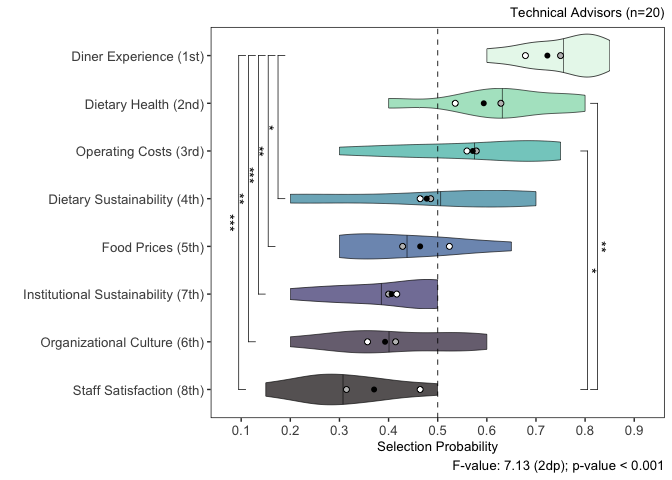<!-- -->
Guest Dining Experience 0.7500000 0.08660254  
Dietary Health 0.6285714 0.13183684  
Operating Costs 0.5785714 0.16547191  
Sustainability of Guest Food Choices 0.4857143 0.20959144  
Food Pricing 0.4285714 0.12863755  
Campus Culture 0.4142857 0.14057704  
Institutional Sustainability 0.4000000 0.11902381  
Staff Satisfaction 0.3142857 0.11443443

geom_jitter(width=0.6,size=2,shape=21,alpha=0.5) +

``` r
library(cowplot)
```

    ## 
    ## Attaching package: 'cowplot'

    ## The following object is masked from 'package:lubridate':
    ## 
    ##     stamp

    ## The following object is masked from 'package:ggpubr':
    ## 
    ##     get_legend

``` r
mean_category <- c("Aggregate Sample (n=32)","Primary Decision Makers (n=12)","Technical Advisors (n=20)")
mean_value <- c(0.5,0.5,0.5)
mean_tibble <- tibble(mean_category,mean_value)
violin_plot_array_legend <- mean_tibble %>%
  ggplot(aes(x=mean_category,y=mean_value,fill=mean_category)) + 
  geom_point(shape=21,color="black") + 
  scale_fill_manual(values=c("black","white","grey")) + 
  labs(fill="Group Mean") +
  theme(legend.position="right",panel.grid=element_blank(),panel.background=element_rect(fill="white"),panel.border=element_rect(fill=NA),legend.title=element_text(size=10),legend.text=element_text(size=10),plot.title=element_text(size=10),plot.subtitle=element_text(size=10,hjust=1),plot.caption=element_text(size=10),axis.title=element_text(size=10),axis.text=element_text(size=10))
legend <- cowplot::get_legend(violin_plot_array_legend)
```

    ## Warning in get_plot_component(plot, "guide-box"): Multiple components found;
    ## returning the first one. To return all, use `return_all = TRUE`.

``` r
decomposed_selection_probability_distribution_plots <- ggarrange(decision_maker_selection_probability_plot,technical_advisor_selection_probability_plot,
          ncol=2,
          labels=c("B","C"))
```

``` r
selection_probability_distribution_plots <- ggarrange(selection_probability_plot,decision_maker_selection_probability_plot,technical_advisor_selection_probability_plot,legend,
                                                      labels=c("A","B","C",""),
                                                      nrow=4,
                                                      heights=c(1,1,1,0.2))
ggsave(filename="selection_probability_distributions.png",plot=selection_probability_distribution_plots,path="/Users/kenjinchang/github/stakeholder-analysis/figures",width=20,height=34,units="cm",dpi=150,limitsize=TRUE)
selection_probability_distribution_plots
```

<!-- -->

could use geom_jitter more strategically to highlight asymmetries in
stakeholder/role types

build in legend calling out overall mean and subgroup mean

independent groups t-test

Dietary Health

``` r
guest_dining_experience_decision_maker_probabilities <- decision_maker_priority_probability_table %>%
  filter(indicator=="Guest Dining Experience") %>%
  mutate(subgroup="Decision Maker",.before=probability) %>%
  select(probability)
guest_dining_experience_technical_advisor_probabilities <- technical_advisor_priority_probability_table %>%
  filter(indicator=="Guest Dining Experience") %>%
  mutate(subgroup="Advisor",.before=probability) %>%
  select(probability)
t.test(guest_dining_experience_decision_maker_probabilities,guest_dining_experience_technical_advisor_probabilities)
```

    ## 
    ##  Welch Two Sample t-test
    ## 
    ## data:  guest_dining_experience_decision_maker_probabilities and guest_dining_experience_technical_advisor_probabilities
    ## t = -1.8179, df = 10.43, p-value = 0.09788
    ## alternative hypothesis: true difference in means is not equal to 0
    ## 95 percent confidence interval:
    ##  -0.15848941  0.01563227
    ## sample estimates:
    ## mean of x mean of y 
    ## 0.6785714 0.7500000

``` r
dietary_health_decision_maker_probabilities <- decision_maker_priority_probability_table %>%
  filter(indicator=="Dietary Health") %>%
  mutate(subgroup="Decision Maker",.before=probability) %>%
  select(probability)
dietary_health_technical_advisor_probabilities <- technical_advisor_priority_probability_table %>%
  filter(indicator=="Dietary Health") %>%
  mutate(subgroup="Advisor",.before=probability) %>%
  select(probability)
t.test(dietary_health_decision_maker_probabilities,dietary_health_technical_advisor_probabilities)
```

    ## 
    ##  Welch Two Sample t-test
    ## 
    ## data:  dietary_health_decision_maker_probabilities and dietary_health_technical_advisor_probabilities
    ## t = -1.3967, df = 11.82, p-value = 0.1882
    ## alternative hypothesis: true difference in means is not equal to 0
    ## 95 percent confidence interval:
    ##  -0.23795499  0.05224071
    ## sample estimates:
    ## mean of x mean of y 
    ## 0.5357143 0.6285714

``` r
operating_costs_decision_maker_probabilities <- decision_maker_priority_probability_table %>%
  filter(indicator=="Operating Costs") %>%
  mutate(subgroup="Decision Maker",.before=probability) %>%
  select(probability)
operating_costs_technical_advisor_probabilities <- technical_advisor_priority_probability_table %>%
  filter(indicator=="Operating Costs") %>%
  mutate(subgroup="Advisor",.before=probability) %>%
  select(probability)
t.test(operating_costs_decision_maker_probabilities,operating_costs_technical_advisor_probabilities)
```

    ## 
    ##  Welch Two Sample t-test
    ## 
    ## data:  operating_costs_decision_maker_probabilities and operating_costs_technical_advisor_probabilities
    ## t = -0.26568, df = 9.4299, p-value = 0.7962
    ## alternative hypothesis: true difference in means is not equal to 0
    ## 95 percent confidence interval:
    ##  -0.1801075  0.1420123
    ## sample estimates:
    ## mean of x mean of y 
    ## 0.5595238 0.5785714

``` r
dietary_sustainability_decision_maker_probabilities <- decision_maker_priority_probability_table %>%
  filter(indicator=="Sustainability of Guest Food Choices") %>%
  mutate(subgroup="Decision Maker",.before=probability) %>%
  select(probability)
dietary_sustainability_technical_advisor_probabilities <- technical_advisor_priority_probability_table %>%
  filter(indicator=="Sustainability of Guest Food Choices") %>%
  mutate(subgroup="Advisor",.before=probability) %>%
  select(probability)
t.test(dietary_sustainability_decision_maker_probabilities,dietary_sustainability_technical_advisor_probabilities)
```

    ## 
    ##  Welch Two Sample t-test
    ## 
    ## data:  dietary_sustainability_decision_maker_probabilities and dietary_sustainability_technical_advisor_probabilities
    ## t = -0.22748, df = 10.241, p-value = 0.8245
    ## alternative hypothesis: true difference in means is not equal to 0
    ## 95 percent confidence interval:
    ##  -0.2306523  0.1877952
    ## sample estimates:
    ## mean of x mean of y 
    ## 0.4642857 0.4857143

``` r
food_pricing_decision_maker_probabilities <- decision_maker_priority_probability_table %>%
  filter(indicator=="Food Pricing") %>%
  mutate(subgroup="Decision Maker",.before=probability) %>%
  select(probability)
food_pricing_technical_advisor_probabilities <- technical_advisor_priority_probability_table %>%
  filter(indicator=="Food Pricing") %>%
  mutate(subgroup="Advisor",.before=probability) %>%
  select(probability)
t.test(food_pricing_decision_maker_probabilities,food_pricing_technical_advisor_probabilities)
```

    ## 
    ##  Welch Two Sample t-test
    ## 
    ## data:  food_pricing_decision_maker_probabilities and food_pricing_technical_advisor_probabilities
    ## t = 1.3585, df = 11.983, p-value = 0.1993
    ## alternative hypothesis: true difference in means is not equal to 0
    ## 95 percent confidence interval:
    ##  -0.05753609  0.24801228
    ## sample estimates:
    ## mean of x mean of y 
    ## 0.5238095 0.4285714

``` r
institutional_sustainability_decision_maker_probabilities <- decision_maker_priority_probability_table %>%
  filter(indicator=="Institutional Sustainability") %>%
  mutate(subgroup="Decision Maker",.before=probability) %>%
  select(probability)
institutional_sustainability_technical_advisor_probabilities <- technical_advisor_priority_probability_table %>%
  filter(indicator=="Institutional Sustainability") %>%
  mutate(subgroup="Advisor",.before=probability) %>%
  select(probability)
t.test(institutional_sustainability_decision_maker_probabilities,institutional_sustainability_technical_advisor_probabilities)
```

    ## 
    ##  Welch Two Sample t-test
    ## 
    ## data:  institutional_sustainability_decision_maker_probabilities and institutional_sustainability_technical_advisor_probabilities
    ## t = 0.2881, df = 11.496, p-value = 0.7784
    ## alternative hypothesis: true difference in means is not equal to 0
    ## 95 percent confidence interval:
    ##  -0.1099927  0.1433260
    ## sample estimates:
    ## mean of x mean of y 
    ## 0.4166667 0.4000000

``` r
campus_culture_decision_maker_probabilities <- decision_maker_priority_probability_table %>%
  filter(indicator=="Campus Culture") %>%
  mutate(subgroup="Decision Maker",.before=probability) %>%
  select(probability)
campus_culture_technical_advisor_probabilities <- technical_advisor_priority_probability_table %>%
  filter(indicator=="Campus Culture") %>%
  mutate(subgroup="Advisor",.before=probability) %>%
  select(probability)
t.test(campus_culture_decision_maker_probabilities,campus_culture_technical_advisor_probabilities)
```

    ## 
    ##  Welch Two Sample t-test
    ## 
    ## data:  campus_culture_decision_maker_probabilities and campus_culture_technical_advisor_probabilities
    ## t = -0.9368, df = 9.465, p-value = 0.3721
    ## alternative hypothesis: true difference in means is not equal to 0
    ## 95 percent confidence interval:
    ##  -0.19410259  0.07981687
    ## sample estimates:
    ## mean of x mean of y 
    ## 0.3571429 0.4142857

``` r
staff_satisfaction_decision_maker_probabilities <- decision_maker_priority_probability_table %>%
  filter(indicator=="Staff Satisfaction") %>%
  mutate(subgroup="Decision Maker",.before=probability) %>%
  select(probability)
staff_satisfaction_technical_advisor_probabilities <- technical_advisor_priority_probability_table %>%
  filter(indicator=="Staff Satisfaction") %>%
  mutate(subgroup="Advisor",.before=probability) %>%
  select(probability)
t.test(staff_satisfaction_decision_maker_probabilities,staff_satisfaction_technical_advisor_probabilities)
```

    ## 
    ##  Welch Two Sample t-test
    ## 
    ## data:  staff_satisfaction_decision_maker_probabilities and staff_satisfaction_technical_advisor_probabilities
    ## t = 2.4309, df = 11.996, p-value = 0.03169
    ## alternative hypothesis: true difference in means is not equal to 0
    ## 95 percent confidence interval:
    ##  0.01554961 0.28445039
    ## sample estimates:
    ## mean of x mean of y 
    ## 0.4642857 0.3142857

STAFF SATISFACTION SIGNIF DIFF (\*)

welch because assume unequal variance n\<30

\## Joint Correlation Analysis

``` r
joint_correlation_appearance_likelihood <- api_frequencies_manual %>%
  mutate(appearance_likelihood=frequency_manual/116) %>%
  select(accessory_indicator_var_manual,appearance_likelihood) %>%
  rename(indicator=accessory_indicator_var_manual)
joint_correlation_selection_probabilities <- priority_probability_table %>%
  group_by(indicator) %>%
  summarise(selection_probability=mean(probability)) %>%
  arrange(desc(selection_probability))
joint_correlation_table <- left_join(joint_correlation_appearance_likelihood,joint_correlation_selection_probabilities,by=join_by(indicator))
```

``` r
joint_correlation_table
```

    ## # A tibble: 8 × 3
    ##   indicator                          appearance_likelihood selection_probability
    ##   <chr>                                              <dbl>                 <dbl>
    ## 1 Campus Culture                                   0.707                   0.393
    ## 2 Dietary Health                                   0.233                   0.594
    ## 3 Operating Costs                                  0.121                   0.571
    ## 4 Sustainability of Guest Food Choi…               0.112                   0.478
    ## 5 Guest Dining Experience                          0.0431                  0.723
    ## 6 Food Pricing                                     0.0345                  0.464
    ## 7 Institutional Sustainability                     0.0172                  0.406
    ## 8 Staff Satisfaction                               0.00862                 0.371

``` r
indicator <- c("Organizational Culture","Dietary Health","Operating Costs","Dietary Sustainability","Diner Experience","Food Prices","Institutional Sustainability","Staff Satisfaction")
appearance_likelihood <- c(8,7,6,5,4,3,2,1)
selection_probability <- c(2,7,6,5,8,4,3,1) 
ordinal_joint_correlation_table <- tibble(indicator,appearance_likelihood,selection_probability)
ordinal_joint_correlation_table
```

    ## # A tibble: 8 × 3
    ##   indicator                    appearance_likelihood selection_probability
    ##   <chr>                                        <dbl>                 <dbl>
    ## 1 Organizational Culture                           8                     2
    ## 2 Dietary Health                                   7                     7
    ## 3 Operating Costs                                  6                     6
    ## 4 Dietary Sustainability                           5                     5
    ## 5 Diner Experience                                 4                     8
    ## 6 Food Prices                                      3                     4
    ## 7 Institutional Sustainability                     2                     3
    ## 8 Staff Satisfaction                               1                     1

``` r
ordinal_joint_correlation_plot <- ordinal_joint_correlation_table %>%
  ggplot(aes(x=selection_probability,y=appearance_likelihood,color=indicator)) +
  geom_smooth(method=loess,se=FALSE,linewidth=0.25,color="black") +
  geom_point(aes(fill=indicator),shape=21,color="black",size=3) + 
  geom_text(aes(label=indicator),hjust=0,nudge_x=0.1,size=3,color="black") + 
  scale_fill_viridis_d(option="mako",limits=c("Staff Satisfaction","Organizational Culture","Institutional Sustainability","Food Prices","Dietary Sustainability","Operating Costs","Dietary Health","Diner Experience")) +
  scale_x_continuous(breaks=c(1,2,3,4,5,6,7,8),limits=c(0.5,8.5)) +
  scale_y_continuous(breaks=c(1,2,3,4,5,6,7,8),limits=c(0.5,8.5)) +
  xlab("Selection Probability Ranking") + 
  ylab("Appearance Likelihood Ranking") +
  labs(caption="Spearman's rho: 0.36 (2dp); p-value: 0.39 (2dp)") + 
  theme(legend.position="none",panel.grid=element_blank(),panel.background=element_rect(fill="white"),panel.border=element_rect(fill=NA),legend.title=element_text(size=10),legend.text=element_text(size=10),plot.title=element_text(size=10),plot.subtitle=element_text(size=10,hjust=1),plot.caption=element_text(size=10),axis.title=element_text(size=10),axis.text=element_text(size=10))
ggsave(filename="ordinal_joint_correlation_plot.png",plot=ordinal_joint_correlation_plot,path="/Users/kenjinchang/github/stakeholder-analysis/figures",width=30,height=20,units="cm",dpi=150,limitsize=TRUE)
```

    ## `geom_smooth()` using formula = 'y ~ x'

``` r
ordinal_joint_correlation_plot
```

    ## `geom_smooth()` using formula = 'y ~ x'

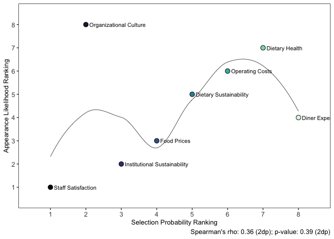<!-- -->

``` r
shapiro.test(ordinal_joint_correlation_table$appearance_likelihood)
```

    ## 
    ##  Shapiro-Wilk normality test
    ## 
    ## data:  ordinal_joint_correlation_table$appearance_likelihood
    ## W = 0.97486, p-value = 0.9332

``` r
shapiro.test(ordinal_joint_correlation_table$selection_probability)
```

    ## 
    ##  Shapiro-Wilk normality test
    ## 
    ## data:  ordinal_joint_correlation_table$selection_probability
    ## W = 0.97486, p-value = 0.9332

``` r
cor.test(ordinal_joint_correlation_table$appearance_likelihood,ordinal_joint_correlation_table$selection_probability,method="kendall")
```

    ## 
    ##  Kendall's rank correlation tau
    ## 
    ## data:  ordinal_joint_correlation_table$appearance_likelihood and ordinal_joint_correlation_table$selection_probability
    ## T = 19, p-value = 0.2751
    ## alternative hypothesis: true tau is not equal to 0
    ## sample estimates:
    ##       tau 
    ## 0.3571429

``` r
cor.test(ordinal_joint_correlation_table$appearance_likelihood,ordinal_joint_correlation_table$selection_probability,method="spearman")
```

    ## 
    ##  Spearman's rank correlation rho
    ## 
    ## data:  ordinal_joint_correlation_table$appearance_likelihood and ordinal_joint_correlation_table$selection_probability
    ## S = 54, p-value = 0.3894
    ## alternative hypothesis: true rho is not equal to 0
    ## sample estimates:
    ##       rho 
    ## 0.3571429

``` r
ordinal_joint_correlation_lm <- lm(appearance_likelihood~selection_probability,data=ordinal_joint_correlation_table)
summary(ordinal_joint_correlation_lm)
```

    ## 
    ## Call:
    ## lm(formula = appearance_likelihood ~ selection_probability, data = ordinal_joint_correlation_table)
    ## 
    ## Residuals:
    ##    Min     1Q Median     3Q    Max 
    ## -2.250 -1.804 -0.500  1.125  4.393 
    ## 
    ## Coefficients:
    ##                       Estimate Std. Error t value Pr(>|t|)
    ## (Intercept)             2.8929     1.9256   1.502    0.184
    ## selection_probability   0.3571     0.3813   0.937    0.385
    ## 
    ## Residual standard error: 2.471 on 6 degrees of freedom
    ## Multiple R-squared:  0.1276, Adjusted R-squared:  -0.01786 
    ## F-statistic: 0.8772 on 1 and 6 DF,  p-value: 0.3851

``` r
shapiro.test(joint_correlation_table$appearance_likelihood)
```

    ## 
    ##  Shapiro-Wilk normality test
    ## 
    ## data:  joint_correlation_table$appearance_likelihood
    ## W = 0.68186, p-value = 0.001402

``` r
shapiro.test(joint_correlation_table$selection_probability)
```

    ## 
    ##  Shapiro-Wilk normality test
    ## 
    ## data:  joint_correlation_table$selection_probability
    ## W = 0.91703, p-value = 0.4062

``` r
res <- cor.test(joint_correlation_table$appearance_likelihood,joint_correlation_table$selection_probability,method="kendall")
res
```

    ## 
    ##  Kendall's rank correlation tau
    ## 
    ## data:  joint_correlation_table$appearance_likelihood and joint_correlation_table$selection_probability
    ## T = 19, p-value = 0.2751
    ## alternative hypothesis: true tau is not equal to 0
    ## sample estimates:
    ##       tau 
    ## 0.3571429

``` r
res <- cor.test(joint_correlation_table$appearance_likelihood,joint_correlation_table$selection_probability,method="spearman")
res
```

    ## 
    ##  Spearman's rank correlation rho
    ## 
    ## data:  joint_correlation_table$appearance_likelihood and joint_correlation_table$selection_probability
    ## S = 54, p-value = 0.3894
    ## alternative hypothesis: true rho is not equal to 0
    ## sample estimates:
    ##       rho 
    ## 0.3571429

``` r
joint_correlation_plot <- joint_correlation_table %>%
  ggplot(aes(x=selection_probability,y=appearance_likelihood,color=indicator)) +
  geom_smooth(method=loess,se=FALSE,color="black",linewidth=0.25) +
  geom_point() + 
  geom_text(aes(label=indicator),hjust=0,nudge_x=0.01,size=2.5,color="black") + 
  scale_x_continuous(limits=c(0,0.85)) + 
  scale_y_continuous(limits=c(0,0.85)) +
  scale_color_viridis_d(option="mako",limits=c("Staff Satisfaction","Campus Culture","Institutional Sustainability","Food Pricing","Sustainability of Guest Food Choices","Operating Costs","Dietary Health","Guest Dining Experience")) +
  xlab("Selection Probability") + 
  ylab("Appearance Likelihood") +
  labs(caption="Adjusted R-Squared: -0.114 (3sf); p-value = 0.612 (3sf)") + 
  theme(legend.position="none",panel.grid=element_blank(),panel.background=element_rect(fill="white"),panel.border=element_rect(fill=NA),legend.title=element_text(size=10),legend.text=element_text(size=10),plot.title=element_text(size=10),plot.subtitle=element_text(size=10,hjust=1),plot.caption=element_text(size=8),axis.title=element_text(size=10),axis.text=element_text(size=8))
ggsave(filename="joint_correlation_plot.png",plot=joint_correlation_plot,path="/Users/kenjinchang/github/stakeholder-analysis/figures",width=20,height=20,units="cm",dpi=150,limitsize=TRUE)
```

    ## `geom_smooth()` using formula = 'y ~ x'

    ## Warning: Removed 2 rows containing missing values or values outside the scale range
    ## (`geom_smooth()`).

``` r
joint_correlation_plot
```

    ## `geom_smooth()` using formula = 'y ~ x'

    ## Warning: Removed 2 rows containing missing values or values outside the scale range
    ## (`geom_smooth()`).

<!-- -->

``` r
joint_correlation_lm <- lm(appearance_likelihood~selection_probability,data=joint_correlation_table)
summary(joint_correlation_lm)
```

    ## 
    ## Call:
    ## lm(formula = appearance_likelihood ~ selection_probability, data = joint_correlation_table)
    ## 
    ## Residuals:
    ##      Min       1Q   Median       3Q      Max 
    ## -0.20408 -0.14996 -0.04061  0.02088  0.50337 
    ## 
    ## Coefficients:
    ##                       Estimate Std. Error t value Pr(>|t|)
    ## (Intercept)             0.3650     0.3942   0.926    0.390
    ## selection_probability  -0.4111     0.7689  -0.535    0.612
    ## 
    ## Residual standard error: 0.2462 on 6 degrees of freedom
    ## Multiple R-squared:  0.04547,    Adjusted R-squared:  -0.1136 
    ## F-statistic: 0.2858 on 1 and 6 DF,  p-value: 0.6121

Re run to see what happens when you limit joint correlation analysis to
those with significant differences only

``` r
campus_culture_limited_joint_correlation_table <- joint_correlation_table %>%
  filter(!indicator=="Dietary Health") %>%
  filter(!indicator=="Operating Costs") 
```

``` r
campus_culture_limited_joint_correlation_table %>%
  ggplot(aes(x=selection_probability,y=appearance_likelihood,color=indicator)) +
  geom_smooth(method=lm,se=FALSE,color="black",linewidth=0.25) +
  geom_point() + 
  geom_text(aes(label=indicator),hjust=0,nudge_x=0.01,size=2.5) + 
  scale_x_continuous(limits=c(0,0.85)) + 
  scale_y_continuous(limits=c(0,0.85)) +
  scale_color_viridis_d(option="mako",limits=c("Staff Satisfaction","Campus Culture","Institutional Sustainability","Food Pricing","Sustainability of Guest Food Choices","Guest Dining Experience")) +
  xlab("Selection Probability") + 
  ylab("Appearance Likelihood") +
  labs(caption="Adjusted R-Squared: -0.114 (3sf); p-value = 0.612 (3sf)") + 
  theme(legend.position="none",panel.grid=element_blank(),panel.background=element_rect(fill="white"),panel.border=element_rect(fill=NA),legend.title=element_text(size=10),legend.text=element_text(size=10),plot.title=element_text(size=10),plot.subtitle=element_text(size=10,hjust=1),plot.caption=element_text(size=8),axis.title=element_text(size=10),axis.text=element_text(size=8))
```

    ## `geom_smooth()` using formula = 'y ~ x'

<!-- -->

``` r
campus_culture_limited_joint_correlation_lm <- lm(appearance_likelihood~selection_probability,data=campus_culture_limited_joint_correlation_table)
summary(campus_culture_limited_joint_correlation_lm)
```

    ## 
    ## Call:
    ## lm(formula = appearance_likelihood ~ selection_probability, data = campus_culture_limited_joint_correlation_table)
    ## 
    ## Residuals:
    ##        1        2        3        4        5        6 
    ##  0.50848 -0.03874  0.03009 -0.12385 -0.17366 -0.20232 
    ## 
    ## Coefficients:
    ##                       Estimate Std. Error t value Pr(>|t|)
    ## (Intercept)             0.4189     0.4950   0.846    0.445
    ## selection_probability  -0.5612     1.0163  -0.552    0.610
    ## 
    ## Residual standard error: 0.2947 on 4 degrees of freedom
    ## Multiple R-squared:  0.07084,    Adjusted R-squared:  -0.1615 
    ## F-statistic: 0.305 on 1 and 4 DF,  p-value: 0.6102

``` r
priority_z_score_table <- priority_score_zscores %>%
  select(comparison_indicator,guest_dining_experience_selection_zscore,dietary_health_selection_zscore,operating_costs_selection_zscore,dietary_sustainability_selection_zscore,food_pricing_selection_zscore,institutional_sustainability_selection_zscore,campus_culture_selection_zscore,staff_satisfaction_selection_zscore) %>%
  pivot_longer(!comparison_indicator,names_to="indicator",values_to="z_score") %>%
  select(-comparison_indicator) %>%
  mutate(across(indicator,str_replace,"guest_dining_experience_selection_zscore","Guest Dining Experience")) %>%
  mutate(across(indicator,str_replace,"dietary_health_selection_zscore","Dietary Health")) %>%
  mutate(across(indicator,str_replace,"operating_costs_selection_zscore","Operating Costs")) %>%
  mutate(across(indicator,str_replace,"dietary_sustainability_selection_zscore","Sustainability of Guest Food Choices")) %>%
  mutate(across(indicator,str_replace,"food_pricing_selection_zscore","Food Pricing")) %>%
  mutate(across(indicator,str_replace,"institutional_sustainability_selection_zscore","Institutional Sustainability")) %>%
  mutate(across(indicator,str_replace,"campus_culture_selection_zscore","Campus Culture")) %>%
  mutate(across(indicator,str_replace,"staff_satisfaction_selection_zscore","Staff Satisfaction")) %>%
  filter(z_score>0)
```

    ## Warning: Using one column matrices in `filter()` was deprecated in dplyr 1.1.0.
    ## ℹ Please use one dimensional logical vectors instead.
    ## This warning is displayed once every 8 hours.
    ## Call `lifecycle::last_lifecycle_warnings()` to see where this warning was
    ## generated.

``` r
priority_z_score_table
```

    ## # A tibble: 40 × 2
    ##    indicator                            z_score[,1]
    ##    <chr>                                      <dbl>
    ##  1 Institutional Sustainability              0.294 
    ##  2 Guest Dining Experience                   0.0891
    ##  3 Dietary Health                            0.0497
    ##  4 Sustainability of Guest Food Choices      0.0887
    ##  5 Campus Culture                            0.183 
    ##  6 Staff Satisfaction                        0.120 
    ##  7 Guest Dining Experience                   0.446 
    ##  8 Dietary Health                            0.713 
    ##  9 Operating Costs                           0.269 
    ## 10 Food Pricing                              0.319 
    ## # ℹ 30 more rows

NEED TO FIGURE OUT IF FILTERING OUT ZERO VALUES IN THIS CASE IS
APPROPRIATE FOR THURSTONE’S LAW COMPARISONS

``` r
priority_z_score_table %>%
  group_by(indicator) %>%
  summarise(total_selection_z_score=sum(z_score),mean_selection_z_score=mean(z_score)) %>%
  arrange(desc(mean_selection_z_score))
```

    ## # A tibble: 8 × 3
    ##   indicator                        total_selection_z_sc…¹ mean_selection_z_score
    ##   <chr>                                             <dbl>                  <dbl>
    ## 1 Food Pricing                                       2.87                  0.717
    ## 2 Campus Culture                                     2.75                  0.688
    ## 3 Sustainability of Guest Food Ch…                   3.14                  0.628
    ## 4 Institutional Sustainability                       3.10                  0.620
    ## 5 Operating Costs                                    2.95                  0.591
    ## 6 Staff Satisfaction                                 2.90                  0.581
    ## 7 Dietary Health                                     2.82                  0.470
    ## 8 Guest Dining Experience                            2.44                  0.406
    ## # ℹ abbreviated name: ¹​total_selection_z_score

``` r
priority_z_score_table %>%
  ggplot(aes(x=fct_reorder(indicator,z_score,.fun="mean"),y=z_score,fill=fct_reorder(indicator,z_score,.fun="mean"),color=fct_reorder(indicator,z_score,.fun="mean"))) +
  geom_boxplot(outlier.shape=NA,color="black",size=0.25,alpha=0.8) +
  stat_summary(fun.y=mean,geom="point",shape=20,size=2,color="black",fill="white") +
  scale_fill_viridis_d(option="mako") +
  scale_color_viridis_d(option="mako",alpha=1) +
  xlab("") + 
  ylab("Z-Score") + 
  labs(caption="F-value: tbd (3sf); p-value = tbd") + 
  coord_flip() +
  theme(aspect.ratio=0.8,legend.position="none",panel.grid=element_blank(),panel.background=element_rect(fill="white"),panel.border=element_rect(fill=NA),legend.title=element_text(size=10),legend.text=element_text(size=10),plot.title=element_text(size=10))
```

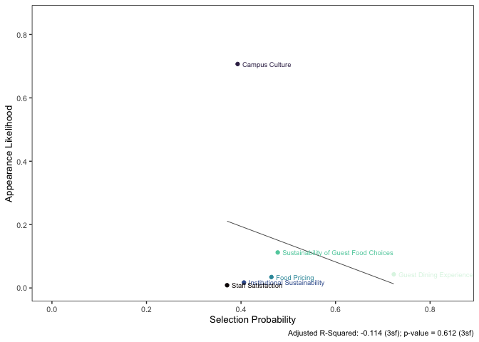<!-- -->
