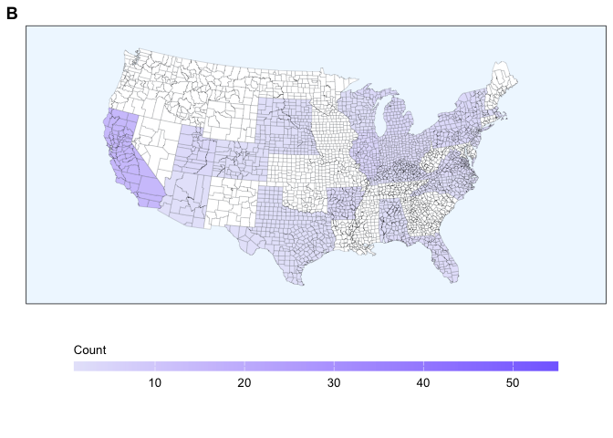

Cleaning Script
================
Last Updated: February 12, 2025

## Package Loading

``` r
library(tidyverse)
```

    ## ── Attaching core tidyverse packages ──────────────────────── tidyverse 2.0.0 ──
    ## ✔ dplyr     1.1.4     ✔ readr     2.1.5
    ## ✔ forcats   1.0.0     ✔ stringr   1.5.1
    ## ✔ ggplot2   3.5.1     ✔ tibble    3.2.1
    ## ✔ lubridate 1.9.3     ✔ tidyr     1.3.1
    ## ✔ purrr     1.0.2     
    ## ── Conflicts ────────────────────────────────────────── tidyverse_conflicts() ──
    ## ✖ dplyr::filter() masks stats::filter()
    ## ✖ dplyr::lag()    masks stats::lag()
    ## ℹ Use the conflicted package (<http://conflicted.r-lib.org/>) to force all conflicts to become errors

``` r
library(ggpubr)
library(ggsignif)
library(maps)
```

    ## 
    ## Attaching package: 'maps'
    ## 
    ## The following object is masked from 'package:purrr':
    ## 
    ##     map

``` r
library(sf)
```

    ## Linking to GEOS 3.11.0, GDAL 3.5.3, PROJ 9.1.0; sf_use_s2() is TRUE

``` r
library(rnaturalearth)
library(rnaturalearthhires)
```

## Data Loading

``` r
survey_data <- read.csv("/Users/kenjinchang/github/stakeholder-analysis/data/parent-files/survey-data.csv")
extraction_data <- read.csv("/Users/kenjinchang/github/stakeholder-analysis/data/parent-files/extraction-data.csv")
```

## Data Cleaning: Scoping Review

Below, we list, operationalize, and—where applicable—provide the input
range for each of the 42 originally extracted variables:

- `study_id`: the unique numeral identifier assigned to each
  independently eligible study included within our scoping review
  (1-116).
- `study`: the parenthetical, in-text citation for each independently
  eligible study’s corresponding record of reference.
- `study_no`: the assigned number specifying the order in which the
  independently eligible study appears within the corresponding record
  of reference.
- `study_count`: the total number of independently eligible studies
  appearing within the corresponding record of reference.
- `doi`: the handle, or digital object identifier (DOI), assigned to
  each independently eligible study’s corresponding record of reference.
- `pub_year`: the calendar year when each independently eligible study’s
  corresponding record of reference was published (2001-2024).
- `pub_title`: the given title for each independently eligible study’s
  corresponding record of reference.
- `pub_journal`: the publishing journal of each independently eligible
  study’s record of reference.
- `university_list`: the complete list of treatment-receiving
  universities participating in the independently eligible study.
- `university_count`: the total number of treatment-receiving
  universities participating in the independently eligible study.
- `investigation_cat`: the scale of the independently eligible study’s
  investigation (single-site for study’s localized to one
  treatment-receiving university or multi-site for study’s implemented
  across multiple treatment-receiving universities).
- `nation_list`: a duplicate-allowing list pairing the participating
  treatment-receiving universities mentioned in each study with the ISO
  (International Organization for Standardization) countries in which
  they are located.
- `nation_list_count`: the total number of unique and duplicate ISO
  countries associated with the participating treatment-receiving
  universities mentioned in each study.
- `nation_var`: a non-duplicate-allowing list pairing the participating
  treatment-receiving universities mentioned in each study with the ISO
  countries in which they are located.
- `nation_var_count`: the total number of unique ISO countries
  associated with the participating treatment-receiving universities
  mentioned in each study.
- `us_state_list`: a conditional, duplicate-allowing list pairing the
  participating treatment-receiving universities mentioned in each study
  with the U.S. state in which they are located.
- `us_state_list_count`: the total number of unique and duplicate U.S.
  states associated with the participating treatment-receiving
  universities mentioned in each study.
- `us_state_var`: a conditional, non-duplicate-allowing list pairing the
  participating treatment-receiving universities mentioned in each study
  with the U.S. states in which they are located.
- `us_state_var_count`: the total number of unique U.S. states
  associated with the participating treatment-receiving universities
  mentioned in each study.
- `uk_country_list`: a conditional, duplicate-allowing list pairing the
  participating treatment-receiving universities mentioned in each study
  with the U.K. country in which they are located.
- `uk_country_list_count`: the total number of unique and duplicate U.K.
  countries associated with the participating treatment-receiving
  universities mentioned each study.
- `uk_country_var`: a conditional, non-duplicate allowing list pairing
  the participating treatment-receiving universities mentioned in each
  study with the U.K. countries in which they are located.
- `uk_country_var_count`: the total number of unique U.K. countries
  associated with the participating treatment-receiving universities
  mentioned in each study.
- `strategy_list`: a duplicate-allowing list pairing the reported
  intervention components mentioned in each study with the specific
  behavioral strategies being leveraged.
- `approach_cat`: the diagnosed behavioral approach associated with each
  study, based on the strategies mapping on to each study’s reported
  intervention components.
- `target_list`: a duplicate-allowing list pairing the reported
  intervention components mentioned in each study with the specific
  socio-ecological tiers being targeted.
- `breadth_cat`: the diagnosed breadth of change associated each study,
  based on the socio-ecological tiers mapping on to each study’s
  reported intervention components.
- `design`: the research design of the included study, as determined by
  the nature of comparison being made (between, within, or between and
  within).
- `principal_indicator_list`: a duplicate-allowing list outlining the
  primary outcome measures being used to document changes to food
  selection or food service in response to the study’s reported
  intervention.
- `principal_indicator_list_count`: the total number of unique and
  duplicate primary outcome measures being
- `principal_indicator_var`:
- `principal_indicator_var_count`:
- `accessory_indicator_list`:
- `accessory_indicator_list_count`:
- `accessory_indicator_var`:
- `accessory_indicator_var_count`:
- `qualifying_indicator_list`:
- `qualifying_indicator_list_count`:
- `qualifying_indicator_var`:
- `qualifying_indicator_var_count`:
- `spillover_monitoring_list`:
- `spillover_monitoring_list_count`:
- `spillover_monitoring_var`:
- `spillover_monitoring_var_count`:
- `intention_behavior_monitoring`:

### Time

``` r
temporal_frequencies <- extraction_data %>%
  select(pub_year,university_count) %>%
  drop_na() %>%
  mutate(count=case_when(university_count>=1~1)) %>%
  group_by(pub_year) %>%
  summarise(frequency=sum(count)) %>%
  mutate(cumulative_frequency=cumsum(frequency)) %>%
  add_row(pub_year=2000,frequency=0) %>%
  add_row(pub_year=2002,frequency=0) %>%
  add_row(pub_year=2003,frequency=0) %>%
  add_row(pub_year=2004,frequency=0) %>%
  add_row(pub_year=2007,frequency=0) %>%
  add_row(pub_year=2008,frequency=0) %>%
  add_row(pub_year=2010,frequency=0) %>%
  arrange(pub_year) %>%
  mutate(cumulative_frequency=cumsum(frequency)) 
temporal_frequencies
```

    ## # A tibble: 25 × 3
    ##    pub_year frequency cumulative_frequency
    ##       <dbl>     <dbl>                <dbl>
    ##  1     2000         0                    0
    ##  2     2001         2                    2
    ##  3     2002         0                    2
    ##  4     2003         0                    2
    ##  5     2004         0                    2
    ##  6     2005         1                    3
    ##  7     2006         1                    4
    ##  8     2007         0                    4
    ##  9     2008         0                    4
    ## 10     2009         3                    7
    ## # ℹ 15 more rows

``` r
exponential_fit <- temporal_frequencies %>%
  slice(-1)
exponential_model <- lm(log(cumulative_frequency)~pub_year,data=exponential_fit)
summary(exponential_model)
```

    ## 
    ## Call:
    ## lm(formula = log(cumulative_frequency) ~ pub_year, data = exponential_fit)
    ## 
    ## Residuals:
    ##      Min       1Q   Median       3Q      Max 
    ## -0.37237 -0.09186  0.03052  0.09792  0.36681 
    ## 
    ## Coefficients:
    ##              Estimate Std. Error t value Pr(>|t|)    
    ## (Intercept) -409.1142    10.4655  -39.09   <2e-16 ***
    ## pub_year       0.2046     0.0052   39.35   <2e-16 ***
    ## ---
    ## Signif. codes:  0 '***' 0.001 '**' 0.01 '*' 0.05 '.' 0.1 ' ' 1
    ## 
    ## Residual standard error: 0.1763 on 22 degrees of freedom
    ## Multiple R-squared:  0.986,  Adjusted R-squared:  0.9854 
    ## F-statistic:  1548 on 1 and 22 DF,  p-value: < 2.2e-16

``` r
temporal_frequencies_plot <- temporal_frequencies %>%
  ggplot(aes(x=pub_year,y=frequency,color=frequency,fill=frequency)) + 
  geom_col() +
  scale_fill_gradient(name="Count",low="lavender",high="slateblue4",limits=c(1,116),na.value="lavender",breaks=c(1,29,58,87,116)) +
  scale_color_gradient(name="Count",low="lavender",high="slateblue4",limits=c(1,116),na.value="lavender",breaks=c(1,29,58,87,116)) +
  xlab("Publication Year") + 
  ylab("Frequency") + 
  scale_y_continuous(limits=c(0,120)) +
  scale_x_continuous(breaks=c(2000,2004,2008,2012,2016,2020,2024),limits=c(2000,2025)) +
  labs(caption="   ") + 
  theme(legend.position="none",legend.justification="center",legend.box.spacing=unit(0,"pt"),legend.key.size=unit(10,"pt"),panel.grid=element_blank(),panel.background=element_rect(fill="white"),panel.border=element_rect(fill=NA),legend.title=element_text(size=10),legend.text=element_text(size=10),plot.title=element_text(size=10))
temporal_cumulative_frequencies_plot <- temporal_frequencies %>%
  ggplot(aes(x=pub_year,y=cumulative_frequency,color=cumulative_frequency,fill=cumulative_frequency)) +
  scale_fill_gradient(name="Count",low="lavender",high="slateblue4",limits=c(1,116),na.value="lavender",breaks=c(1,29,58,87,116)) +
  scale_color_gradient(name="Count",low="lavender",high="slateblue4",limits=c(1,116),na.value="lavender",breaks=c(1,29,58,87,116)) +
  geom_col() + 
  xlab("Publication Year") + 
  ylab("Cumulative Frequency") + 
  scale_y_continuous(limits=c(0,120)) +
  scale_x_continuous(breaks=c(2000,2004,2008,2012,2016,2020,2024),limits=c(2000,2025)) +
  labs(caption="Adjusted R-Squared: 0.985 (3sf)") + 
  theme(legend.title.position="none",legend.position="none",legend.justification="center",legend.box.spacing=unit(0,"pt"),legend.key.width=unit(50,"pt"),legend.key.height=unit(7.5,"pt"),panel.grid=element_blank(),panel.background=element_rect(fill="white"),panel.border=element_rect(fill=NA),legend.title=element_text(size=10),legend.text=element_text(size=10),plot.title=element_text(size=10))
```

``` r
temporal_plots <- ggarrange(temporal_frequencies_plot,temporal_cumulative_frequencies_plot,
          nrow=2,
          labels=c("A","B"))
```

    ## Warning: Removed 1 row containing missing values or values outside the scale range
    ## (`geom_col()`).
    ## Removed 1 row containing missing values or values outside the scale range
    ## (`geom_col()`).

``` r
ggsave(filename="publication-rate.png",plot=temporal_plots,path="/Users/kenjinchang/github/stakeholder-analysis/figures",width=30,height=20,units="cm",dpi=150,limitsize=TRUE)
temporal_plots
```

<!-- -->

### Place

``` r
global_shapefile <- map_data("world")
global_shapefile <- global_shapefile %>% 
  rename(country=region) %>%
  mutate(country=case_when(country=="Macedonia"~"North Macedonia",
                           country=="Ivory Coast"~"Cote d'Ivoire",
                           country=="Democratic Republic of the Congo"~"Congo, Dem. Rep.",
                           country=="Republic of Congo"~"Congo, Rep.",
                           country=="UK"~"United Kingdom",
                           country=="USA"~"United States",
                           country=="Laos"~"Lao",
                           country=="Slovakia"~"Slovak Republic",
                           country=="Saint Lucia"~"St. Lucia",
                           country=="Kyrgyzstan"~"Krygyz Republic",
                           country=="Micronesia"~"Micronesia, Fed. Sts.",
                           country=="Swaziland"~"Eswatini",
                           country=="Virgin Islands"~"Virgin Islands (U.S.)",
                        TRUE~country))
island_nations <- c("Antigua","Barbuda","Nevis", 
                 "Saint Kitts","Trinidad",
                 "Tobago","Grenadines","Saint Vincent")
island_nations_match <- global_shapefile %>% 
  filter(country %in% island_nations)
ant_bar <- c(137,138 )
kit_nev <- c(930,931)
tri_tog <- c(1425,1426)
vin_gre <- c(1575,1576,1577)
island_nation_names <- c("Antigua and Barbuda","St. Kitts and Nevis","Trinidad and Tobago","St. Vincent and the Grenadines")
island_nations_match <- island_nations_match %>% 
  mutate(country=case_when(group %in% ant_bar~"Antigua and Barbuda",
                           group %in% kit_nev~"St. Kitts and Nevis",
                           group %in% tri_tog~"Trinidad and Tobago",
                           group %in% vin_gre~"St. Vincent and the Grenadines")) %>% 
  tibble()
global_shapefile <- global_shapefile %>%
  filter(!country %in% island_nation_names)
global_shapefile <- global_shapefile %>% 
  bind_rows(island_nations_match) %>%
  arrange(country) %>%
  tibble()
sra_names <- c("Hong Kong","Macao")
hk_mc <- global_shapefile %>% 
  filter(subregion %in% sra_names)
hk_mc <- hk_mc %>%
  mutate(country = case_when(subregion=="Hong Kong"~"Hong Kong, China",
                             subregion=="Macao"~"Macao, China"))
global_shapefile <- global_shapefile %>%
  filter(!subregion %in% sra_names)
global_shapefile <- global_shapefile %>% 
  bind_rows(hk_mc) %>%
  select(-subregion) %>% 
  tibble()
```

``` r
spatial_frequencies <- extraction_data %>%
  select(nation_var,nation_var_count) %>%
  rename(country=nation_var) %>%
  mutate(across(country,str_replace,"USA","United States")) %>%
  mutate(across(country,str_replace,"UK","United Kingdom")) %>%
  group_by(country) %>%
  summarise(frequency=sum(nation_var_count)) %>%
  arrange(desc(frequency))
```

    ## Warning: There was 1 warning in `mutate()`.
    ## ℹ In argument: `across(country, str_replace, "USA", "United States")`.
    ## Caused by warning:
    ## ! The `...` argument of `across()` is deprecated as of dplyr 1.1.0.
    ## Supply arguments directly to `.fns` through an anonymous function instead.
    ## 
    ##   # Previously
    ##   across(a:b, mean, na.rm = TRUE)
    ## 
    ##   # Now
    ##   across(a:b, \(x) mean(x, na.rm = TRUE))

``` r
spatial_frequencies
```

    ## # A tibble: 17 × 2
    ##    country          frequency
    ##    <chr>                <int>
    ##  1 "United States"         55
    ##  2 "United Kingdom"        16
    ##  3 "Canada"                13
    ##  4 "Italy"                  6
    ##  5 "Germany"                4
    ##  6 "China"                  3
    ##  7 "Portugal"               3
    ##  8 "Sweden"                 3
    ##  9 "Australia"              2
    ## 10 "Belgium "               2
    ## 11 "Brazil"                 2
    ## 12 "Netherlands"            2
    ## 13 "France"                 1
    ## 14 "India"                  1
    ## 15 "Norway"                 1
    ## 16 "Switzerland"            1
    ## 17 "Thailand"               1

``` r
spatial_frequencies %>%
  summarise(sum(frequency))
```

    ## # A tibble: 1 × 1
    ##   `sum(frequency)`
    ##              <int>
    ## 1              116

scale_fill_gradient(low=‘white’, high=‘grey20’, limits=c(1, 10))

scale_fill_gradient(low=“lavender”,high=“slateblue4”,na.value=“white”,name=“Intervention-Receiving
Institutions”,guide=guide_colourbar(reverse=FALSE,title.position=“top”,title.hjust=0.5,limits=c(1,116)))
+

``` r
crs_robin <- "+proj=robin +lat_0=0 +lon_0=0 +x0=0 +y0=0"
```

``` r
spatial_frequencies_joined <- left_join(global_shapefile,spatial_frequencies,by="country")
national_frequencies <- spatial_frequencies_joined %>%
  ggplot(aes(x=long,y=lat,fill=frequency,group=group)) + 
  geom_polygon(color="black",linewidth=0.125,alpha=0.60) +
  scale_fill_gradient(low="lavender",high="slateblue4",na.value="white",limits=c(1,55)) +
  coord_sf(crs=crs_robin) +
  xlab("") + 
  ylab("") +
  scale_y_continuous(limits=c(-55,85)) +
  labs(caption="") +
  theme(aspect.ratio=.48,legend.key.width=unit(3,"lines"),legend.position="none",legend.justification="center",legend.box.spacing=unit(-15,"pt"),legend.key.size=unit(10,"pt"),panel.grid=element_blank(),panel.background=element_rect(fill="aliceblue"),panel.border=element_rect(fill=NA),axis.text=element_blank(),axis.ticks=element_blank(),legend.title=element_text(size=10),legend.text=element_text(size=10),plot.title=element_text(size=10))
```

scale_fill_gradient(name=“Count”,low=“lavender”,high=“slateblue4”,limits=c(1,116),na.value=“lavender”,breaks=c(1,29,58,87,116)) +
scale_color_gradient(name=“Count”,low=“lavender”,high=“slateblue4”,limits=c(1,116),na.value=“lavender”,breaks=c(1,29,58,87,116))
+

``` r
usa_shapefile <- map_data("county") %>%
  rename(state=region)
```

``` r
state_frequencies <- extraction_data %>%
  select(study,us_state_var) %>%
  separate_longer_delim(c(us_state_var),delim=";") %>%
  add_column(count=1) %>%
  group_by(us_state_var) %>%
  summarise(frequency=sum(count)) %>%
  arrange(desc(frequency)) %>%
  mutate(us_state_var=tolower(us_state_var)) %>%
  rename(state=us_state_var) %>%
  drop_na()
state_frequencies 
```

    ## # A tibble: 38 × 2
    ##    state            frequency
    ##    <chr>                <dbl>
    ##  1 "california"            15
    ##  2 "illinois"               4
    ##  3 "michigan"               3
    ##  4 "new york"               3
    ##  5 "pennsylvania"           3
    ##  6 "utah"                   3
    ##  7 " massachusetts"         2
    ##  8 "arkansas"               2
    ##  9 "florida"                2
    ## 10 "indiana"                2
    ## # ℹ 28 more rows

``` r
state_frequencies %>% summarise(sum(frequency))
```

    ## # A tibble: 1 × 1
    ##   `sum(frequency)`
    ##              <dbl>
    ## 1               69

``` r
state_frequencies_joined <- left_join(usa_shapefile,state_frequencies,by="state")
```

``` r
usa_frequencies <- state_frequencies_joined %>%
  ggplot(aes(x=long,y=lat,fill=frequency,group=group)) + 
  geom_polygon(color="black",linewidth=0.125) +
  scale_fill_gradient(low="lavender",high="slateblue4",na.value="white",limits=c(1,55)) +
  xlab("") + 
  ylab("") +
  labs(caption="") +
  coord_map("albers",lat0=45.5,lat1=29.5) +
  theme(legend.key.width=unit(3,"lines"),legend.position="none",legend.justification="center",legend.box.spacing=unit(-15,"pt"),legend.key.size=unit(10,"pt"),panel.grid=element_blank(),panel.background=element_rect(fill="aliceblue"),panel.border=element_rect(fill=NA),axis.text=element_blank(),axis.ticks=element_blank(),legend.title=element_text(size=10),legend.text=element_text(size=10),plot.title=element_text(size=10))
```

``` r
subnational_frequencies <- extraction_data %>%
  select(uk_country_var,uk_country_var_count) %>%
  rename(subregion=uk_country_var) %>%
  separate_longer_delim(c(subregion,uk_country_var_count),delim=";") %>%
  mutate(uk_country_var_count=as.numeric(uk_country_var_count)) %>%
  group_by(subregion) %>%
  summarise(frequency=sum(uk_country_var_count)) %>%
  arrange(desc(frequency)) %>%
  mutate(across("subregion",str_replace,"England","Great Britain")) %>%
  drop_na()
subnational_frequencies
```

    ## # A tibble: 3 × 2
    ##   subregion     frequency
    ##   <chr>             <dbl>
    ## 1 Great Britain        14
    ## 2 Scotland              1
    ## 3 Wales                 1

``` r
uk_shapefile <- ne_states(country="united kingdom",returnclass="sf")
```

``` r
subnational_frequencies <- subnational_frequencies %>%
  mutate(across('subregion',str_replace,"Great Britain","England")) %>%
  rename(geonunit=subregion)
subnational_frequencies
```

    ## # A tibble: 3 × 2
    ##   geonunit frequency
    ##   <chr>        <dbl>
    ## 1 England         14
    ## 2 Scotland         1
    ## 3 Wales            1

``` r
subnational_frequencies_joined <- left_join(uk_shapefile,subnational_frequencies,by="geonunit")
```

``` r
uk_frequencies <- subnational_frequencies_joined %>%
ggplot(aes(fill=frequency,group=geonunit)) + 
  geom_sf(aes(fill=frequency),color="black",linewidth=0.125) +
  scale_fill_gradient(low="lavender",high="slateblue4",na.value="white",limits=c(1,55)) +
  theme(legend.key.width=unit(3,"lines"),legend.position="none",legend.justification="center",legend.box.spacing=unit(-15,"pt"),legend.key.size=unit(10,"pt"),panel.grid=element_blank(),panel.background=element_rect(fill="aliceblue"),panel.border=element_rect(fill=NA),axis.text=element_blank(),axis.ticks=element_blank(),legend.title=element_text(size=10),legend.text=element_text(size=10),plot.title=element_text(size=10))
```

``` r
subnational_frequency_choros <- ggarrange(usa_frequencies,uk_frequencies,
                                         ncol=2,
                                         labels=c("B","C"))
national_frequency_choros <- ggarrange(national_frequencies,
                                       labels="A")
```

``` r
spatial_plots <- ggarrange(national_frequency_choros,subnational_frequency_choros,
          nrow=2)
ggsave(filename="publication-distribution.png",plot=spatial_plots,path="/Users/kenjinchang/github/stakeholder-analysis/figures",width=30,height=20,units="cm",dpi=150,limitsize=TRUE)
spatial_plots
```

<!-- -->

### Primary Performance Indicators

``` r
ppi_frequencies <- extraction_data %>%
  select(study,principal_indicator_var) %>%
  separate_longer_delim(c(principal_indicator_var),delim=";") %>%
  add_column(count=1) %>%
  group_by(principal_indicator_var) %>%
  summarise(frequency=sum(count)) %>%
  mutate(across(principal_indicator_var,str_replace_all,"Observed Food Choice","Food Choice, Observed")) %>%
  mutate(across(principal_indicator_var,str_replace_all,"Observed Food Service","Food Service, Observed")) %>%
  mutate(across(principal_indicator_var,str_replace_all,"Self-Reported Food Choice","Food Choice, Self-Reported")) %>%
  mutate(across(principal_indicator_var,str_replace_all,"Intended Food Choice","Food Choice, Intended")) 
ppi_frequencies 
```

    ## # A tibble: 8 × 2
    ##   principal_indicator_var       frequency
    ##   <chr>                             <dbl>
    ## 1 "  Food Choice, Observed"             1
    ## 2 " Food Choice, Observed"             11
    ## 3 " Food Service, Observed"             1
    ## 4 " Food Choice, Self-Reported"        30
    ## 5 "Food Choice, Intended"              36
    ## 6 "Food Choice, Observed"              42
    ## 7 "Food Service, Observed"              1
    ## 8 "Food Choice, Self-Reported"         37

``` r
principal_indicator_var_manual <- c("Food Choice, Intended","Food Choice, Self-Reported","Food Choice, Observed","Food Service, Observed")
frequency_manual <- c(36,67,54,2)
ppi_frequencies_manual <- tibble(principal_indicator_var_manual,frequency_manual) %>%
  mutate(mode_manual=case_when(principal_indicator_var_manual=="Food Choice, Intended"~"Intended",
                        principal_indicator_var_manual=="Food Choice, Self-Reported"~"Self-Reported",
                        principal_indicator_var_manual=="Food Choice, Observed"~"Observed",
                        principal_indicator_var_manual=="Food Service, Observed"~"Observed")) %>%
  mutate(across(principal_indicator_var_manual,str_replace_all,"Food Choice, Observed","Food Choice")) %>%
  mutate(across(principal_indicator_var_manual,str_replace_all,"Food Choice, Intended","Food Choice")) %>%
  mutate(across(principal_indicator_var_manual,str_replace_all,"Food Choice, Self-Reported","Food Choice")) %>%
  mutate(across(principal_indicator_var_manual,str_replace_all,"Food Service, Observed","Food Service"))
ppi_frequencies_manual 
```

    ## # A tibble: 4 × 3
    ##   principal_indicator_var_manual frequency_manual mode_manual  
    ##   <chr>                                     <dbl> <chr>        
    ## 1 Food Choice                                  36 Intended     
    ## 2 Food Choice                                  67 Self-Reported
    ## 3 Food Choice                                  54 Observed     
    ## 4 Food Service                                  2 Observed

need to run chisq.test 36,54,67. 2

``` r
ppi_frequencies_plot <- ppi_frequencies_manual %>%
  ggplot(aes(x=principal_indicator_var_manual,y=frequency_manual,fill=mode_manual,color=mode_manual)) + 
  geom_col() +
  scale_fill_brewer(palette="Pastel1") +
  scale_color_brewer(palette="Pastel1") +
  xlab("Indicator") +
  ylab("Frequency") +
  guides(fill=guide_legend(title="Mode"),color=guide_legend(title="Mode")) +
  geom_signif(comparisons=list(c("Food Choice","Food Service")),color="black",size=0.25,annotation="***",y_position=158,tip_length=0.02,vjust=0) +
  theme(aspect.ratio=1,legend.position="right",panel.grid=element_blank(),panel.background=element_rect(fill="white"),panel.border=element_rect(fill=NA),legend.title=element_text(size=10),legend.text=element_text(size=10),plot.title=element_text(size=10))
ggsave(filename="primary-performance-indicators.png",plot=ppi_frequencies_plot,path="/Users/kenjinchang/github/stakeholder-analysis/figures",width=20,height=20,units="cm",dpi=150,limitsize=TRUE)
ppi_frequencies_plot
```

<!-- -->

### Accessory Performance Indicators

``` r
api_frequencies <- extraction_data %>%
  select(study,accessory_indicator_var) %>%
  separate_longer_delim(c(accessory_indicator_var),delim=";") %>%
  add_column(count=1) %>%
  group_by(accessory_indicator_var) %>%
  summarise(frequency=sum(count))
api_frequencies
```

    ## # A tibble: 15 × 2
    ##    accessory_indicator_var                 frequency
    ##    <chr>                                       <dbl>
    ##  1 " Campus Culture"                               2
    ##  2 " Dietary Health"                              18
    ##  3 " Food Pricing"                                 1
    ##  4 " Guest Dining Experience"                      4
    ##  5 " Institutional Sustainability"                 2
    ##  6 " Operating Costs"                             12
    ##  7 " Staff Satisfaction"                           1
    ##  8 " Sustainability of Guest Food Choices"        10
    ##  9 "Campus Culture"                               80
    ## 10 "Dietary Health"                                9
    ## 11 "Food Pricing"                                  3
    ## 12 "Guest Dining Experience"                       1
    ## 13 "Operating Costs"                               2
    ## 14 "Sustainability of Guest Food Choices"          3
    ## 15  <NA>                                          18

``` r
accessory_indicator_var_manual <- c("Food Choice, Intended","Food Choice, Self-Reported","Food Choice, Observed","Food Service, Observed")
frequency_manual <- c(36,67,54,2)
ppi_frequencies_manual <- tibble(principal_indicator_var_manual,frequency_manual) %>%
  mutate(mode_manual=case_when(principal_indicator_var_manual=="Food Choice, Intended"~"Intended",
                        principal_indicator_var_manual=="Food Choice, Self-Reported"~"Self-Reported",
                        principal_indicator_var_manual=="Food Choice, Observed"~"Observed",
                        principal_indicator_var_manual=="Food Service, Observed"~"Observed")) %>%
  mutate(across(principal_indicator_var_manual,str_replace_all,"Food Choice, Observed","Food Choice")) %>%
  mutate(across(principal_indicator_var_manual,str_replace_all,"Food Choice, Intended","Food Choice")) %>%
  mutate(across(principal_indicator_var_manual,str_replace_all,"Food Choice, Self-Reported","Food Choice")) %>%
  mutate(across(principal_indicator_var_manual,str_replace_all,"Food Service, Observed","Food Service"))
ppi_frequencies_manual 
```

    ## # A tibble: 4 × 3
    ##   principal_indicator_var_manual frequency_manual mode_manual  
    ##   <chr>                                     <dbl> <chr>        
    ## 1 Food Choice                                  36 Intended     
    ## 2 Food Choice                                  67 Self-Reported
    ## 3 Food Choice                                  54 Observed     
    ## 4 Food Service                                  2 Observed

not sure why this isn’t collapsing correctly

variety

``` r
extraction_data %>%
  select(accessory_indicator_var) %>%
  str_count("Campus Culture")
```

    ## Warning in stri_count_regex(string, pattern, opts_regex = opts(pattern)):
    ## argument is not an atomic vector; coercing

    ## [1] 82

``` r
extraction_data %>%
  select(accessory_indicator_var) %>%
  str_count("Dietary Health")
```

    ## Warning in stri_count_regex(string, pattern, opts_regex = opts(pattern)):
    ## argument is not an atomic vector; coercing

    ## [1] 27

``` r
extraction_data %>%
  select(accessory_indicator_var) %>%
  str_count("Operating Costs")
```

    ## Warning in stri_count_regex(string, pattern, opts_regex = opts(pattern)):
    ## argument is not an atomic vector; coercing

    ## [1] 14

``` r
extraction_data %>%
  select(accessory_indicator_var) %>%
  str_count("Sustainability of Guest Food Choices")
```

    ## Warning in stri_count_regex(string, pattern, opts_regex = opts(pattern)):
    ## argument is not an atomic vector; coercing

    ## [1] 13

``` r
extraction_data %>%
  select(accessory_indicator_var) %>%
  str_count("Guest Dining Experience")
```

    ## Warning in stri_count_regex(string, pattern, opts_regex = opts(pattern)):
    ## argument is not an atomic vector; coercing

    ## [1] 5

``` r
extraction_data %>%
  select(accessory_indicator_var) %>%
  str_count("Food Pricing")
```

    ## Warning in stri_count_regex(string, pattern, opts_regex = opts(pattern)):
    ## argument is not an atomic vector; coercing

    ## [1] 4

``` r
extraction_data %>%
  select(accessory_indicator_var) %>%
  str_count("Institutional Sustainability")
```

    ## Warning in stri_count_regex(string, pattern, opts_regex = opts(pattern)):
    ## argument is not an atomic vector; coercing

    ## [1] 2

``` r
extraction_data %>%
  select(accessory_indicator_var) %>%
  str_count("Staff Satisfaction")
```

    ## Warning in stri_count_regex(string, pattern, opts_regex = opts(pattern)):
    ## argument is not an atomic vector; coercing

    ## [1] 1

list

``` r
extraction_data %>%
  select(accessory_indicator_list) %>%
  str_count("Campus Culture")
```

    ## Warning in stri_count_regex(string, pattern, opts_regex = opts(pattern)):
    ## argument is not an atomic vector; coercing

    ## [1] 398

``` r
extraction_data %>%
  select(accessory_indicator_list) %>%
  str_count("Dietary Health")
```

    ## Warning in stri_count_regex(string, pattern, opts_regex = opts(pattern)):
    ## argument is not an atomic vector; coercing

    ## [1] 241

``` r
extraction_data %>%
  select(accessory_indicator_list) %>%
  str_count("Operating Costs")
```

    ## Warning in stri_count_regex(string, pattern, opts_regex = opts(pattern)):
    ## argument is not an atomic vector; coercing

    ## [1] 23

``` r
extraction_data %>%
  select(accessory_indicator_list) %>%
  str_count("Sustainability of Guest Food Choices")
```

    ## Warning in stri_count_regex(string, pattern, opts_regex = opts(pattern)):
    ## argument is not an atomic vector; coercing

    ## [1] 41

``` r
extraction_data %>%
  select(accessory_indicator_list) %>%
  str_count("Guest Dining Experience")
```

    ## Warning in stri_count_regex(string, pattern, opts_regex = opts(pattern)):
    ## argument is not an atomic vector; coercing

    ## [1] 7

``` r
extraction_data %>%
  select(accessory_indicator_list) %>%
  str_count("Food Pricing")
```

    ## Warning in stri_count_regex(string, pattern, opts_regex = opts(pattern)):
    ## argument is not an atomic vector; coercing

    ## [1] 4

``` r
extraction_data %>%
  select(accessory_indicator_list) %>%
  str_count("Institutional Sustainability")
```

    ## Warning in stri_count_regex(string, pattern, opts_regex = opts(pattern)):
    ## argument is not an atomic vector; coercing

    ## [1] 8

``` r
extraction_data %>%
  select(accessory_indicator_list) %>%
  str_count("Staff Satisfaction")
```

    ## Warning in stri_count_regex(string, pattern, opts_regex = opts(pattern)):
    ## argument is not an atomic vector; coercing

    ## [1] 1

### Performance Qualifiers

api_frequencies \<- extraction_data %\>%
select(study,accessory_indicator_var) %\>%
separate_longer_delim(c(accessory_indicator_var),delim=“;”) %\>%
add_column(count=1) %\>% group_by(accessory_indicator_var) %\>%
summarise(frequency=sum(count)) api_frequencies

``` r
qpi_frequencies <- extraction_data %>%
  select(study,qualifying_indicator_var) %>%
  separate_longer_delim(c(qualifying_indicator_var),delim=";") %>%
  add_column(count=1) %>%
  group_by(qualifying_indicator_var) %>%
  summarise(frequency=sum(count))
qpi_frequencies
```

    ## # A tibble: 9 × 2
    ##   qualifying_indicator_var frequency
    ##   <chr>                        <dbl>
    ## 1 " Lifestyle"                    37
    ## 2 " Lifestyle "                    6
    ## 3 " Program Reception"            34
    ## 4 " Situational"                  21
    ## 5 "Demographics"                  87
    ## 6 "Lifestyle"                      3
    ## 7 "Program Reception"              5
    ## 8 "Situational"                    8
    ## 9  <NA>                           13

``` r
extraction_data %>%
  select(qualifying_indicator_var) %>%
  str_count("Demographics")
```

    ## Warning in stri_count_regex(string, pattern, opts_regex = opts(pattern)):
    ## argument is not an atomic vector; coercing

    ## [1] 87

``` r
extraction_data %>%
  select(qualifying_indicator_var) %>%
  str_count("Lifestyle")
```

    ## Warning in stri_count_regex(string, pattern, opts_regex = opts(pattern)):
    ## argument is not an atomic vector; coercing

    ## [1] 46

``` r
extraction_data %>%
  select(qualifying_indicator_var) %>%
  str_count("Program Reception")
```

    ## Warning in stri_count_regex(string, pattern, opts_regex = opts(pattern)):
    ## argument is not an atomic vector; coercing

    ## [1] 39

``` r
extraction_data %>%
  select(qualifying_indicator_var) %>%
  str_count("Situational")
```

    ## Warning in stri_count_regex(string, pattern, opts_regex = opts(pattern)):
    ## argument is not an atomic vector; coercing

    ## [1] 29

### Gap Monitoring

#### Spillover

#### Intention-Behavior Asymmetries

## Data Cleaning: Stakeholder Analysis
